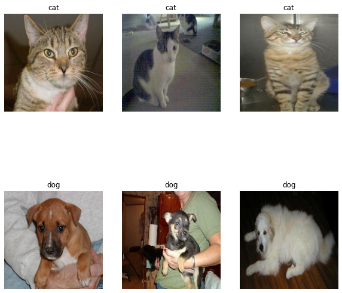
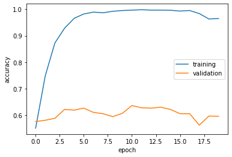
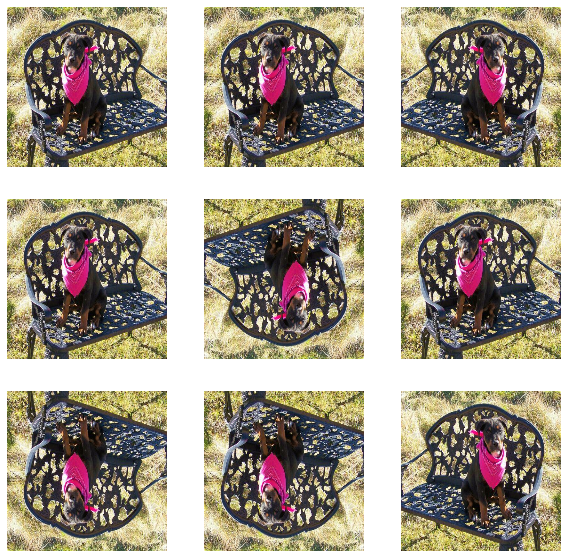
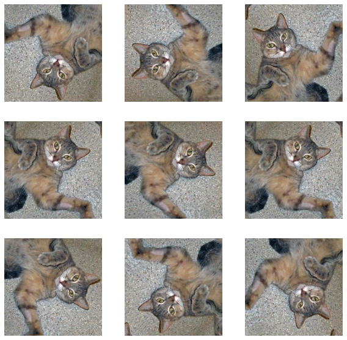
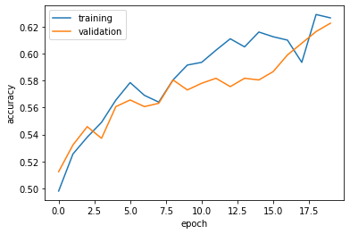
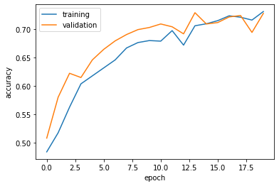
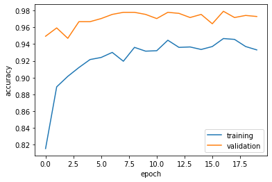

**This blog post provides a tutorial on the topic of image classification and transfer learning.**

# §1. Load Packages and Obtain Data


```python
import os
import pandas as pd
import numpy as np
import tensorflow as tf
from tensorflow.keras import utils, datasets, layers, models
from matplotlib import pyplot as plt
```


```python
# location of data
_URL = 'https://storage.googleapis.com/mledu-datasets/cats_and_dogs_filtered.zip'

# download the data and extract it
path_to_zip = utils.get_file('cats_and_dogs.zip', origin=_URL, extract=True)

# construct paths
PATH = os.path.join(os.path.dirname(path_to_zip), 'cats_and_dogs_filtered')

train_dir = os.path.join(PATH, 'train')
validation_dir = os.path.join(PATH, 'validation')

# parameters for datasets
BATCH_SIZE = 32
IMG_SIZE = (160, 160)

# construct train and validation datasets 
train_dataset = utils.image_dataset_from_directory(train_dir,
                                                   shuffle=True,
                                                   batch_size=BATCH_SIZE,
                                                   image_size=IMG_SIZE)

validation_dataset = utils.image_dataset_from_directory(validation_dir,
                                                        shuffle=True,
                                                        batch_size=BATCH_SIZE,
                                                        image_size=IMG_SIZE)

# construct the test dataset by taking every 5th observation out of the validation dataset
val_batches = tf.data.experimental.cardinality(validation_dataset)
test_dataset = validation_dataset.take(val_batches // 5)
validation_dataset = validation_dataset.skip(val_batches // 5)
```

    Found 2000 files belonging to 2 classes.
    Found 1000 files belonging to 2 classes.


```python
AUTOTUNE = tf.data.AUTOTUNE

train_dataset = train_dataset.prefetch(buffer_size=AUTOTUNE)
validation_dataset = validation_dataset.prefetch(buffer_size=AUTOTUNE)
test_dataset = test_dataset.prefetch(buffer_size=AUTOTUNE)
```

Write a function to create a two-row visualization


```python
def two_row_visualization(train_dataset):
  # set the class names as "cats" and "dogs"
  class_names = ["cat","dog"]

  plt.figure(figsize=(10, 10))
  for images, labels in train_dataset.take(1):
    #count0 and count1 keeps track of the number of images of cats and dogs respectively
    count0 = 0
    count1 = 0
    for i in range(32):
      #print three images of cats on the first row
      if labels[i] == 0 and count0 <3:
        count0 = count0 + 1
        ax = plt.subplot(2,3,count0)
        plt.imshow(images[i].numpy().astype("uint8"))
        plt.title(class_names[labels[i]])
        plt.axis("off")
      #print three images of dogs on the second row
      if labels[i] == 1 and count1 <3:
        count1 = count1 + 1
        ax = plt.subplot(2,3,count1+3)
        plt.imshow(images[i].numpy().astype("uint8"))
        plt.title(class_names[labels[i]])
        plt.axis("off")
```

Apply the two_row_visualization function created above on our training dataset.


```python
two_row_visualization(train_dataset)
```


    

    


**Check Label Frequencies**

Now we will check the number of images in the training data with label 0 (corresponding to "cat") and label 1 (corresponding to "dog").


```python
labels_iterator= train_dataset.unbatch().map(lambda image, label: label).as_numpy_iterator()
```


```python
#label0 and label1 will hold the number of cats and dogs images respectively
label0 = 0
label1 = 0
for label in labels_iterator:
  if label == 0:
    label0 += 1
  else:
    label1 += 1
  
print("There are " + str(label0) + " images in the training data with label 0.")
print("There are " + str(label1) + " images in the training data with label 1.")
```

    There are 1000 images in the training data with label 0.
    There are 1000 images in the training data with label 1.


Since baseline machine learning model is the model that always guesses the most frequent label and the two labels in our training data have the same frequency, currently the baseline model would be 50% accurate.

# §2. First Model

We will first create a tf.keras.Sequential model using some of the layers we learnt in class including Conv2D layers, MaxPooling2D layers, Flatten layer, Dense layer, and Dropout layer.


```python
model1 = tf.keras.models.Sequential([
                                    #input
                                    #let the first layer Conv2D have 8 kernels, shape 3*3, 'relu' non-linear transformation
                                    #also specify the input shape in the first layer
                                    layers.Conv2D(8, (3, 3), activation='relu', input_shape=(160, 160, 3)),
                                     
                                    #layers
                                    #Dropout(0.2) disables a fixed percentage (20% here) of the units in each layer during training
                                    #to reduce the risk of overfitting
                                    layers.Dropout(0.2),
                                    #MaxPooling2D((2, 2)) specifies the size of window (2*2 here) to find the max
                                    layers.MaxPooling2D((2, 2)),
                                    layers.Conv2D(32, (3, 3), activation='relu'),
                                    layers.MaxPooling2D((2, 2)),
                                     
                                    #output
                                    #Flatten() reshapes 2d data into one row
                                    layers.Flatten(),
                                    layers.Dense(32, activation='relu'),
                                    layers.Dense(2) # number of classes
    
])
```


```python
model1.compile(optimizer='adam',
              loss=tf.keras.losses.SparseCategoricalCrossentropy(from_logits=True),
              metrics=['accuracy'])
```

Train model1 on the training data.


```python
history = model1.fit(train_dataset, 
                     epochs=20, 
                     validation_data=validation_dataset)
```

    Epoch 1/20
    63/63 [==============================] - 7s 79ms/step - loss: 28.1525 - accuracy: 0.5505 - val_loss: 1.4347 - val_accuracy: 0.5755
    Epoch 2/20
    63/63 [==============================] - 5s 75ms/step - loss: 0.7904 - accuracy: 0.7485 - val_loss: 1.0775 - val_accuracy: 0.5804
    Epoch 3/20
    63/63 [==============================] - 5s 76ms/step - loss: 0.2979 - accuracy: 0.8725 - val_loss: 1.1851 - val_accuracy: 0.5879
    Epoch 4/20
    63/63 [==============================] - 5s 76ms/step - loss: 0.1598 - accuracy: 0.9280 - val_loss: 1.2303 - val_accuracy: 0.6213
    Epoch 5/20
    63/63 [==============================] - 5s 77ms/step - loss: 0.0985 - accuracy: 0.9655 - val_loss: 1.2529 - val_accuracy: 0.6188
    Epoch 6/20
    63/63 [==============================] - 5s 75ms/step - loss: 0.0592 - accuracy: 0.9820 - val_loss: 1.3997 - val_accuracy: 0.6262
    Epoch 7/20
    63/63 [==============================] - 5s 75ms/step - loss: 0.0435 - accuracy: 0.9890 - val_loss: 1.6010 - val_accuracy: 0.6101
    Epoch 8/20
    63/63 [==============================] - 5s 74ms/step - loss: 0.0525 - accuracy: 0.9865 - val_loss: 1.5793 - val_accuracy: 0.6052
    Epoch 9/20
    63/63 [==============================] - 5s 73ms/step - loss: 0.0506 - accuracy: 0.9920 - val_loss: 1.5354 - val_accuracy: 0.5941
    Epoch 10/20
    63/63 [==============================] - 5s 76ms/step - loss: 0.0256 - accuracy: 0.9950 - val_loss: 1.7287 - val_accuracy: 0.6064
    Epoch 11/20
    63/63 [==============================] - 5s 74ms/step - loss: 0.0244 - accuracy: 0.9965 - val_loss: 1.5855 - val_accuracy: 0.6361
    Epoch 12/20
    63/63 [==============================] - 5s 73ms/step - loss: 0.0179 - accuracy: 0.9980 - val_loss: 1.7249 - val_accuracy: 0.6275
    Epoch 13/20
    63/63 [==============================] - 5s 74ms/step - loss: 0.0157 - accuracy: 0.9965 - val_loss: 1.7717 - val_accuracy: 0.6262
    Epoch 14/20
    63/63 [==============================] - 5s 78ms/step - loss: 0.0166 - accuracy: 0.9965 - val_loss: 2.0383 - val_accuracy: 0.6300
    Epoch 15/20
    63/63 [==============================] - 5s 75ms/step - loss: 0.0201 - accuracy: 0.9960 - val_loss: 1.8698 - val_accuracy: 0.6213
    Epoch 16/20
    63/63 [==============================] - 5s 76ms/step - loss: 0.0304 - accuracy: 0.9930 - val_loss: 1.9945 - val_accuracy: 0.6052
    Epoch 17/20
    63/63 [==============================] - 5s 77ms/step - loss: 0.0201 - accuracy: 0.9950 - val_loss: 2.1487 - val_accuracy: 0.6052
    Epoch 18/20
    63/63 [==============================] - 5s 78ms/step - loss: 0.0642 - accuracy: 0.9835 - val_loss: 2.1442 - val_accuracy: 0.5619
    Epoch 19/20
    63/63 [==============================] - 5s 79ms/step - loss: 0.1220 - accuracy: 0.9630 - val_loss: 2.0781 - val_accuracy: 0.5965
    Epoch 20/20
    63/63 [==============================] - 5s 78ms/step - loss: 0.1255 - accuracy: 0.9650 - val_loss: 1.8432 - val_accuracy: 0.5953


Plot accuracy history on both the training and validation sets. 


```python
plt.plot(history.history["accuracy"], label = "training")
plt.plot(history.history["val_accuracy"], label = "validation")
plt.gca().set(xlabel = "epoch", ylabel = "accuracy")
plt.legend()
```


    <matplotlib.legend.Legend at 0x7f320040bcd0>


    

    


To get the best validation accuracy, I experimented with adding more Conv2D layers, altering the parameters in the dropout and MaxPooling2D layers, and also adjusted the number of dense layers.

**Validation accuracy of model1 during training**


**The accuracy of my model1 stabilized at around 59% during training, which is better (about 9% higher) than the accuracy by the baseline model.**


**Overfitting**

**It is obvious from the accuracy plot above that the training accuracy is much higher than the validation accuracy. Therefore the problem of overfitting exists for my model1.**

# §3. Model with Data Augmentation

Add data augmentation layers:

Data augmentation refers to the practice of including modified copies of the same image in the training set.

**Plot of the original image and a few copies to which RandomFlip() has been applied:**


```python
RandomFlip = tf.keras.layers.RandomFlip()
```


```python
for image, _ in train_dataset.take(1):
  plt.figure(figsize=(10, 10))
  first_image = image[0]
  for i in range(9):
    ax = plt.subplot(3, 3, i + 1)
    augmented_image = RandomFlip(tf.expand_dims(first_image, 0))
    plt.imshow(augmented_image[0] / 255)
    plt.axis('off')
```


    

    


```python
RandomRotation = tf.keras.layers.RandomRotation(0.6)
```


```python
for image, _ in train_dataset.take(1):
  plt.figure(figsize=(10, 10))
  first_image = image[0]
  for i in range(9):
    ax = plt.subplot(3, 3, i + 1)
    augmented_image = RandomRotation(tf.expand_dims(first_image, 0))
    plt.imshow(augmented_image[0] / 255)
    plt.axis('off')
```


    

    


We will then create a new tf.keras.models.Sequential model called model2 in which the first two layers are augmentation layers. 


```python
model2 = tf.keras.models.Sequential([
                                    layers.RandomFlip(),
                                    layers.RandomRotation(0.6),
                                    layers.Conv2D(8, (3, 3), activation='relu', input_shape=(160, 160, 3)),
                                    layers.Dropout(0.2),
                                    layers.MaxPooling2D((2, 2)),
                                    layers.Conv2D(32, (3, 3), activation='relu'),
                                    layers.MaxPooling2D((2, 2)),
                                    layers.Flatten(),
                                    layers.Dense(32, activation='relu'),
                                    layers.Dense(2) # number of classes
    
])
```


```python
model2.compile(optimizer='adam',
              loss=tf.keras.losses.SparseCategoricalCrossentropy(from_logits=True),
              metrics=['accuracy'])
```

Train model2 on the training data.


```python
history2 = model2.fit(train_dataset, 
                     epochs=20, 
                     validation_data=validation_dataset)
```

    Epoch 1/20
    63/63 [==============================] - 7s 81ms/step - loss: 68.0702 - accuracy: 0.4980 - val_loss: 0.6954 - val_accuracy: 0.5124
    Epoch 2/20
    63/63 [==============================] - 5s 77ms/step - loss: 0.7138 - accuracy: 0.5255 - val_loss: 0.6937 - val_accuracy: 0.5322
    Epoch 3/20
    63/63 [==============================] - 5s 81ms/step - loss: 0.6950 - accuracy: 0.5380 - val_loss: 0.6903 - val_accuracy: 0.5458
    Epoch 4/20
    63/63 [==============================] - 5s 78ms/step - loss: 0.6935 - accuracy: 0.5490 - val_loss: 0.6936 - val_accuracy: 0.5371
    Epoch 5/20
    63/63 [==============================] - 5s 80ms/step - loss: 0.6808 - accuracy: 0.5655 - val_loss: 0.7000 - val_accuracy: 0.5606
    Epoch 6/20
    63/63 [==============================] - 5s 79ms/step - loss: 0.6854 - accuracy: 0.5785 - val_loss: 0.6836 - val_accuracy: 0.5656
    Epoch 7/20
    63/63 [==============================] - 5s 77ms/step - loss: 0.6882 - accuracy: 0.5690 - val_loss: 0.6902 - val_accuracy: 0.5606
    Epoch 8/20
    63/63 [==============================] - 5s 79ms/step - loss: 0.6817 - accuracy: 0.5640 - val_loss: 0.6801 - val_accuracy: 0.5631
    Epoch 9/20
    63/63 [==============================] - 5s 78ms/step - loss: 0.6757 - accuracy: 0.5805 - val_loss: 0.6781 - val_accuracy: 0.5804
    Epoch 10/20
    63/63 [==============================] - 5s 81ms/step - loss: 0.6732 - accuracy: 0.5915 - val_loss: 0.6852 - val_accuracy: 0.5730
    Epoch 11/20
    63/63 [==============================] - 5s 79ms/step - loss: 0.6788 - accuracy: 0.5935 - val_loss: 0.6858 - val_accuracy: 0.5780
    Epoch 12/20
    63/63 [==============================] - 5s 77ms/step - loss: 0.6696 - accuracy: 0.6025 - val_loss: 0.6788 - val_accuracy: 0.5817
    Epoch 13/20
    63/63 [==============================] - 5s 78ms/step - loss: 0.6638 - accuracy: 0.6110 - val_loss: 0.6788 - val_accuracy: 0.5755
    Epoch 14/20
    63/63 [==============================] - 5s 79ms/step - loss: 0.6675 - accuracy: 0.6050 - val_loss: 0.6726 - val_accuracy: 0.5817
    Epoch 15/20
    63/63 [==============================] - 5s 74ms/step - loss: 0.6485 - accuracy: 0.6160 - val_loss: 0.6801 - val_accuracy: 0.5804
    Epoch 16/20
    63/63 [==============================] - 5s 78ms/step - loss: 0.6922 - accuracy: 0.6125 - val_loss: 0.6743 - val_accuracy: 0.5866
    Epoch 17/20
    63/63 [==============================] - 5s 77ms/step - loss: 0.6579 - accuracy: 0.6100 - val_loss: 0.6788 - val_accuracy: 0.5990
    Epoch 18/20
    63/63 [==============================] - 5s 76ms/step - loss: 0.6634 - accuracy: 0.5935 - val_loss: 0.6681 - val_accuracy: 0.6077
    Epoch 19/20
    63/63 [==============================] - 5s 76ms/step - loss: 0.6436 - accuracy: 0.6290 - val_loss: 0.6605 - val_accuracy: 0.6163
    Epoch 20/20
    63/63 [==============================] - 5s 76ms/step - loss: 0.6576 - accuracy: 0.6265 - val_loss: 0.6628 - val_accuracy: 0.6225


Plot accuracy history on both the training and validation sets.


```python
plt.plot(history2.history["accuracy"], label = "training")
plt.plot(history2.history["val_accuracy"], label = "validation")
plt.gca().set(xlabel = "epoch", ylabel = "accuracy")
plt.legend()
```


    <matplotlib.legend.Legend at 0x7f32003e5750>


    

    


**Validation accuracy of model2 during training**

**The accuracy of my model2 stabilized at around 66% during training, which is a little bit better (about 7% higher) than the accuracy by model1.**

**Overfitting**

**From the accuracy plot above we can see that the gap between the training accuracy and the validation accuracy became very small at the end of 20 epochs. Therefore the problem of overfitting no longer exists for my model2.**

# §4. Data Preprocessing

**Create a preprocessor layer to slot into your model pipeline:**

To increase model efficiency by handling the scaling prior to the training process.


```python
i = tf.keras.Input(shape=(160, 160, 3))
x = tf.keras.applications.mobilenet_v2.preprocess_input(i)
preprocessor = tf.keras.Model(inputs = [i], outputs = [x])
```

Create model3 by incorporating the preprocessor layer as the very first layer, before the data augmentation layers.


```python
model3 = tf.keras.models.Sequential([
                                    preprocessor,
                                    layers.RandomFlip(),
                                    layers.RandomRotation(0.6),
                                    layers.Conv2D(8, (3, 3), activation='relu', input_shape=(160, 160, 3)),
                                    layers.Dropout(0.2),
                                    layers.MaxPooling2D((2, 2)),
                                    layers.Conv2D(32, (3, 3), activation='relu'),
                                    layers.MaxPooling2D((2, 2)),
                                    layers.Flatten(),
                                    layers.Dense(32, activation='relu'),
                                    layers.Dense(2) # number of classes
    
])
```


```python
model3.compile(optimizer='adam',
              loss=tf.keras.losses.SparseCategoricalCrossentropy(from_logits=True),
              metrics=['accuracy'])
```

Train model3 on the training data.


```python
history3 = model3.fit(train_dataset, 
                     epochs=20, 
                     validation_data=validation_dataset)
```

    Epoch 1/20
    63/63 [==============================] - 6s 77ms/step - loss: 0.8231 - accuracy: 0.4845 - val_loss: 0.6906 - val_accuracy: 0.5087
    Epoch 2/20
    63/63 [==============================] - 5s 75ms/step - loss: 0.6894 - accuracy: 0.5180 - val_loss: 0.6858 - val_accuracy: 0.5804
    Epoch 3/20
    63/63 [==============================] - 5s 78ms/step - loss: 0.6805 - accuracy: 0.5630 - val_loss: 0.6573 - val_accuracy: 0.6225
    Epoch 4/20
    63/63 [==============================] - 5s 76ms/step - loss: 0.6564 - accuracy: 0.6040 - val_loss: 0.6302 - val_accuracy: 0.6151
    Epoch 5/20
    63/63 [==============================] - 5s 75ms/step - loss: 0.6435 - accuracy: 0.6180 - val_loss: 0.6372 - val_accuracy: 0.6460
    Epoch 6/20
    63/63 [==============================] - 6s 96ms/step - loss: 0.6367 - accuracy: 0.6320 - val_loss: 0.6155 - val_accuracy: 0.6646
    Epoch 7/20
    63/63 [==============================] - 5s 76ms/step - loss: 0.6132 - accuracy: 0.6460 - val_loss: 0.5949 - val_accuracy: 0.6795
    Epoch 8/20
    63/63 [==============================] - 5s 76ms/step - loss: 0.6022 - accuracy: 0.6670 - val_loss: 0.5860 - val_accuracy: 0.6906
    Epoch 9/20
    63/63 [==============================] - 5s 76ms/step - loss: 0.5881 - accuracy: 0.6765 - val_loss: 0.5820 - val_accuracy: 0.6993
    Epoch 10/20
    63/63 [==============================] - 5s 76ms/step - loss: 0.5869 - accuracy: 0.6800 - val_loss: 0.5712 - val_accuracy: 0.7030
    Epoch 11/20
    63/63 [==============================] - 5s 78ms/step - loss: 0.5841 - accuracy: 0.6790 - val_loss: 0.5729 - val_accuracy: 0.7092
    Epoch 12/20
    63/63 [==============================] - 5s 77ms/step - loss: 0.5678 - accuracy: 0.6975 - val_loss: 0.5836 - val_accuracy: 0.7042
    Epoch 13/20
    63/63 [==============================] - 5s 75ms/step - loss: 0.5871 - accuracy: 0.6720 - val_loss: 0.5713 - val_accuracy: 0.6918
    Epoch 14/20
    63/63 [==============================] - 5s 76ms/step - loss: 0.5634 - accuracy: 0.7060 - val_loss: 0.5463 - val_accuracy: 0.7290
    Epoch 15/20
    63/63 [==============================] - 5s 76ms/step - loss: 0.5570 - accuracy: 0.7095 - val_loss: 0.5651 - val_accuracy: 0.7092
    Epoch 16/20
    63/63 [==============================] - 5s 74ms/step - loss: 0.5523 - accuracy: 0.7150 - val_loss: 0.5544 - val_accuracy: 0.7116
    Epoch 17/20
    63/63 [==============================] - 5s 76ms/step - loss: 0.5375 - accuracy: 0.7235 - val_loss: 0.5626 - val_accuracy: 0.7215
    Epoch 18/20
    63/63 [==============================] - 5s 75ms/step - loss: 0.5462 - accuracy: 0.7210 - val_loss: 0.5399 - val_accuracy: 0.7240
    Epoch 19/20
    63/63 [==============================] - 5s 77ms/step - loss: 0.5400 - accuracy: 0.7160 - val_loss: 0.5934 - val_accuracy: 0.6943
    Epoch 20/20
    63/63 [==============================] - 5s 76ms/step - loss: 0.5400 - accuracy: 0.7310 - val_loss: 0.5381 - val_accuracy: 0.7277


Plot accuracy history on both the training and validation sets.


```python
plt.plot(history3.history["accuracy"], label = "training")
plt.plot(history3.history["val_accuracy"], label = "validation")
plt.gca().set(xlabel = "epoch", ylabel = "accuracy")
plt.legend()
```


    <matplotlib.legend.Legend at 0x7f320e02bcd0>


    

    


**Validation accuracy of model3 during training**


**The accuracy of my model3 stabilized at around 72% during training, which is better (about 13% higher) than the accuracy by model1.**


**Overfitting**

**From the accuracy plot above, we can see that the gap between the training accuracy and the validation accuracy no longer exists. Therefore model3 does not suffer from the problem of overfitting.**

# §5. Transfer Learning

**Leverage on a pre-existing model for our task:**

Configure MobileNetV2 as a layer to be included in our model.


```python
IMG_SHAPE = IMG_SIZE + (3,)
base_model = tf.keras.applications.MobileNetV2(input_shape=IMG_SHAPE,
                                               include_top=False,
                                               weights='imagenet')
base_model.trainable = False

i = tf.keras.Input(shape=IMG_SHAPE)
x = base_model(i, training = False)
base_model_layer = tf.keras.Model(inputs = [i], outputs = [x])
```


```python
model4 = tf.keras.models.Sequential([
                                    preprocessor,
                                    layers.RandomFlip(),
                                    layers.RandomRotation(0.6),
                                    base_model_layer,
                                    layers.Dropout(0.2),
                                    layers.GlobalMaxPool2D(),
                                    layers.Dense(32, activation='relu'),
                                    layers.Dense(2) # number of classes
    
])
```


```python
model4.compile(optimizer='adam',
              loss=tf.keras.losses.SparseCategoricalCrossentropy(from_logits=True),
              metrics=['accuracy'])
```


```python
model4.summary()
```

    Model: "sequential_3"
    _________________________________________________________________
     Layer (type)                Output Shape              Param #   
    =================================================================
     model (Functional)          (None, 160, 160, 3)       0         
                                                                     
     random_flip_3 (RandomFlip)  (None, 160, 160, 3)       0         
                                                                     
     random_rotation_3 (RandomRo  (None, 160, 160, 3)      0         
     tation)                                                         
                                                                     
     model_1 (Functional)        (None, 5, 5, 1280)        2257984   
                                                                     
     dropout_3 (Dropout)         (None, 5, 5, 1280)        0         
                                                                     
     global_max_pooling2d (Globa  (None, 1280)             0         
     lMaxPooling2D)                                                  
                                                                     
     dense_6 (Dense)             (None, 32)                40992     
                                                                     
     dense_7 (Dense)             (None, 2)                 66        
                                                                     
    =================================================================
    Total params: 2,299,042
    Trainable params: 41,058
    Non-trainable params: 2,257,984
    _________________________________________________________________


Train model4 on the training data.

The summary shows that we have to train 41，058 parameters in model4.


```python
history4 = model4.fit(train_dataset, 
                     epochs=20, 
                     validation_data=validation_dataset)
```

    Epoch 1/20
    63/63 [==============================] - 12s 116ms/step - loss: 0.5181 - accuracy: 0.8155 - val_loss: 0.1395 - val_accuracy: 0.9493
    Epoch 2/20
    63/63 [==============================] - 6s 92ms/step - loss: 0.2661 - accuracy: 0.8890 - val_loss: 0.1094 - val_accuracy: 0.9592
    Epoch 3/20
    63/63 [==============================] - 6s 92ms/step - loss: 0.2272 - accuracy: 0.9015 - val_loss: 0.1230 - val_accuracy: 0.9468
    Epoch 4/20
    63/63 [==============================] - 6s 92ms/step - loss: 0.2195 - accuracy: 0.9120 - val_loss: 0.0916 - val_accuracy: 0.9666
    Epoch 5/20
    63/63 [==============================] - 6s 91ms/step - loss: 0.1962 - accuracy: 0.9215 - val_loss: 0.0932 - val_accuracy: 0.9666
    Epoch 6/20
    63/63 [==============================] - 6s 92ms/step - loss: 0.1838 - accuracy: 0.9240 - val_loss: 0.0706 - val_accuracy: 0.9703
    Epoch 7/20
    63/63 [==============================] - 6s 92ms/step - loss: 0.1714 - accuracy: 0.9300 - val_loss: 0.0677 - val_accuracy: 0.9752
    Epoch 8/20
    63/63 [==============================] - 6s 93ms/step - loss: 0.1870 - accuracy: 0.9195 - val_loss: 0.0663 - val_accuracy: 0.9777
    Epoch 9/20
    63/63 [==============================] - 6s 93ms/step - loss: 0.1592 - accuracy: 0.9360 - val_loss: 0.0582 - val_accuracy: 0.9777
    Epoch 10/20
    63/63 [==============================] - 6s 94ms/step - loss: 0.1717 - accuracy: 0.9315 - val_loss: 0.0682 - val_accuracy: 0.9752
    Epoch 11/20
    63/63 [==============================] - 6s 92ms/step - loss: 0.1668 - accuracy: 0.9320 - val_loss: 0.0805 - val_accuracy: 0.9703
    Epoch 12/20
    63/63 [==============================] - 6s 91ms/step - loss: 0.1432 - accuracy: 0.9445 - val_loss: 0.0707 - val_accuracy: 0.9777
    Epoch 13/20
    63/63 [==============================] - 6s 89ms/step - loss: 0.1637 - accuracy: 0.9360 - val_loss: 0.0647 - val_accuracy: 0.9765
    Epoch 14/20
    63/63 [==============================] - 6s 92ms/step - loss: 0.1534 - accuracy: 0.9365 - val_loss: 0.0673 - val_accuracy: 0.9715
    Epoch 15/20
    63/63 [==============================] - 6s 93ms/step - loss: 0.1610 - accuracy: 0.9335 - val_loss: 0.0562 - val_accuracy: 0.9752
    Epoch 16/20
    63/63 [==============================] - 6s 93ms/step - loss: 0.1555 - accuracy: 0.9370 - val_loss: 0.0726 - val_accuracy: 0.9641
    Epoch 17/20
    63/63 [==============================] - 6s 93ms/step - loss: 0.1281 - accuracy: 0.9465 - val_loss: 0.0597 - val_accuracy: 0.9790
    Epoch 18/20
    63/63 [==============================] - 6s 93ms/step - loss: 0.1424 - accuracy: 0.9455 - val_loss: 0.0779 - val_accuracy: 0.9715
    Epoch 19/20
    63/63 [==============================] - 6s 93ms/step - loss: 0.1463 - accuracy: 0.9370 - val_loss: 0.0677 - val_accuracy: 0.9740
    Epoch 20/20
    63/63 [==============================] - 6s 94ms/step - loss: 0.1531 - accuracy: 0.9330 - val_loss: 0.0693 - val_accuracy: 0.9728


Plot accuracy history on both the training and validation sets.


```python
plt.plot(history4.history["accuracy"], label = "training")
plt.plot(history4.history["val_accuracy"], label = "validation")
plt.gca().set(xlabel = "epoch", ylabel = "accuracy")
plt.legend()
```


    <matplotlib.legend.Legend at 0x7f318f3597d0>


    

    


**Validation accuracy of model4 during training**


**The accuracy of my model4 stabilized at around 97% during training, which produces a much better accuracy by any of the previous models.**

**Overfitting**

**From the accuracy plot above, we can see that the validation accuracy for model4 not only stablized above 95%, but is also consistently above the training accuracy due to the dropout layer. Therefore model4 does not suffer from the problem of overfitting.**

# §6. Score on Test Data

I will evaluate the most performant model(model4) on the test dataset.


```python
model4.evaluate(test_dataset)
```

    6/6 [==============================] - 1s 68ms/step - loss: 0.0422 - accuracy: 0.9896


    [0.042192455381155014, 0.9895833134651184]


Model4 is able to correctly distinguish between images of cats and dogs 99% of the time, which is a very impressive rate of accuracy!
