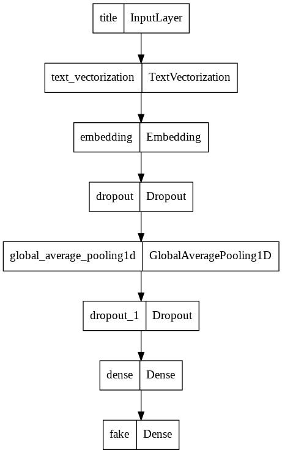
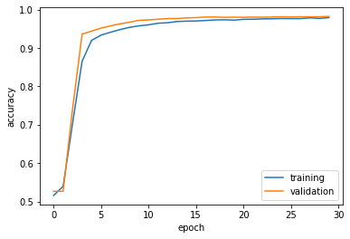
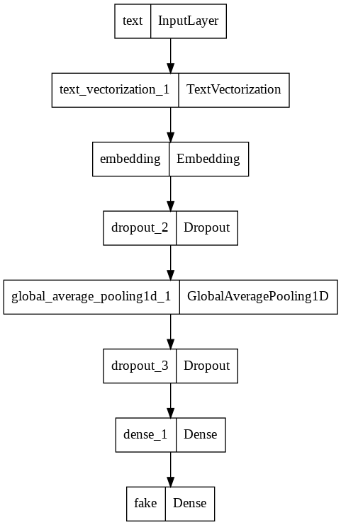
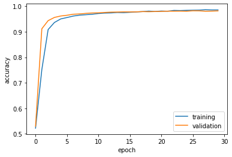
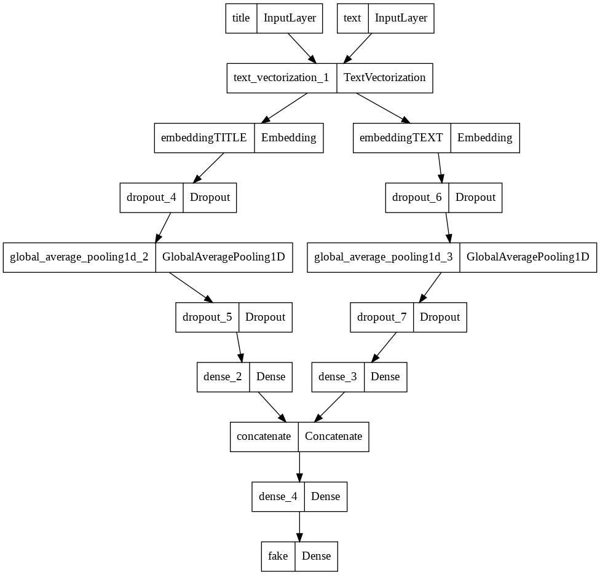
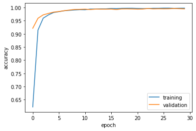

# §1. Acquire Training Data


```python
import numpy as np
import pandas as pd
import tensorflow as tf
import re
import string
from matplotlib import pyplot as plt
```


```python
from tensorflow.keras import layers
from tensorflow.keras import losses
from tensorflow import keras
from sklearn.decomposition import PCA  
```


```python
from tensorflow.keras.layers.experimental.preprocessing import TextVectorization
from tensorflow.keras.layers.experimental.preprocessing import StringLookup

from sklearn.model_selection import train_test_split
from sklearn.preprocessing import LabelEncoder

import plotly.express as px 
import plotly.io as pio
from plotly.io import write_html
pio.templates.default = "plotly_white"
```


```python
train_url = "https://github.com/PhilChodrow/PIC16b/blob/master/datasets/fake_news_train.csv?raw=true"
train_data = pd.read_csv(train_url)
```


```python
train_data.head()
```


<div>
<style scoped>
    .dataframe tbody tr th:only-of-type {
        vertical-align: middle;
    }

    .dataframe tbody tr th {
        vertical-align: top;
    }

    .dataframe thead th {
        text-align: right;
    }
</style>
<table border="1" class="dataframe">
  <thead>
    <tr style="text-align: right;">
      <th></th>
      <th>Unnamed: 0</th>
      <th>title</th>
      <th>text</th>
      <th>fake</th>
    </tr>
  </thead>
  <tbody>
    <tr>
      <th>0</th>
      <td>17366</td>
      <td>Merkel: Strong result for Austria's FPO 'big c...</td>
      <td>German Chancellor Angela Merkel said on Monday...</td>
      <td>0</td>
    </tr>
    <tr>
      <th>1</th>
      <td>5634</td>
      <td>Trump says Pence will lead voter fraud panel</td>
      <td>WEST PALM BEACH, Fla.President Donald Trump sa...</td>
      <td>0</td>
    </tr>
    <tr>
      <th>2</th>
      <td>17487</td>
      <td>JUST IN: SUSPECTED LEAKER and “Close Confidant...</td>
      <td>On December 5, 2017, Circa s Sara Carter warne...</td>
      <td>1</td>
    </tr>
    <tr>
      <th>3</th>
      <td>12217</td>
      <td>Thyssenkrupp has offered help to Argentina ove...</td>
      <td>Germany s Thyssenkrupp, has offered assistance...</td>
      <td>0</td>
    </tr>
    <tr>
      <th>4</th>
      <td>5535</td>
      <td>Trump say appeals court decision on travel ban...</td>
      <td>President Donald Trump on Thursday called the ...</td>
      <td>0</td>
    </tr>
  </tbody>
</table>
</div>


# §2. Make a Dataset

Write a function called make_dataset. This function should do two things:
Remove stopwords from the article text and title. 

1.   Remove stopwords from the article text and title. 
2.   Construct and return a tf.data.Dataset with two inputs and one output. The input should be of the form (title, text), and the output should consist only of the fake column. 


```python
import nltk
nltk.download('stopwords')
```

    [nltk_data] Downloading package stopwords to /root/nltk_data...
    [nltk_data]   Package stopwords is already up-to-date!


    True


```python
from nltk.corpus import stopwords
stop = stopwords.words('english')
```


```python
def make_dataset(train_data):
  # remove stopwords
  train_data['title_no_sw'] = train_data['title'] .apply(lambda x: ' '.join([word for word in x.split() if word not in (stop)]))
  train_data['text_no_sw'] = train_data['text'] .apply(lambda x: ' '.join([word for word in x.split() if word not in (stop)]))

  data = tf.data.Dataset.from_tensor_slices(
    (
        {
            "title" : train_data[["title_no_sw"]], 
            "text" : train_data[["text_no_sw"]],
        }, 
        {
            "fake" : train_data[["fake"]]
        }
    )
  )

  data = data.batch(100)
  return data
```


```python
# apply make_dataset function on the dataset
Dataset = make_dataset(train_data)
```

Validation Data - Split 20% of the primary dataset to use for validation


```python
train_size = int(0.8*len(Dataset))
train = Dataset.take(train_size)   
val   = Dataset.skip(train_size)   
len(train), len(val)
```


    (180, 45)


Base Rate (the accuracy of a model that always makes the same guess)


```python
labels_iterator= train.unbatch().map(lambda image,fake: fake).as_numpy_iterator()
True_Article = 0
Fake_Article = 0
for LABEL in labels_iterator:
    if LABEL["fake"] == 1:
      Fake_Article += 1
    else:
      True_Article += 1
```


```python
base_rate = Fake_Article / (Fake_Article + True_Article)
print(base_rate)
```

    0.5220555555555556


The base rate for this data set is approximately 0.522, which means if a model predicts "fake" for a random piece of news, the prediction accuracy is around 52.2%.

# §3. Create Models

Use TensorFlow models to offer a perspective on the following question:

When detecting fake news, is it most effective to focus on only the title of the article, the full text of the article, or both?

To address this question, create three (3) TensorFlow models.


1. In the first model, you should use only the article title as an input.
2. In the second model, you should use only the article text as an input.
3. In the third model, you should use both the article title and the article text as input.


### Model 1: Article title as input


```python
size_vocabulary = 2000

# function for text standardization
def standardization(input_data):    
    # change all letters to lowercase
    lowercase = tf.strings.lower(input_data)
    # remove punctuations
    no_punctuation = tf.strings.regex_replace(lowercase,
                                  '[%s]' % re.escape(string.punctuation),'')
    return no_punctuation 

# function for text vectorization
vectorize_layer = TextVectorization(
    standardize = standardization, 
    max_tokens = size_vocabulary, 
    output_mode='int',
    output_sequence_length=500) 

# vectorization layer
vectorize_layer.adapt(train.map(lambda x, y: x["title"]))
```


```python
title_input = keras.Input(
    shape = (1,),
    name = "title",
    dtype = "string"
)
```


```python
title_features = vectorize_layer(title_input)
title_features = layers.Embedding(size_vocabulary, 3, name = "embedding")(title_features)
title_features = layers.Dropout(0.2)(title_features)
title_features = layers.GlobalAveragePooling1D()(title_features)
title_features = layers.Dropout(0.2)(title_features)
title_features = layers.Dense(12, activation='relu')(title_features)
```


```python
output = layers.Dense(2, name = "fake")(title_features)
```


```python
# use article title as input for model 1
model1 = keras.Model(
    inputs = title_input,
    outputs = output)

```


```python
model1.summary()
```

    Model: "model"
    _________________________________________________________________
     Layer (type)                Output Shape              Param #   
    =================================================================
     title (InputLayer)          [(None, 1)]               0         
                                                                     
     text_vectorization (TextVec  (None, 500)              0         
     torization)                                                     
                                                                     
     embedding (Embedding)       (None, 500, 3)            6000      
                                                                     
     dropout (Dropout)           (None, 500, 3)            0         
                                                                     
     global_average_pooling1d (G  (None, 3)                0         
     lobalAveragePooling1D)                                          
                                                                     
     dropout_1 (Dropout)         (None, 3)                 0         
                                                                     
     dense (Dense)               (None, 12)                48        
                                                                     
     fake (Dense)                (None, 2)                 26        
                                                                     
    =================================================================
    Total params: 6,074
    Trainable params: 6,074
    Non-trainable params: 0
    _________________________________________________________________


```python
# Plot model 1
keras.utils.plot_model(model1)  
```


    

    


```python
model1.compile(optimizer = "adam",
              loss = losses.SparseCategoricalCrossentropy(from_logits=True),
              metrics=['accuracy'])
```


```python
# Train model1
history = model1.fit(train,
                    validation_data=val,
                    epochs = 30)
```

    Epoch 1/30


    /usr/local/lib/python3.7/dist-packages/keras/engine/functional.py:559: UserWarning:
    
    Input dict contained keys ['text'] which did not match any model input. They will be ignored by the model.
    


    180/180 [==============================] - 2s 10ms/step - loss: 0.6923 - accuracy: 0.5158 - val_loss: 0.6898 - val_accuracy: 0.5266
    Epoch 2/30
    180/180 [==============================] - 1s 8ms/step - loss: 0.6858 - accuracy: 0.5396 - val_loss: 0.6763 - val_accuracy: 0.5266
    Epoch 3/30
    180/180 [==============================] - 1s 8ms/step - loss: 0.6564 - accuracy: 0.7041 - val_loss: 0.6259 - val_accuracy: 0.7420
    Epoch 4/30
    180/180 [==============================] - 2s 9ms/step - loss: 0.5782 - accuracy: 0.8656 - val_loss: 0.5154 - val_accuracy: 0.9364
    Epoch 5/30
    180/180 [==============================] - 2s 9ms/step - loss: 0.4528 - accuracy: 0.9201 - val_loss: 0.3808 - val_accuracy: 0.9443
    Epoch 6/30
    180/180 [==============================] - 1s 8ms/step - loss: 0.3368 - accuracy: 0.9338 - val_loss: 0.2802 - val_accuracy: 0.9519
    Epoch 7/30
    180/180 [==============================] - 1s 8ms/step - loss: 0.2607 - accuracy: 0.9413 - val_loss: 0.2166 - val_accuracy: 0.9580
    Epoch 8/30
    180/180 [==============================] - 1s 8ms/step - loss: 0.2142 - accuracy: 0.9482 - val_loss: 0.1752 - val_accuracy: 0.9631
    Epoch 9/30
    180/180 [==============================] - 1s 8ms/step - loss: 0.1814 - accuracy: 0.9539 - val_loss: 0.1470 - val_accuracy: 0.9674
    Epoch 10/30
    180/180 [==============================] - 2s 8ms/step - loss: 0.1581 - accuracy: 0.9580 - val_loss: 0.1276 - val_accuracy: 0.9724
    Epoch 11/30
    180/180 [==============================] - 2s 9ms/step - loss: 0.1400 - accuracy: 0.9606 - val_loss: 0.1132 - val_accuracy: 0.9733
    Epoch 12/30
    180/180 [==============================] - 2s 9ms/step - loss: 0.1266 - accuracy: 0.9648 - val_loss: 0.1029 - val_accuracy: 0.9753
    Epoch 13/30
    180/180 [==============================] - 1s 8ms/step - loss: 0.1157 - accuracy: 0.9661 - val_loss: 0.0946 - val_accuracy: 0.9768
    Epoch 14/30
    180/180 [==============================] - 1s 8ms/step - loss: 0.1069 - accuracy: 0.9692 - val_loss: 0.0857 - val_accuracy: 0.9771
    Epoch 15/30
    180/180 [==============================] - 2s 9ms/step - loss: 0.1004 - accuracy: 0.9701 - val_loss: 0.0786 - val_accuracy: 0.9786
    Epoch 16/30
    180/180 [==============================] - 1s 8ms/step - loss: 0.0955 - accuracy: 0.9706 - val_loss: 0.0746 - val_accuracy: 0.9793
    Epoch 17/30
    180/180 [==============================] - 1s 8ms/step - loss: 0.0891 - accuracy: 0.9718 - val_loss: 0.0717 - val_accuracy: 0.9809
    Epoch 18/30
    180/180 [==============================] - 1s 8ms/step - loss: 0.0854 - accuracy: 0.9733 - val_loss: 0.0684 - val_accuracy: 0.9809
    Epoch 19/30
    180/180 [==============================] - 1s 8ms/step - loss: 0.0805 - accuracy: 0.9737 - val_loss: 0.0660 - val_accuracy: 0.9800
    Epoch 20/30
    180/180 [==============================] - 1s 8ms/step - loss: 0.0810 - accuracy: 0.9728 - val_loss: 0.0615 - val_accuracy: 0.9804
    Epoch 21/30
    180/180 [==============================] - 1s 8ms/step - loss: 0.0748 - accuracy: 0.9748 - val_loss: 0.0591 - val_accuracy: 0.9802
    Epoch 22/30
    180/180 [==============================] - 1s 8ms/step - loss: 0.0734 - accuracy: 0.9751 - val_loss: 0.0576 - val_accuracy: 0.9807
    Epoch 23/30
    180/180 [==============================] - 2s 9ms/step - loss: 0.0695 - accuracy: 0.9759 - val_loss: 0.0617 - val_accuracy: 0.9804
    Epoch 24/30
    180/180 [==============================] - 1s 8ms/step - loss: 0.0679 - accuracy: 0.9763 - val_loss: 0.0550 - val_accuracy: 0.9809
    Epoch 25/30
    180/180 [==============================] - 1s 8ms/step - loss: 0.0659 - accuracy: 0.9770 - val_loss: 0.0548 - val_accuracy: 0.9816
    Epoch 26/30
    180/180 [==============================] - 2s 9ms/step - loss: 0.0648 - accuracy: 0.9768 - val_loss: 0.0529 - val_accuracy: 0.9811
    Epoch 27/30
    180/180 [==============================] - 1s 8ms/step - loss: 0.0638 - accuracy: 0.9768 - val_loss: 0.0525 - val_accuracy: 0.9816
    Epoch 28/30
    180/180 [==============================] - 2s 9ms/step - loss: 0.0612 - accuracy: 0.9787 - val_loss: 0.0514 - val_accuracy: 0.9816
    Epoch 29/30
    180/180 [==============================] - 2s 9ms/step - loss: 0.0611 - accuracy: 0.9773 - val_loss: 0.0506 - val_accuracy: 0.9816
    Epoch 30/30
    180/180 [==============================] - 2s 9ms/step - loss: 0.0587 - accuracy: 0.9794 - val_loss: 0.0492 - val_accuracy: 0.9822


```python
plt.plot(history.history["accuracy"], label = "training")
plt.plot(history.history["val_accuracy"], label = "validation")
plt.gca().set(xlabel = "epoch", ylabel = "accuracy")
plt.legend()
```


    <matplotlib.legend.Legend at 0x7fe77c9a3650>


    

    


The plot above shows that Model 1 (with article title as input) is able to achieve around 98% validation accuracy with no overfitting observed as validation accuracy is almost consistently above training accuracy due to the dropout layers.

# Model 2: Article text as input


```python
size_vocabulary = 2000

# function for text standardization
def standardization(input_data):
    lowercase = tf.strings.lower(input_data)
    no_punctuation = tf.strings.regex_replace(lowercase,
                                  '[%s]' % re.escape(string.punctuation),'')
    return no_punctuation 

# function for text vectorization
vectorize_layer = TextVectorization(
    standardize=standardization,
    max_tokens=size_vocabulary, # only consider this many words
    output_mode='int',
    output_sequence_length=500) 

# vectorization layer
vectorize_layer.adapt(train.map(lambda x, y: x["text"]))
```


```python
text_input = keras.Input(
    shape = (1,),
    name = "text",
    dtype = "string"
)
```


```python
text_features = vectorize_layer(text_input)
text_features = layers.Embedding(size_vocabulary, 3, name = "embedding")(text_features)
text_features = layers.Dropout(0.2)(text_features)
text_features = layers.GlobalAveragePooling1D()(text_features)
text_features = layers.Dropout(0.2)(text_features)
text_features = layers.Dense(12, activation='relu')(text_features)
# Set up the text layers as we discussed in the lecture
```


```python
output = layers.Dense(2, name = "fake")(text_features)
```


```python
# use article text as input for model 2
model2 = keras.Model(
    inputs = text_input,
    outputs = output)
```


```python
model2.summary()
```

    Model: "model_1"
    _________________________________________________________________
     Layer (type)                Output Shape              Param #   
    =================================================================
     text (InputLayer)           [(None, 1)]               0         
                                                                     
     text_vectorization_1 (TextV  (None, 500)              0         
     ectorization)                                                   
                                                                     
     embedding (Embedding)       (None, 500, 3)            6000      
                                                                     
     dropout_2 (Dropout)         (None, 500, 3)            0         
                                                                     
     global_average_pooling1d_1   (None, 3)                0         
     (GlobalAveragePooling1D)                                        
                                                                     
     dropout_3 (Dropout)         (None, 3)                 0         
                                                                     
     dense_1 (Dense)             (None, 12)                48        
                                                                     
     fake (Dense)                (None, 2)                 26        
                                                                     
    =================================================================
    Total params: 6,074
    Trainable params: 6,074
    Non-trainable params: 0
    _________________________________________________________________


```python
# Plot model 2
keras.utils.plot_model(model2) 
```


    

    


```python
model2.compile(optimizer = "adam",
              loss = losses.SparseCategoricalCrossentropy(from_logits=True),
              metrics=['accuracy'])
```


```python
# Train model2
history = model2.fit(train,
                    validation_data=val,
                    epochs = 30)
```

    Epoch 1/30


    /usr/local/lib/python3.7/dist-packages/keras/engine/functional.py:559: UserWarning:
    
    Input dict contained keys ['title'] which did not match any model input. They will be ignored by the model.
    


    180/180 [==============================] - 4s 16ms/step - loss: 0.6886 - accuracy: 0.5223 - val_loss: 0.6771 - val_accuracy: 0.5298
    Epoch 2/30
    180/180 [==============================] - 3s 15ms/step - loss: 0.6137 - accuracy: 0.7518 - val_loss: 0.4966 - val_accuracy: 0.9117
    Epoch 3/30
    180/180 [==============================] - 3s 15ms/step - loss: 0.3894 - accuracy: 0.9085 - val_loss: 0.2897 - val_accuracy: 0.9434
    Epoch 4/30
    180/180 [==============================] - 3s 15ms/step - loss: 0.2598 - accuracy: 0.9362 - val_loss: 0.2122 - val_accuracy: 0.9559
    Epoch 5/30
    180/180 [==============================] - 3s 15ms/step - loss: 0.2072 - accuracy: 0.9501 - val_loss: 0.1744 - val_accuracy: 0.9616
    Epoch 6/30
    180/180 [==============================] - 3s 15ms/step - loss: 0.1738 - accuracy: 0.9556 - val_loss: 0.1510 - val_accuracy: 0.9645
    Epoch 7/30
    180/180 [==============================] - 3s 15ms/step - loss: 0.1535 - accuracy: 0.9614 - val_loss: 0.1352 - val_accuracy: 0.9685
    Epoch 8/30
    180/180 [==============================] - 3s 15ms/step - loss: 0.1381 - accuracy: 0.9648 - val_loss: 0.1242 - val_accuracy: 0.9697
    Epoch 9/30
    180/180 [==============================] - 3s 15ms/step - loss: 0.1280 - accuracy: 0.9666 - val_loss: 0.1152 - val_accuracy: 0.9719
    Epoch 10/30
    180/180 [==============================] - 3s 15ms/step - loss: 0.1159 - accuracy: 0.9683 - val_loss: 0.1082 - val_accuracy: 0.9735
    Epoch 11/30
    180/180 [==============================] - 3s 15ms/step - loss: 0.1092 - accuracy: 0.9713 - val_loss: 0.1021 - val_accuracy: 0.9739
    Epoch 12/30
    180/180 [==============================] - 3s 15ms/step - loss: 0.1022 - accuracy: 0.9730 - val_loss: 0.0983 - val_accuracy: 0.9755
    Epoch 13/30
    180/180 [==============================] - 3s 15ms/step - loss: 0.0987 - accuracy: 0.9738 - val_loss: 0.0941 - val_accuracy: 0.9766
    Epoch 14/30
    180/180 [==============================] - 3s 15ms/step - loss: 0.0927 - accuracy: 0.9753 - val_loss: 0.0913 - val_accuracy: 0.9771
    Epoch 15/30
    180/180 [==============================] - 3s 16ms/step - loss: 0.0874 - accuracy: 0.9746 - val_loss: 0.0897 - val_accuracy: 0.9777
    Epoch 16/30
    180/180 [==============================] - 3s 15ms/step - loss: 0.0825 - accuracy: 0.9761 - val_loss: 0.0877 - val_accuracy: 0.9775
    Epoch 17/30
    180/180 [==============================] - 3s 16ms/step - loss: 0.0788 - accuracy: 0.9774 - val_loss: 0.0869 - val_accuracy: 0.9777
    Epoch 18/30
    180/180 [==============================] - 3s 15ms/step - loss: 0.0755 - accuracy: 0.9789 - val_loss: 0.0857 - val_accuracy: 0.9789
    Epoch 19/30
    180/180 [==============================] - 3s 15ms/step - loss: 0.0713 - accuracy: 0.9808 - val_loss: 0.0836 - val_accuracy: 0.9784
    Epoch 20/30
    180/180 [==============================] - 3s 15ms/step - loss: 0.0708 - accuracy: 0.9793 - val_loss: 0.0824 - val_accuracy: 0.9791
    Epoch 21/30
    180/180 [==============================] - 3s 15ms/step - loss: 0.0655 - accuracy: 0.9811 - val_loss: 0.0803 - val_accuracy: 0.9795
    Epoch 22/30
    180/180 [==============================] - 3s 15ms/step - loss: 0.0648 - accuracy: 0.9803 - val_loss: 0.0791 - val_accuracy: 0.9804
    Epoch 23/30
    180/180 [==============================] - 3s 15ms/step - loss: 0.0614 - accuracy: 0.9834 - val_loss: 0.0792 - val_accuracy: 0.9804
    Epoch 24/30
    180/180 [==============================] - 3s 16ms/step - loss: 0.0598 - accuracy: 0.9828 - val_loss: 0.0798 - val_accuracy: 0.9807
    Epoch 25/30
    180/180 [==============================] - 3s 15ms/step - loss: 0.0557 - accuracy: 0.9837 - val_loss: 0.0798 - val_accuracy: 0.9802
    Epoch 26/30
    180/180 [==============================] - 3s 17ms/step - loss: 0.0556 - accuracy: 0.9842 - val_loss: 0.0764 - val_accuracy: 0.9820
    Epoch 27/30
    180/180 [==============================] - 3s 15ms/step - loss: 0.0534 - accuracy: 0.9847 - val_loss: 0.0767 - val_accuracy: 0.9818
    Epoch 28/30
    180/180 [==============================] - 3s 15ms/step - loss: 0.0494 - accuracy: 0.9861 - val_loss: 0.0813 - val_accuracy: 0.9802
    Epoch 29/30
    180/180 [==============================] - 3s 15ms/step - loss: 0.0489 - accuracy: 0.9853 - val_loss: 0.0783 - val_accuracy: 0.9807
    Epoch 30/30
    180/180 [==============================] - 3s 15ms/step - loss: 0.0478 - accuracy: 0.9853 - val_loss: 0.0778 - val_accuracy: 0.9816


```python
plt.plot(history.history["accuracy"], label = "training")
plt.plot(history.history["val_accuracy"], label = "validation")
plt.gca().set(xlabel = "epoch", ylabel = "accuracy")
plt.legend()
```


    <matplotlib.legend.Legend at 0x7fe77a76bbd0>


    

    


The plot above shows that Model 2 (with article text as input) is able to achieve around 98% validation accuracy with no overfitting observed.

# Model 3: Article title and text as input


```python
# layer from Model 1
title_features = vectorize_layer(title_input)
title_features = layers.Embedding(size_vocabulary, 3, name = "embeddingTITLE")(title_features)
title_features = layers.Dropout(0.2)(title_features)
title_features = layers.GlobalAveragePooling1D()(title_features)
title_features = layers.Dropout(0.2)(title_features)
title_features = layers.Dense(12, activation='relu')(title_features)
```


```python
# layer from Model 2
text_features = vectorize_layer(text_input)
text_features = layers.Embedding(size_vocabulary, 3, name = "embeddingTEXT")(text_features)
text_features = layers.Dropout(0.2)(text_features)
text_features = layers.GlobalAveragePooling1D()(text_features)
text_features = layers.Dropout(0.2)(text_features)
text_features = layers.Dense(12, activation='relu')(text_features)
```


```python
# concatenate layers 
main = layers.concatenate([title_features, text_features], axis = 1)
# add one output layer
main = layers.Dense(32, activation='relu')(main)
output = layers.Dense(2, name = "fake")(main)

```


```python
# use article title and text as input for model 3
model3 = keras.Model(
    inputs = [title_input, text_input],
    outputs = output)
```


```python
model3.summary()
```

    Model: "model_2"
    __________________________________________________________________________________________________
     Layer (type)                   Output Shape         Param #     Connected to                     
    ==================================================================================================
     title (InputLayer)             [(None, 1)]          0           []                               
                                                                                                      
     text (InputLayer)              [(None, 1)]          0           []                               
                                                                                                      
     text_vectorization_1 (TextVect  (None, 500)         0           ['title[0][0]',                  
     orization)                                                       'text[0][0]']                   
                                                                                                      
     embeddingTITLE (Embedding)     (None, 500, 3)       6000        ['text_vectorization_1[1][0]']   
                                                                                                      
     embeddingTEXT (Embedding)      (None, 500, 3)       6000        ['text_vectorization_1[2][0]']   
                                                                                                      
     dropout_4 (Dropout)            (None, 500, 3)       0           ['embeddingTITLE[0][0]']         
                                                                                                      
     dropout_6 (Dropout)            (None, 500, 3)       0           ['embeddingTEXT[0][0]']          
                                                                                                      
     global_average_pooling1d_2 (Gl  (None, 3)           0           ['dropout_4[0][0]']              
     obalAveragePooling1D)                                                                            
                                                                                                      
     global_average_pooling1d_3 (Gl  (None, 3)           0           ['dropout_6[0][0]']              
     obalAveragePooling1D)                                                                            
                                                                                                      
     dropout_5 (Dropout)            (None, 3)            0           ['global_average_pooling1d_2[0][0
                                                                     ]']                              
                                                                                                      
     dropout_7 (Dropout)            (None, 3)            0           ['global_average_pooling1d_3[0][0
                                                                     ]']                              
                                                                                                      
     dense_2 (Dense)                (None, 12)           48          ['dropout_5[0][0]']              
                                                                                                      
     dense_3 (Dense)                (None, 12)           48          ['dropout_7[0][0]']              
                                                                                                      
     concatenate (Concatenate)      (None, 24)           0           ['dense_2[0][0]',                
                                                                      'dense_3[0][0]']                
                                                                                                      
     dense_4 (Dense)                (None, 32)           800         ['concatenate[0][0]']            
                                                                                                      
     fake (Dense)                   (None, 2)            66          ['dense_4[0][0]']                
                                                                                                      
    ==================================================================================================
    Total params: 12,962
    Trainable params: 12,962
    Non-trainable params: 0
    __________________________________________________________________________________________________


```python
# plot Model 3
keras.utils.plot_model(model3)
```


    

    


```python
model3.compile(optimizer = "adam",
              loss = losses.SparseCategoricalCrossentropy(from_logits=True),
              metrics=['accuracy'])

```


```python
# Train Model 3
history = model3.fit(train,
                    validation_data=val,
                    epochs = 30)

```

    Epoch 1/30
    180/180 [==============================] - 5s 21ms/step - loss: 0.6621 - accuracy: 0.6224 - val_loss: 0.5347 - val_accuracy: 0.9213
    Epoch 2/30
    180/180 [==============================] - 4s 20ms/step - loss: 0.3148 - accuracy: 0.9144 - val_loss: 0.1746 - val_accuracy: 0.9593
    Epoch 3/30
    180/180 [==============================] - 4s 20ms/step - loss: 0.1521 - accuracy: 0.9598 - val_loss: 0.1110 - val_accuracy: 0.9724
    Epoch 4/30
    180/180 [==============================] - 4s 20ms/step - loss: 0.1048 - accuracy: 0.9722 - val_loss: 0.0827 - val_accuracy: 0.9777
    Epoch 5/30
    180/180 [==============================] - 4s 20ms/step - loss: 0.0755 - accuracy: 0.9813 - val_loss: 0.0612 - val_accuracy: 0.9827
    Epoch 6/30
    180/180 [==============================] - 4s 20ms/step - loss: 0.0565 - accuracy: 0.9844 - val_loss: 0.0469 - val_accuracy: 0.9849
    Epoch 7/30
    180/180 [==============================] - 4s 20ms/step - loss: 0.0453 - accuracy: 0.9879 - val_loss: 0.0368 - val_accuracy: 0.9881
    Epoch 8/30
    180/180 [==============================] - 4s 20ms/step - loss: 0.0375 - accuracy: 0.9894 - val_loss: 0.0309 - val_accuracy: 0.9906
    Epoch 9/30
    180/180 [==============================] - 4s 20ms/step - loss: 0.0318 - accuracy: 0.9909 - val_loss: 0.0257 - val_accuracy: 0.9928
    Epoch 10/30
    180/180 [==============================] - 4s 20ms/step - loss: 0.0273 - accuracy: 0.9920 - val_loss: 0.0241 - val_accuracy: 0.9933
    Epoch 11/30
    180/180 [==============================] - 4s 20ms/step - loss: 0.0262 - accuracy: 0.9917 - val_loss: 0.0216 - val_accuracy: 0.9939
    Epoch 12/30
    180/180 [==============================] - 4s 20ms/step - loss: 0.0205 - accuracy: 0.9945 - val_loss: 0.0239 - val_accuracy: 0.9926
    Epoch 13/30
    180/180 [==============================] - 4s 20ms/step - loss: 0.0183 - accuracy: 0.9943 - val_loss: 0.0199 - val_accuracy: 0.9942
    Epoch 14/30
    180/180 [==============================] - 4s 20ms/step - loss: 0.0178 - accuracy: 0.9952 - val_loss: 0.0183 - val_accuracy: 0.9939
    Epoch 15/30
    180/180 [==============================] - 4s 20ms/step - loss: 0.0160 - accuracy: 0.9952 - val_loss: 0.0183 - val_accuracy: 0.9939
    Epoch 16/30
    180/180 [==============================] - 4s 20ms/step - loss: 0.0137 - accuracy: 0.9966 - val_loss: 0.0187 - val_accuracy: 0.9942
    Epoch 17/30
    180/180 [==============================] - 4s 20ms/step - loss: 0.0138 - accuracy: 0.9960 - val_loss: 0.0222 - val_accuracy: 0.9926
    Epoch 18/30
    180/180 [==============================] - 4s 20ms/step - loss: 0.0117 - accuracy: 0.9972 - val_loss: 0.0169 - val_accuracy: 0.9948
    Epoch 19/30
    180/180 [==============================] - 4s 20ms/step - loss: 0.0101 - accuracy: 0.9973 - val_loss: 0.0169 - val_accuracy: 0.9951
    Epoch 20/30
    180/180 [==============================] - 4s 20ms/step - loss: 0.0102 - accuracy: 0.9974 - val_loss: 0.0185 - val_accuracy: 0.9946
    Epoch 21/30
    180/180 [==============================] - 4s 20ms/step - loss: 0.0099 - accuracy: 0.9968 - val_loss: 0.0193 - val_accuracy: 0.9939
    Epoch 22/30
    180/180 [==============================] - 4s 20ms/step - loss: 0.0108 - accuracy: 0.9962 - val_loss: 0.0180 - val_accuracy: 0.9944
    Epoch 23/30
    180/180 [==============================] - 4s 20ms/step - loss: 0.0104 - accuracy: 0.9963 - val_loss: 0.0162 - val_accuracy: 0.9964
    Epoch 24/30
    180/180 [==============================] - 4s 20ms/step - loss: 0.0085 - accuracy: 0.9973 - val_loss: 0.0169 - val_accuracy: 0.9951
    Epoch 25/30
    180/180 [==============================] - 4s 20ms/step - loss: 0.0086 - accuracy: 0.9973 - val_loss: 0.0174 - val_accuracy: 0.9955
    Epoch 26/30
    180/180 [==============================] - 4s 20ms/step - loss: 0.0070 - accuracy: 0.9979 - val_loss: 0.0165 - val_accuracy: 0.9953
    Epoch 27/30
    180/180 [==============================] - 4s 20ms/step - loss: 0.0074 - accuracy: 0.9979 - val_loss: 0.0175 - val_accuracy: 0.9955
    Epoch 28/30
    180/180 [==============================] - 4s 20ms/step - loss: 0.0082 - accuracy: 0.9971 - val_loss: 0.0167 - val_accuracy: 0.9964
    Epoch 29/30
    180/180 [==============================] - 4s 20ms/step - loss: 0.0080 - accuracy: 0.9975 - val_loss: 0.0178 - val_accuracy: 0.9957
    Epoch 30/30
    180/180 [==============================] - 4s 20ms/step - loss: 0.0071 - accuracy: 0.9977 - val_loss: 0.0177 - val_accuracy: 0.9951


```python
plt.plot(history.history["accuracy"], label = "training")
plt.plot(history.history["val_accuracy"], label = "validation")
plt.gca().set(xlabel = "epoch", ylabel = "accuracy")
plt.legend()
```


    <matplotlib.legend.Legend at 0x7fe77f359f50>


    

    


The plot above shows that Model 3 (with article title and text as input) is able to achieve around 99% validation accuracy with no overfitting observed due to the dropout layers.

# §4. Model Evaluation

Test best model (Model 3) performance on unseen test data


```python
test_url = "https://github.com/PhilChodrow/PIC16b/blob/master/datasets/fake_news_test.csv?raw=true"
test_data  = pd.read_csv(test_url)
```


```python
# convert this data using the make_dataset function defined in Part §2
test_data = make_dataset(test_data)
```


```python
model3.evaluate(test_data)
```

    225/225 [==============================] - 2s 10ms/step - loss: 0.0301 - accuracy: 0.9933


    [0.030065199360251427, 0.9933182001113892]


The accuracy of Model 3 on unseen test data is around an impressive 99%.

# §5. Embedding Visualization

Visualize and comment on the embedding that our model learned


```python
# weights from the embedding layer
weights = 0.5*(model3.get_layer('embeddingTITLE').get_weights()[0]) + 0.5*(model3.get_layer('embeddingTEXT').get_weights()[0])
vocab = vectorize_layer.get_vocabulary()  
```


```python
# convert data into 2 dimension 
pca = PCA(n_components=2)             
weights = pca.fit_transform(weights)
```


```python
embedding_df = pd.DataFrame({
    'word' : vocab, 
    'x0'   : weights[:,0],
    'x1'   : weights[:,1]
})
```


```python
fig = px.scatter(embedding_df, 
                 x = "x0", 
                 y = "x1", 
                 size = list(np.ones(len(embedding_df))),
                 size_max = 2,
                 hover_name = "word")

write_html(fig, "word_embed.html")
```


<html>
<head><meta charset="utf-8" /></head>
<body>
    <div>
            <script src="https://cdnjs.cloudflare.com/ajax/libs/mathjax/2.7.5/MathJax.js?config=TeX-AMS-MML_SVG"></script><script type="text/javascript">if (window.MathJax) {MathJax.Hub.Config({SVG: {font: "STIX-Web"}});}</script>
                <script type="text/javascript">window.PlotlyConfig = {MathJaxConfig: 'local'};</script>
        <script src="https://cdn.plot.ly/plotly-latest.min.js"></script>    
            <div id="86ff2376-34ce-4980-ace7-0d512f634341" class="plotly-graph-div" style="height:525px; width:100%;"></div>
            <script type="text/javascript">

                    window.PLOTLYENV=window.PLOTLYENV || {};

                if (document.getElementById("86ff2376-34ce-4980-ace7-0d512f634341")) {
                    Plotly.newPlot(
                        '86ff2376-34ce-4980-ace7-0d512f634341',
                        [{"hoverlabel": {"namelength": 0}, "hovertemplate": "<b>%{hovertext}</b><br><br>x0=%{x}<br>x1=%{y}<br>size=%{marker.size}", "hovertext": ["", "[UNK]", "said", "trump", "the", "us", "i", "would", "president", "people", "it", "one", "also", "new", "state", "donald", "house", "states", "government", "clinton", "he", "obama", "could", "republican", "told", "united", "in", "like", "white", "campaign", "we", "last", "two", "news", "time", "election", "first", "party", "this", "a", "even", "former", "year", "country", "but", "that", "hillary", "years", "many", "security", "political", "may", "say", "media", "make", "get", "made", "national", "since", "police", "law", "court", "republicans", "american", "going", "percent", "presidential", "and", "back", "democratic", "bill", "administration", "russia", "support", "think", "know", "week", "america", "north", "including", "senate", "public", "way", "trumps", "vote", "according", "group", "officials", "take", "office", "federal", "called", "they", "foreign", "right", "million", "statement", "saying", "world", "military", "department", "want", "tax", "washington", "well", "see", "you", "tuesday", "much", "russian", "still", "congress", "says", "another", "wednesday", "minister", "part", "there", "women", "day", "if", "work", "thursday", "go", "friday", "democrats", "policy", "asked", "2016", "monday", "war", "rights", "committee", "china", "next", "americans", "need", "secretary", "help", "deal", "city", "whether", "three", "official", "general", "black", "never", "case", "york", "korea", "leader", "around", "show", "order", "man", "come", "on", "members", "senator", "took", "meeting", "good", "report", "use", "countries", "candidate", "intelligence", "without", "power", "left", "put", "times", "fbi", "really", "used", "every", "she", "end", "attack", "money", "month", "investigation", "syria", "trade", "top", "decision", "fact", "justice", "twitter", "reported", "long", "information", "change", "family", "plan", "business", "already", "leaders", "groups", "international", "days", "here", "now", "nuclear", "story", "conservative", "several", "interview", "so", "far", "voters", "iran", "south", "as", "clear", "fox", "place", "however", "children", "months", "likely", "among", "health", "something", "issue", "director", "call", "program", "believe", "must", "got", "social", "agency", "speech", "move", "chief", "barack", "is", "press", "home", "least", "recent", "john", "came", "things", "school", "might", "immigration", "reporters", "control", "major", "number", "trying", "him", "found", "actually", "though", "act", "earlier", "seen", "great", "sanders", "post", "border", "islamic", "point", "billion", "matter", "killed", "sunday", "spokesman", "supporters", "system", "later", "yet", "today", "march", "give", "look", "went", "working", "nation", "economic", "thing", "keep", "them", "making", "at", "little", "win", "big", "real", "away", "executive", "muslim", "become", "free", "set", "for", "attacks", "more", "let", "past", "nothing", "legal", "member", "democrat", "all", "four", "violence", "added", "senior", "companies", "prime", "comment", "what", "ever", "july", "defense", "stop", "forces", "no", "european", "nations", "january", "not", "talks", "issues", "taking", "eu", "opposition", "known", "following", "held", "lawmakers", "better", "across", "continue", "local", "person", "human", "2015", "sanctions", "action", "cruz", "illegal", "company", "to", "expected", "gun", "care", "head", "given", "community", "process", "job", "legislation", "when", "enough", "others", "force", "financial", "governor", "woman", "possible", "june", "men", "high", "lot", "important", "wrote", "released", "pay", "done", "night", "wall", "source", "union", "team", "un", "history", "reports", "evidence", "course", "nominee", "attorney", "taken", "supreme", "majority", "face", "close", "response", "refugees", "anyone", "1", "run", "life", "conference", "syrian", "question", "open", "private", "special", "staff", "20", "judge", "using", "wants", "anything", "10", "ago", "mexico", "ban", "find", "november", "email", "plans", "second", "fight", "air", "less", "gop", "university", "comments", "budget", "best", "behind", "agreement", "mr", "future", "despite", "early", "ryan", "crisis", "accused", "able", "debate", "watch", "iraq", "instead", "while", "someone", "efforts", "role", "saturday", "putin", "along", "calling", "after", "race", "lives", "death", "comes", "five", "within", "weeks", "letter", "israel", "his", "name", "current", "region", "sure", "saudi", "service", "announced", "lead", "full", "jobs", "sources", "council", "economy", "visit", "hard", "civil", "getting", "october", "event", "due", "students", "global", "citizens", "running", "coalition", "paul", "congressional", "out", "with", "live", "young", "elections", "sent", "allow", "december", "britain", "emails", "line", "muslims", "center", "facebook", "texas", "effort", "coming", "chairman", "problem", "ties", "candidates", "rules", "nearly", "position", "8", "daily", "thousands", "authorities", "representatives", "wanted", "weapons", "2014", "september", "leave", "votes", "some", "led", "ruling", "needs", "middle", "street", "tell", "comey", "politics", "hold", "reform", "talk", "climate", "florida", "outside", "2", "relations", "army", "february", "began", "peace", "officers", "obamacare", "rule", "immediately", "claims", "failed", "15", "liberal", "april", "together", "whose", "bad", "criminal", "based", "east", "late", "means", "healthcare", "capital", "everyone", "words", "gave", "cannot", "central", "start", "access", "latest", "agencies", "bush", "message", "thought", "parliament", "lost", "do", "list", "again", "germany", "tried", "services", "questions", "different", "rather", "showed", "speaking", "sexual", "workers", "2017", "turkey", "decided", "immigrants", "bring", "read", "racist", "hope", "elected", "concerns", "strong", "protect", "conservatives", "voting", "policies", "six", "always", "charges", "ministry", "meet", "august", "try", "almost", "threat", "recently", "reason", "cut", "up", "organization", "stand", "millions", "energy", "idea", "spending", "poll", "enforcement", "planned", "involved", "george", "ahead", "makes", "received", "laws", "her", "fake", "denied", "everything", "allies", "allowed", "often", "industry", "happened", "entire", "district", "met", "morning", "allegations", "of", "parties", "provide", "missile", "shooting", "seems", "rally", "freedom", "3", "talking", "side", "market", "situation", "oil", "hate", "agreed", "fire", "key", "officer", "30", "large", "kind", "release", "century", "calls", "especially", "looking", "europe", "needed", "include", "fighting", "12", "nomination", "funding", "room", "bank", "shot", "small", "personal", "vice", "james", "adding", "j", "actions", "representative", "cases", "west", "presidency", "chinese", "me", "insurance", "realdonaldtrump", "movement", "data", "step", "potential", "clearly", "old", "either", "hearing", "near", "interest", "worked", "biggest", "true", "myanmar", "host", "confirmed", "western", "hit", "although", "feel", "california", "claim", "foundation", "voted", "alleged", "tweet", "request", "address", "spoke", "hours", "forward", "moscow", "wrong", "shows", "decades", "terrorist", "leading", "term", "fired", "arrested", "area", "2012", "british", "county", "polls", "documents", "5", "wife", "return", "11", "serious", "korean", "board", "s", "water", "building", "travel", "claimed", "front", "tillerson", "adviser", "declined", "relationship", "nov", "appeared", "father", "commission", "pressure", "david", "crime", "families", "passed", "main", "review", "continued", "terrorism", "love", "protesters", "25", "simply", "brought", "signed", "mean", "influence", "record", "dollars", "points", "toward", "probably", "paid", "network", "soon", "short", "result", "victory", "started", "taxes", "forced", "truth", "details", "aid", "pretty", "raised", "turned", "primary", "became", "4", "college", "posted", "previously", "mark", "food", "included", "mccain", "leadership", "mike", "spent", "pass", "merkel", "attempt", "whole", "popular", "debt", "turn", "son", "religious", "longer", "arabia", "independence", "friends", "agenda", "proposed", "view", "issued", "saw", "article", "michael", "2013", "our", "level", "created", "half", "giving", "seeking", "sign", "deputy", "rubio", "bernie", "protest", "german", "guy", "regional", "phone", "lawyer", "incident", "conflict", "total", "21st", "independent", "ted", "clintons", "described", "website", "obamas", "criticized", "respond", "currently", "these", "example", "child", "final", "areas", "push", "hand", "living", "helped", "else", "account", "remarks", "mayor", "increase", "hundreds", "ask", "ambassador", "similar", "fund", "firm", "speak", "constitution", "fear", "absolutely", "armed", "town", "pence", "changes", "speaker", "heard", "violent", "sessions", "robert", "mass", "by", "education", "telling", "protests", "third", "largest", "remain", "programs", "goes", "repeatedly", "discuss", "an", "refugee", "reality", "published", "inside", "risk", "spokeswoman", "how", "employees", "japan", "secret", "flynn", "hands", "medical", "appears", "rate", "experts", "apparently", "18", "lower", "san", "tweeted", "convention", "page", "are", "individuals", "understand", "warned", "focus", "form", "mainstream", "tv", "single", "research", "flag", "asking", "opinion", "safety", "proposal", "cost", "build", "24", "seven", "cause", "why", "politicians", "photo", "johnson", "criticism", "completely", "television", "interests", "voter", "100", "share", "businesses", "previous", "measures", "victims", "problems", "nato", "transition", "quickly", "happen", "prevent", "development", "militants", "carolina", "fellow", "schools", "online", "funds", "respect", "stay", "concern", "served", "presidentelect", "crowd", "seek", "then", "northern", "christian", "provided", "urged", "cia", "16", "its", "al", "student", "king", "senators", "project", "powerful", "land", "radio", "book", "6", "iraqi", "exactly", "create", "committed", "southern", "dangerous", "13", "poor", "attention", "coverage", "charged", "certainly", "parents", "safe", "troops", "isis", "trip", "joe", "responsible", "base", "threats", "events", "numbers", "concerned", "consider", "yes", "gets", "considered", "presidents", "drug", "results", "named", "france", "measure", "operations", "responded", "organizations", "false", "died", "island", "answer", "rohingya", "filed", "ground", "14", "target", "hear", "fraud", "holding", "governments", "certain", "series", "knew", "society", "residents", "were", "leaving", "panel", "internet", "choice", "french", "expressed", "brexit", "chance", "reporter", "down", "assault", "cuts", "critical", "church", "charge", "takes", "moment", "kurdish", "favor", "ensure", "sides", "just", "eight", "democracy", "who", "terms", "investment", "9", "diplomatic", "backed", "rhetoric", "ready", "50", "knows", "because", "parts", "corruption", "virginia", "growing", "class", "affairs", "believed", "refused", "difficult", "worst", "mcconnell", "behavior", "kelly", "repeal", "protection", "impact", "complete", "send", "expect", "low", "reached", "serve", "individual", "terrorists", "standing", "direct", "rep", "prison", "records", "negotiations", "approved", "huge", "beyond", "husband", "sean", "views", "threatened", "terror", "suggested", "critics", "referendum", "agents", "7", "play", "ordered", "offered", "moore", "newspaper", "courts", "agree", "massive", "gas", "statements", "cities", "mother", "exchange", "about", "paris", "believes", "labor", "offer", "continues", "cabinet", "avoid", "progress", "ways", "maybe", "finally", "radical", "london", "defend", "car", "strategy", "ability", "scandal", "star", "sought", "screen", "population", "amendment", "regulations", "19", "word", "reach", "dnc", "joint", "domestic", "supported", "sen", "before", "authority", "god", "corporate", "canada", "2011", "27", "related", "perhaps", "lack", "growth", "counsel", "my", "chris", "2018", "weekend", "remains", "crimes", "per", "guns", "effect", "common", "opportunity", "abortion", "rest", "period", "dead", "includes", "accept", "21", "o", "test", "22", "body", "promised", "daughter", "buy", "w", "operation", "friend", "caused", "17", "lies", "considering", "status", "credit", "showing", "rich", "publicly", "killing", "2008", "attacked", "activists", "willing", "raise", "worth", "summit", "looks", "during", "announcement", "replace", "kim", "higher", "gone", "facts", "minority", "lawsuit", "worse", "supporting", "costs", "significant", "inc", "additional", "lose", "establishment", "towards", "environmental", "2010", "xi", "opposed", "spicer", "multiple", "jan", "citing", "arab", "sense", "join", "cyber", "capture", "gay", "from", "declared", "particularly", "lawyers", "mind", "chicago", "income", "becoming", "fair", "red", "macron", "directly", "referring", "noted", "quite", "block", "challenge", "socalled", "fiscal", "mexican", "arms", "supporter", "followed", "remember", "arrest", "banks", "vladimir", "seem", "cover", "putting", "journalists", "appear", "other", "israeli", "electoral", "sept", "regarding", "michigan", "jerusalem", "begin", "necessary", "legislative", "trial", "thinks", "jr", "approval", "ohio", "association", "shut", "rival", "decide", "seriously", "oct", "kids", "deep", "alliance", "regime", "beijing", "upon", "finance", "sea", "ended", "cuba", "subject", "mostly", "green", "cooperation", "communities", "battle", "stage", "accusations", "rise", "coal", "turkish", "eastern", "was", "launched", "joined", "responsibility", "ally", "aimed", "steve", "site", "propaganda", "over", "jeff", "28", "winning", "most", "reporting", "migrants", "language", "bureau", "briefing", "iranian", "tough", "meetings", "26", "both", "helping", "hollywood", "trust", "racism", "puerto", "accounts", "couple", "afghanistan", "blame", "ran", "probe", "investigating", "caught", "price", "dc", "communications", "moving", "break", "scheduled", "goal", "discussed", "deals", "de", "revealed", "facing", "bannon", "transgender", "follow", "available", "experience", "classified", "required", "largely", "infrastructure", "murder", "positions", "meant", "ukraine", "homeland", "separate", "estate", "acting", "various", "reasons", "powers", "version", "guilty", "yemen", "approach", "embassy", "soldiers", "manager", "constitutional", "23", "be", "stated", "rejected", "ruled", "professor", "kill", "average", "supposed", "tweets", "carry", "aides", "wikileaks", "pointed", "russians", "mueller", "those", "conversation", "pyongyang", "allowing", "throughout", "controversial", "too", "shared", "lie", "investigations", "emergency", "did", "sex", "pushed", "nbc", "resolution", "hurt", "decisions", "positive", "pick", "lying", "bit", "will", "light", "felt", "appeal", "uk", "tensions", "appeals", "broke", "property", "damage", "condition", "amount", "libya", "billionaire", "paying", "doubt", "values", "pm", "fully", "born", "amid", "alabama", "scott", "piece", "heart", "solution", "angry", "rightwing", "hill", "benefits", "40", "present", "familiar", "annual", "hopes", "hannity", "abc", "sales", "iowa", "cast", "alone", "prosecutors", "29", "activities", "im", "steps", "figure", "female", "arizona", "technology", "played", "bangladesh", "veterans", "removed", "focused", "faced", "explain", "claiming", "promise", "argued", "written", "targeted", "strike", "islam", "designed", "increased", "jones", "2009", "reduce", "mission", "demand", "addition", "voice", "treasury", "stories", "literally", "markets", "identified", "game", "warning", "career", "moved", "fall", "lebanon", "beginning", "conspiracy", "changed", "dropped", "treatment", "picture", "opponents", "african", "works", "romney", "borders", "judges", "cited", "lady", "jail", "airport", "conditions", "carson", "under", "resources", "housing", "featured", "brown", "humanitarian", "compared", "carried", "admitted", "60", "partner", "zone", "seat", "religion", "highly", "happy", "decade", "sort", "server", "conduct", "warren", "restrictions", "internal", "erdogan", "document", "bringing", "thats", "territory", "sarah", "please", "partners", "collusion", "require", "bloc", "asia", "totally", "institute", "bid", "stopped", "particular", "or", "ceo", "losing", "unless", "surprise", "closed", "victim", "starting", "possibility", "playing", "martin", "investors", "age", "girl", "planning", "matters", "spain", "hospital", "ongoing", "nine", "discussion", "australia", "possibly", "msnbc", "none", "hotel", "below", "analysis", "aide", "requests", "loss", "hacking", "drew", "bomb", "31", "2017realdonaldtrump", "pentagon", "thank", "africa", "very", "hell", "dozens", "bills", "province", "note", "basis", "whatever", "suspected", "systems", "marriage", "specific", "study", "save", "miles", "allegedly", "scene", "receive", "built", "biden", "affordable", "secure", "brussels", "negative", "minutes", "judicial", "intended", "sometimes", "paper", "benefit", "racial", "entering", "audience", "militant", "pushing", "opened", "confirmation", "behalf", "seemed", "thanks", "involvement", "defeat", "clean", "campus", "ben", "frontrunner", "prepared", "islamist", "offensive", "explained", "disaster", "politically", "kremlin", "faces", "arrived", "kushner", "judiciary", "eric", "don", "eventually", "t", "kept", "payments", "numerous", "watching", "streets", "progressive", "destroy", "campaigns", "worried", "prior", "names", "illegally", "delegates", "correct", "ethnic", "dec", "date", "wait", "sitting", "park", "leftist", "greater", "field", "asylum", "vowed", "vietnam", "nobody", "jim", "associated", "prosecutor", "prices", "reforms", "drive", "conducted", "ad", "activist", "levels", "inauguration", "failure", "detained", "ones", "immediate", "assembly", "ultimately", "testimony", "reportedly", "backing", "attend", "thinking", "highest", "capitol", "assistance", "stance", "evening", "agent", "training", "management", "estimated", "extremely", "door", "camp", "remove", "parenthood", "attempted", "getty", "dismissed", "assad", "advance", "stood", "standards", "rico", "listen", "innocent", "abuse", "richard", "resignation", "increasingly", "wisconsin", "confidence", "choose", "blamed", "truly", "prove", "path", "palestinian", "opening", "natural", "missiles", "mattis", "drop", "cash", "administrations", "polling", "jersey", "christmas", "aware", "spend", "republic", "keeping", "interference", "dr", "tom", "seats", "institutions", "boost", "sheriff", "check", "attempts", "treated", "shown", "rape", "platform", "investigators", "communist", "mention", "happens", "happening", "denies", "contact", "wounded", "neither", "liberals", "himself", "civilians", "hurricane", "guard", "fuel", "commitment", "code", "blocked", "tells", "raising", "players", "illinois", "taiwan", "otherwise", "lines", "suspect", "station", "places", "limit", "citizen", "providing", "looked", "actual", "strongly", "club", "attended", "alternative", "easy", "broadcast", "ballistic", "appointed", "sweden", "search", "potentially", "gives", "committees", "21wire", "vehicle", "serving", "culture", "coup", "conway", "strategic", "signs", "fighters", "carrying", "wealthy", "screenshot", "road", "retired", "production", "oh", "obvious", "detroit", "attacking", "venezuela", "unlikely", "products", "orders", "limited", "lee", "tehran", "rates", "hes", "grand", "diplomats", "congressman", "learned", "film", "businessman", "schumer", "epa", "activity", "veteran", "linked", "resign", "injured", "does", "unclear", "pennsylvania", "off", "failing", "christie", "successful", "sending", "donors", "strikes", "standard", "can", "praised", "floor", "ballot", "wearing", "seeing", "prominent", "overseas", "minimum", "manafort", "heavily", "boy", "appearance", "visa", "presence", "sick", "involving", "35", "temporary", "japanese", "homes", "banned", "simple", "proposals", "investigate", "consequences", "abe", "session", "relief", "discrimination", "spread", "ivanka", "fine", "fed", "dialogue", "youtube", "waiting", "pledged", "hour", "gender", "difference", "definitely", "chancellor", "aliens", "st", "sell", "proof", "recognize", "projects", "heads", "drugs", "controversy", "chair", "ross", "posts", "medicaid", "have", "flint", "girls", "deeply", "widely", "shortly", "range", "magazine", "links", "knowledge", "firms", "environment", "corp", "analysts", "abroad", "wonder", "surveillance", "sector", "hezbollah", "hall", "graham", "convicted", "setting", "interior", "hoped", "yesterday"], "legendgroup": "", "marker": {"color": "#636efa", "size": [1.0, 1.0, 1.0, 1.0, 1.0, 1.0, 1.0, 1.0, 1.0, 1.0, 1.0, 1.0, 1.0, 1.0, 1.0, 1.0, 1.0, 1.0, 1.0, 1.0, 1.0, 1.0, 1.0, 1.0, 1.0, 1.0, 1.0, 1.0, 1.0, 1.0, 1.0, 1.0, 1.0, 1.0, 1.0, 1.0, 1.0, 1.0, 1.0, 1.0, 1.0, 1.0, 1.0, 1.0, 1.0, 1.0, 1.0, 1.0, 1.0, 1.0, 1.0, 1.0, 1.0, 1.0, 1.0, 1.0, 1.0, 1.0, 1.0, 1.0, 1.0, 1.0, 1.0, 1.0, 1.0, 1.0, 1.0, 1.0, 1.0, 1.0, 1.0, 1.0, 1.0, 1.0, 1.0, 1.0, 1.0, 1.0, 1.0, 1.0, 1.0, 1.0, 1.0, 1.0, 1.0, 1.0, 1.0, 1.0, 1.0, 1.0, 1.0, 1.0, 1.0, 1.0, 1.0, 1.0, 1.0, 1.0, 1.0, 1.0, 1.0, 1.0, 1.0, 1.0, 1.0, 1.0, 1.0, 1.0, 1.0, 1.0, 1.0, 1.0, 1.0, 1.0, 1.0, 1.0, 1.0, 1.0, 1.0, 1.0, 1.0, 1.0, 1.0, 1.0, 1.0, 1.0, 1.0, 1.0, 1.0, 1.0, 1.0, 1.0, 1.0, 1.0, 1.0, 1.0, 1.0, 1.0, 1.0, 1.0, 1.0, 1.0, 1.0, 1.0, 1.0, 1.0, 1.0, 1.0, 1.0, 1.0, 1.0, 1.0, 1.0, 1.0, 1.0, 1.0, 1.0, 1.0, 1.0, 1.0, 1.0, 1.0, 1.0, 1.0, 1.0, 1.0, 1.0, 1.0, 1.0, 1.0, 1.0, 1.0, 1.0, 1.0, 1.0, 1.0, 1.0, 1.0, 1.0, 1.0, 1.0, 1.0, 1.0, 1.0, 1.0, 1.0, 1.0, 1.0, 1.0, 1.0, 1.0, 1.0, 1.0, 1.0, 1.0, 1.0, 1.0, 1.0, 1.0, 1.0, 1.0, 1.0, 1.0, 1.0, 1.0, 1.0, 1.0, 1.0, 1.0, 1.0, 1.0, 1.0, 1.0, 1.0, 1.0, 1.0, 1.0, 1.0, 1.0, 1.0, 1.0, 1.0, 1.0, 1.0, 1.0, 1.0, 1.0, 1.0, 1.0, 1.0, 1.0, 1.0, 1.0, 1.0, 1.0, 1.0, 1.0, 1.0, 1.0, 1.0, 1.0, 1.0, 1.0, 1.0, 1.0, 1.0, 1.0, 1.0, 1.0, 1.0, 1.0, 1.0, 1.0, 1.0, 1.0, 1.0, 1.0, 1.0, 1.0, 1.0, 1.0, 1.0, 1.0, 1.0, 1.0, 1.0, 1.0, 1.0, 1.0, 1.0, 1.0, 1.0, 1.0, 1.0, 1.0, 1.0, 1.0, 1.0, 1.0, 1.0, 1.0, 1.0, 1.0, 1.0, 1.0, 1.0, 1.0, 1.0, 1.0, 1.0, 1.0, 1.0, 1.0, 1.0, 1.0, 1.0, 1.0, 1.0, 1.0, 1.0, 1.0, 1.0, 1.0, 1.0, 1.0, 1.0, 1.0, 1.0, 1.0, 1.0, 1.0, 1.0, 1.0, 1.0, 1.0, 1.0, 1.0, 1.0, 1.0, 1.0, 1.0, 1.0, 1.0, 1.0, 1.0, 1.0, 1.0, 1.0, 1.0, 1.0, 1.0, 1.0, 1.0, 1.0, 1.0, 1.0, 1.0, 1.0, 1.0, 1.0, 1.0, 1.0, 1.0, 1.0, 1.0, 1.0, 1.0, 1.0, 1.0, 1.0, 1.0, 1.0, 1.0, 1.0, 1.0, 1.0, 1.0, 1.0, 1.0, 1.0, 1.0, 1.0, 1.0, 1.0, 1.0, 1.0, 1.0, 1.0, 1.0, 1.0, 1.0, 1.0, 1.0, 1.0, 1.0, 1.0, 1.0, 1.0, 1.0, 1.0, 1.0, 1.0, 1.0, 1.0, 1.0, 1.0, 1.0, 1.0, 1.0, 1.0, 1.0, 1.0, 1.0, 1.0, 1.0, 1.0, 1.0, 1.0, 1.0, 1.0, 1.0, 1.0, 1.0, 1.0, 1.0, 1.0, 1.0, 1.0, 1.0, 1.0, 1.0, 1.0, 1.0, 1.0, 1.0, 1.0, 1.0, 1.0, 1.0, 1.0, 1.0, 1.0, 1.0, 1.0, 1.0, 1.0, 1.0, 1.0, 1.0, 1.0, 1.0, 1.0, 1.0, 1.0, 1.0, 1.0, 1.0, 1.0, 1.0, 1.0, 1.0, 1.0, 1.0, 1.0, 1.0, 1.0, 1.0, 1.0, 1.0, 1.0, 1.0, 1.0, 1.0, 1.0, 1.0, 1.0, 1.0, 1.0, 1.0, 1.0, 1.0, 1.0, 1.0, 1.0, 1.0, 1.0, 1.0, 1.0, 1.0, 1.0, 1.0, 1.0, 1.0, 1.0, 1.0, 1.0, 1.0, 1.0, 1.0, 1.0, 1.0, 1.0, 1.0, 1.0, 1.0, 1.0, 1.0, 1.0, 1.0, 1.0, 1.0, 1.0, 1.0, 1.0, 1.0, 1.0, 1.0, 1.0, 1.0, 1.0, 1.0, 1.0, 1.0, 1.0, 1.0, 1.0, 1.0, 1.0, 1.0, 1.0, 1.0, 1.0, 1.0, 1.0, 1.0, 1.0, 1.0, 1.0, 1.0, 1.0, 1.0, 1.0, 1.0, 1.0, 1.0, 1.0, 1.0, 1.0, 1.0, 1.0, 1.0, 1.0, 1.0, 1.0, 1.0, 1.0, 1.0, 1.0, 1.0, 1.0, 1.0, 1.0, 1.0, 1.0, 1.0, 1.0, 1.0, 1.0, 1.0, 1.0, 1.0, 1.0, 1.0, 1.0, 1.0, 1.0, 1.0, 1.0, 1.0, 1.0, 1.0, 1.0, 1.0, 1.0, 1.0, 1.0, 1.0, 1.0, 1.0, 1.0, 1.0, 1.0, 1.0, 1.0, 1.0, 1.0, 1.0, 1.0, 1.0, 1.0, 1.0, 1.0, 1.0, 1.0, 1.0, 1.0, 1.0, 1.0, 1.0, 1.0, 1.0, 1.0, 1.0, 1.0, 1.0, 1.0, 1.0, 1.0, 1.0, 1.0, 1.0, 1.0, 1.0, 1.0, 1.0, 1.0, 1.0, 1.0, 1.0, 1.0, 1.0, 1.0, 1.0, 1.0, 1.0, 1.0, 1.0, 1.0, 1.0, 1.0, 1.0, 1.0, 1.0, 1.0, 1.0, 1.0, 1.0, 1.0, 1.0, 1.0, 1.0, 1.0, 1.0, 1.0, 1.0, 1.0, 1.0, 1.0, 1.0, 1.0, 1.0, 1.0, 1.0, 1.0, 1.0, 1.0, 1.0, 1.0, 1.0, 1.0, 1.0, 1.0, 1.0, 1.0, 1.0, 1.0, 1.0, 1.0, 1.0, 1.0, 1.0, 1.0, 1.0, 1.0, 1.0, 1.0, 1.0, 1.0, 1.0, 1.0, 1.0, 1.0, 1.0, 1.0, 1.0, 1.0, 1.0, 1.0, 1.0, 1.0, 1.0, 1.0, 1.0, 1.0, 1.0, 1.0, 1.0, 1.0, 1.0, 1.0, 1.0, 1.0, 1.0, 1.0, 1.0, 1.0, 1.0, 1.0, 1.0, 1.0, 1.0, 1.0, 1.0, 1.0, 1.0, 1.0, 1.0, 1.0, 1.0, 1.0, 1.0, 1.0, 1.0, 1.0, 1.0, 1.0, 1.0, 1.0, 1.0, 1.0, 1.0, 1.0, 1.0, 1.0, 1.0, 1.0, 1.0, 1.0, 1.0, 1.0, 1.0, 1.0, 1.0, 1.0, 1.0, 1.0, 1.0, 1.0, 1.0, 1.0, 1.0, 1.0, 1.0, 1.0, 1.0, 1.0, 1.0, 1.0, 1.0, 1.0, 1.0, 1.0, 1.0, 1.0, 1.0, 1.0, 1.0, 1.0, 1.0, 1.0, 1.0, 1.0, 1.0, 1.0, 1.0, 1.0, 1.0, 1.0, 1.0, 1.0, 1.0, 1.0, 1.0, 1.0, 1.0, 1.0, 1.0, 1.0, 1.0, 1.0, 1.0, 1.0, 1.0, 1.0, 1.0, 1.0, 1.0, 1.0, 1.0, 1.0, 1.0, 1.0, 1.0, 1.0, 1.0, 1.0, 1.0, 1.0, 1.0, 1.0, 1.0, 1.0, 1.0, 1.0, 1.0, 1.0, 1.0, 1.0, 1.0, 1.0, 1.0, 1.0, 1.0, 1.0, 1.0, 1.0, 1.0, 1.0, 1.0, 1.0, 1.0, 1.0, 1.0, 1.0, 1.0, 1.0, 1.0, 1.0, 1.0, 1.0, 1.0, 1.0, 1.0, 1.0, 1.0, 1.0, 1.0, 1.0, 1.0, 1.0, 1.0, 1.0, 1.0, 1.0, 1.0, 1.0, 1.0, 1.0, 1.0, 1.0, 1.0, 1.0, 1.0, 1.0, 1.0, 1.0, 1.0, 1.0, 1.0, 1.0, 1.0, 1.0, 1.0, 1.0, 1.0, 1.0, 1.0, 1.0, 1.0, 1.0, 1.0, 1.0, 1.0, 1.0, 1.0, 1.0, 1.0, 1.0, 1.0, 1.0, 1.0, 1.0, 1.0, 1.0, 1.0, 1.0, 1.0, 1.0, 1.0, 1.0, 1.0, 1.0, 1.0, 1.0, 1.0, 1.0, 1.0, 1.0, 1.0, 1.0, 1.0, 1.0, 1.0, 1.0, 1.0, 1.0, 1.0, 1.0, 1.0, 1.0, 1.0, 1.0, 1.0, 1.0, 1.0, 1.0, 1.0, 1.0, 1.0, 1.0, 1.0, 1.0, 1.0, 1.0, 1.0, 1.0, 1.0, 1.0, 1.0, 1.0, 1.0, 1.0, 1.0, 1.0, 1.0, 1.0, 1.0, 1.0, 1.0, 1.0, 1.0, 1.0, 1.0, 1.0, 1.0, 1.0, 1.0, 1.0, 1.0, 1.0, 1.0, 1.0, 1.0, 1.0, 1.0, 1.0, 1.0, 1.0, 1.0, 1.0, 1.0, 1.0, 1.0, 1.0, 1.0, 1.0, 1.0, 1.0, 1.0, 1.0, 1.0, 1.0, 1.0, 1.0, 1.0, 1.0, 1.0, 1.0, 1.0, 1.0, 1.0, 1.0, 1.0, 1.0, 1.0, 1.0, 1.0, 1.0, 1.0, 1.0, 1.0, 1.0, 1.0, 1.0, 1.0, 1.0, 1.0, 1.0, 1.0, 1.0, 1.0, 1.0, 1.0, 1.0, 1.0, 1.0, 1.0, 1.0, 1.0, 1.0, 1.0, 1.0, 1.0, 1.0, 1.0, 1.0, 1.0, 1.0, 1.0, 1.0, 1.0, 1.0, 1.0, 1.0, 1.0, 1.0, 1.0, 1.0, 1.0, 1.0, 1.0, 1.0, 1.0, 1.0, 1.0, 1.0, 1.0, 1.0, 1.0, 1.0, 1.0, 1.0, 1.0, 1.0, 1.0, 1.0, 1.0, 1.0, 1.0, 1.0, 1.0, 1.0, 1.0, 1.0, 1.0, 1.0, 1.0, 1.0, 1.0, 1.0, 1.0, 1.0, 1.0, 1.0, 1.0, 1.0, 1.0, 1.0, 1.0, 1.0, 1.0, 1.0, 1.0, 1.0, 1.0, 1.0, 1.0, 1.0, 1.0, 1.0, 1.0, 1.0, 1.0, 1.0, 1.0, 1.0, 1.0, 1.0, 1.0, 1.0, 1.0, 1.0, 1.0, 1.0, 1.0, 1.0, 1.0, 1.0, 1.0, 1.0, 1.0, 1.0, 1.0, 1.0, 1.0, 1.0, 1.0, 1.0, 1.0, 1.0, 1.0, 1.0, 1.0, 1.0, 1.0, 1.0, 1.0, 1.0, 1.0, 1.0, 1.0, 1.0, 1.0, 1.0, 1.0, 1.0, 1.0, 1.0, 1.0, 1.0, 1.0, 1.0, 1.0, 1.0, 1.0, 1.0, 1.0, 1.0, 1.0, 1.0, 1.0, 1.0, 1.0, 1.0, 1.0, 1.0, 1.0, 1.0, 1.0, 1.0, 1.0, 1.0, 1.0, 1.0, 1.0, 1.0, 1.0, 1.0, 1.0, 1.0, 1.0, 1.0, 1.0, 1.0, 1.0, 1.0, 1.0, 1.0, 1.0, 1.0, 1.0, 1.0, 1.0, 1.0, 1.0, 1.0, 1.0, 1.0, 1.0, 1.0, 1.0, 1.0, 1.0, 1.0, 1.0, 1.0, 1.0, 1.0, 1.0, 1.0, 1.0, 1.0, 1.0, 1.0, 1.0, 1.0, 1.0, 1.0, 1.0, 1.0, 1.0, 1.0, 1.0, 1.0, 1.0, 1.0, 1.0, 1.0, 1.0, 1.0, 1.0, 1.0, 1.0, 1.0, 1.0, 1.0, 1.0, 1.0, 1.0, 1.0, 1.0, 1.0, 1.0, 1.0, 1.0, 1.0, 1.0, 1.0, 1.0, 1.0, 1.0, 1.0, 1.0, 1.0, 1.0, 1.0, 1.0, 1.0, 1.0, 1.0, 1.0, 1.0, 1.0, 1.0, 1.0, 1.0, 1.0, 1.0, 1.0, 1.0, 1.0, 1.0, 1.0, 1.0, 1.0, 1.0, 1.0, 1.0, 1.0, 1.0, 1.0, 1.0, 1.0, 1.0, 1.0, 1.0, 1.0, 1.0, 1.0, 1.0, 1.0, 1.0, 1.0, 1.0, 1.0, 1.0, 1.0, 1.0, 1.0, 1.0, 1.0, 1.0, 1.0, 1.0, 1.0, 1.0, 1.0, 1.0, 1.0, 1.0, 1.0, 1.0, 1.0, 1.0, 1.0, 1.0, 1.0, 1.0, 1.0, 1.0, 1.0, 1.0, 1.0, 1.0, 1.0, 1.0, 1.0, 1.0, 1.0, 1.0, 1.0, 1.0, 1.0, 1.0, 1.0, 1.0, 1.0, 1.0, 1.0, 1.0, 1.0, 1.0, 1.0, 1.0, 1.0, 1.0, 1.0, 1.0, 1.0, 1.0, 1.0, 1.0, 1.0, 1.0, 1.0, 1.0, 1.0, 1.0, 1.0, 1.0, 1.0, 1.0, 1.0, 1.0, 1.0, 1.0, 1.0, 1.0, 1.0, 1.0, 1.0, 1.0, 1.0, 1.0, 1.0, 1.0, 1.0, 1.0, 1.0, 1.0, 1.0, 1.0, 1.0, 1.0, 1.0, 1.0, 1.0, 1.0, 1.0, 1.0, 1.0, 1.0, 1.0, 1.0, 1.0, 1.0, 1.0, 1.0, 1.0, 1.0, 1.0, 1.0, 1.0, 1.0, 1.0, 1.0, 1.0, 1.0, 1.0, 1.0, 1.0, 1.0, 1.0, 1.0, 1.0, 1.0, 1.0, 1.0, 1.0, 1.0, 1.0, 1.0, 1.0, 1.0, 1.0, 1.0, 1.0, 1.0, 1.0, 1.0, 1.0, 1.0, 1.0, 1.0, 1.0, 1.0, 1.0, 1.0, 1.0, 1.0, 1.0, 1.0, 1.0, 1.0, 1.0, 1.0, 1.0, 1.0, 1.0, 1.0, 1.0, 1.0, 1.0, 1.0, 1.0, 1.0, 1.0, 1.0, 1.0, 1.0, 1.0, 1.0, 1.0, 1.0, 1.0, 1.0, 1.0, 1.0, 1.0, 1.0, 1.0, 1.0, 1.0, 1.0, 1.0, 1.0, 1.0, 1.0, 1.0, 1.0, 1.0, 1.0, 1.0, 1.0, 1.0, 1.0, 1.0, 1.0, 1.0, 1.0, 1.0, 1.0, 1.0, 1.0, 1.0, 1.0, 1.0, 1.0, 1.0, 1.0, 1.0, 1.0, 1.0, 1.0, 1.0, 1.0, 1.0, 1.0, 1.0, 1.0, 1.0, 1.0, 1.0, 1.0, 1.0, 1.0, 1.0, 1.0, 1.0, 1.0, 1.0, 1.0, 1.0, 1.0, 1.0, 1.0, 1.0, 1.0, 1.0, 1.0, 1.0, 1.0, 1.0, 1.0, 1.0, 1.0, 1.0, 1.0, 1.0, 1.0, 1.0, 1.0, 1.0, 1.0, 1.0, 1.0, 1.0, 1.0, 1.0, 1.0, 1.0, 1.0, 1.0, 1.0, 1.0, 1.0, 1.0, 1.0, 1.0, 1.0, 1.0, 1.0, 1.0, 1.0, 1.0, 1.0, 1.0, 1.0, 1.0, 1.0, 1.0, 1.0, 1.0, 1.0, 1.0, 1.0, 1.0, 1.0, 1.0, 1.0, 1.0, 1.0, 1.0, 1.0, 1.0, 1.0, 1.0, 1.0, 1.0, 1.0, 1.0, 1.0, 1.0, 1.0, 1.0, 1.0, 1.0, 1.0, 1.0, 1.0, 1.0, 1.0, 1.0, 1.0, 1.0, 1.0, 1.0, 1.0, 1.0, 1.0, 1.0, 1.0, 1.0, 1.0, 1.0, 1.0, 1.0, 1.0, 1.0, 1.0, 1.0, 1.0, 1.0, 1.0, 1.0, 1.0, 1.0, 1.0, 1.0, 1.0, 1.0, 1.0, 1.0, 1.0, 1.0, 1.0, 1.0, 1.0, 1.0, 1.0, 1.0, 1.0, 1.0, 1.0, 1.0, 1.0, 1.0, 1.0, 1.0, 1.0, 1.0, 1.0, 1.0, 1.0, 1.0, 1.0, 1.0, 1.0, 1.0, 1.0, 1.0, 1.0, 1.0, 1.0, 1.0, 1.0, 1.0, 1.0, 1.0, 1.0, 1.0, 1.0, 1.0, 1.0, 1.0, 1.0, 1.0, 1.0, 1.0, 1.0, 1.0, 1.0, 1.0, 1.0, 1.0, 1.0, 1.0, 1.0, 1.0, 1.0, 1.0, 1.0, 1.0, 1.0, 1.0, 1.0, 1.0, 1.0, 1.0, 1.0, 1.0, 1.0, 1.0, 1.0, 1.0, 1.0, 1.0, 1.0, 1.0, 1.0, 1.0, 1.0, 1.0, 1.0, 1.0, 1.0, 1.0, 1.0, 1.0, 1.0, 1.0, 1.0, 1.0, 1.0, 1.0, 1.0, 1.0, 1.0, 1.0, 1.0, 1.0, 1.0, 1.0, 1.0, 1.0, 1.0, 1.0, 1.0, 1.0, 1.0, 1.0, 1.0, 1.0, 1.0, 1.0, 1.0, 1.0, 1.0, 1.0, 1.0, 1.0, 1.0, 1.0, 1.0, 1.0, 1.0, 1.0, 1.0, 1.0, 1.0, 1.0, 1.0, 1.0, 1.0, 1.0, 1.0, 1.0, 1.0, 1.0, 1.0, 1.0, 1.0, 1.0, 1.0, 1.0, 1.0, 1.0, 1.0, 1.0, 1.0, 1.0, 1.0, 1.0, 1.0, 1.0, 1.0, 1.0, 1.0, 1.0, 1.0, 1.0, 1.0, 1.0, 1.0, 1.0, 1.0, 1.0, 1.0, 1.0, 1.0, 1.0, 1.0, 1.0, 1.0, 1.0, 1.0, 1.0, 1.0, 1.0, 1.0, 1.0, 1.0, 1.0, 1.0, 1.0, 1.0, 1.0, 1.0, 1.0, 1.0, 1.0, 1.0, 1.0, 1.0, 1.0, 1.0, 1.0, 1.0, 1.0, 1.0, 1.0, 1.0, 1.0, 1.0, 1.0, 1.0, 1.0, 1.0, 1.0, 1.0, 1.0, 1.0, 1.0, 1.0, 1.0, 1.0, 1.0, 1.0, 1.0, 1.0, 1.0, 1.0, 1.0, 1.0, 1.0, 1.0, 1.0, 1.0, 1.0, 1.0, 1.0, 1.0, 1.0, 1.0, 1.0, 1.0, 1.0, 1.0, 1.0, 1.0, 1.0, 1.0, 1.0, 1.0, 1.0, 1.0, 1.0, 1.0, 1.0, 1.0, 1.0, 1.0, 1.0, 1.0, 1.0, 1.0, 1.0, 1.0, 1.0, 1.0, 1.0, 1.0, 1.0, 1.0, 1.0, 1.0, 1.0, 1.0, 1.0, 1.0, 1.0, 1.0, 1.0, 1.0, 1.0, 1.0, 1.0, 1.0, 1.0, 1.0, 1.0, 1.0, 1.0, 1.0, 1.0, 1.0, 1.0, 1.0, 1.0, 1.0, 1.0, 1.0, 1.0, 1.0, 1.0, 1.0, 1.0, 1.0, 1.0, 1.0, 1.0, 1.0, 1.0, 1.0, 1.0, 1.0, 1.0, 1.0, 1.0, 1.0, 1.0, 1.0, 1.0, 1.0, 1.0, 1.0, 1.0, 1.0, 1.0, 1.0, 1.0, 1.0, 1.0, 1.0, 1.0, 1.0, 1.0, 1.0, 1.0, 1.0, 1.0, 1.0, 1.0, 1.0, 1.0, 1.0, 1.0, 1.0, 1.0, 1.0, 1.0, 1.0, 1.0, 1.0, 1.0, 1.0, 1.0, 1.0, 1.0, 1.0, 1.0, 1.0, 1.0, 1.0, 1.0, 1.0, 1.0, 1.0, 1.0, 1.0, 1.0, 1.0, 1.0, 1.0, 1.0, 1.0, 1.0, 1.0, 1.0, 1.0, 1.0, 1.0, 1.0, 1.0, 1.0, 1.0, 1.0, 1.0, 1.0, 1.0, 1.0, 1.0, 1.0, 1.0, 1.0, 1.0, 1.0, 1.0, 1.0, 1.0], "sizemode": "area", "sizeref": 0.25, "symbol": "circle"}, "mode": "markers", "name": "", "showlegend": false, "type": "scattergl", "x": [-0.05384618416428566, 0.5309602618217468, 0.3724958896636963, 0.08130255341529846, 1.4415123462677002, -0.5899324417114258, 0.3195229768753052, -0.041262004524469376, 0.698006808757782, 0.3912612795829773, 0.9575095772743225, 0.44714823365211487, 0.13029251992702484, -0.08180994540452957, 0.0882200226187706, 0.7998362183570862, -0.37909746170043945, -0.13374941051006317, -0.08579165488481522, 0.10821235924959183, 0.7923130989074707, 0.4455386698246002, -0.012052410282194614, 0.09646452963352203, 0.08242855966091156, 0.15215955674648285, 1.3775931596755981, 0.32627081871032715, -0.27835577726364136, 0.041284266859292984, 0.5281797051429749, 0.05273209512233734, 0.062455516308546066, 0.47407230734825134, 0.4660918414592743, -0.17196080088615417, 0.20651273429393768, -0.08663299679756165, 0.7777066826820374, 1.1017168760299683, 0.29331937432289124, 0.15660840272903442, -0.36314064264297485, 0.18908193707466125, 0.5805141925811768, 0.7864438891410828, 1.1907389163970947, -0.007243776228278875, -0.24477602541446686, 0.0007628919556736946, 0.08434005081653595, -0.6030582785606384, -0.5064494013786316, 0.07415036112070084, 0.486009418964386, 0.24192801117897034, -0.011179046705365181, -0.00555609492585063, 0.3398020267486572, -0.3246607184410095, -0.01887703500688076, -0.18757279217243195, 0.14322015643119812, 0.5045598149299622, 0.34476733207702637, -0.388170063495636, -0.28615760803222656, 1.2897388935089111, 0.20445361733436584, -0.22356095910072327, -0.02414211817085743, -0.21009664237499237, -0.35258060693740845, 0.04407542198896408, 0.5616380572319031, 0.06385545432567596, -0.0255461223423481, 0.6134102940559387, -0.5435165166854858, 0.09945783019065857, -0.5878332257270813, -0.07897384464740753, 0.0116744264960289, -0.6847303509712219, -0.11577273160219193, 0.004179077222943306, 0.14155247807502747, -0.501646876335144, 0.41563794016838074, -0.04785691946744919, 0.15275618433952332, 0.30503350496292114, 0.7115098834037781, 0.15033864974975586, 0.32099446654319763, -0.013567632995545864, -0.1208655834197998, 0.44910910725593567, 0.5451416373252869, -0.2504812777042389, -0.05277490243315697, 0.24710726737976074, -0.26996278762817383, -0.25226396322250366, -0.34728118777275085, 0.2069280594587326, 0.6188473105430603, -0.13619627058506012, 0.3410447835922241, -0.2870372533798218, -0.0346943698823452, -0.17330099642276764, -1.2430390119552612, 0.36042869091033936, -0.24265599250793457, -0.1487671434879303, -0.07707905024290085, 0.15176406502723694, -0.07387976348400116, 0.2953198552131653, 0.30497655272483826, -0.18912117183208466, -0.3050954341888428, 0.1740340292453766, -0.36558422446250916, 0.1648813784122467, 0.09108718484640121, 0.3163553774356842, 0.2676149308681488, -0.0065656425431370735, 0.04256276413798332, -0.26468029618263245, -0.18990489840507507, -0.5364131927490234, 0.026230106130242348, 0.08786943554878235, 0.053987979888916016, -0.24805045127868652, -0.07718478888273239, -0.20635372400283813, -0.11508603394031525, -0.05882726237177849, -0.21891380846500397, -0.5714161992073059, -0.14697904884815216, 0.477939248085022, 0.09613294899463654, -0.2117065042257309, -0.2886521816253662, -0.33902981877326965, 0.09443007409572601, 0.13453660905361176, 0.4432973563671112, -0.20337553322315216, 0.15392085909843445, -0.13884039223194122, 1.4893927574157715, 0.21650226414203644, 0.2020382285118103, -0.0030320666264742613, -0.14590485394001007, 0.11460879445075989, -0.029828766360878944, -0.018073607236146927, -0.285241037607193, -0.1421932727098465, -0.1383909285068512, 0.10461059212684631, -0.4990576207637787, 0.161894753575325, 0.027571897953748703, 0.0490766204893589, 0.22207726538181305, 0.3117692470550537, 0.1672622114419937, 0.13775570690631866, 0.6618759632110596, 0.09516722708940506, -0.09595535695552826, -0.1167513057589531, 0.12251786142587662, 0.22247539460659027, -0.273689866065979, -0.19405685365200043, -0.03742263838648796, -0.3985525667667389, -0.09565111994743347, -0.1315009891986847, -0.600380539894104, -0.07770318537950516, 0.009166622534394264, -0.5042882561683655, 0.06366731971502304, 0.06253840774297714, -0.08255548030138016, -0.18599149584770203, 0.2105000615119934, 0.005470717791467905, 0.022263363003730774, 0.09312209486961365, 0.16105489432811737, 0.24679510295391083, 0.46566614508628845, -0.056371625512838364, 0.004728964064270258, 0.1820867359638214, 0.15132686495780945, -0.045306336134672165, 0.46884453296661377, -0.3624403476715088, 0.001382406335324049, 0.05320422723889351, -0.7405024170875549, 0.7436981201171875, -0.1844574511051178, 0.05326547846198082, 0.0989142432808876, -0.06792105734348297, -0.02288799174129963, -0.07950287312269211, -0.10485167056322098, 0.09271998703479767, -0.12366177886724472, 0.21467314660549164, -0.16006210446357727, 0.2062094509601593, -0.19324874877929688, -0.22807034850120544, 0.21819202601909637, 0.10669147223234177, 0.24162933230400085, -0.04969329759478569, -0.6266913414001465, -0.027103109285235405, 0.2652158737182617, -0.5857714414596558, 0.4775792360305786, 1.1747363805770874, 0.14373789727687836, 0.013567565008997917, -0.5007600784301758, 0.18544024229049683, 0.4048866033554077, 0.11219652742147446, 0.18316969275474548, 0.37196847796440125, 0.1385064274072647, -0.25401413440704346, 0.18485185503959656, 0.0039228652603924274, 0.45530757308006287, 0.20474407076835632, -0.043892256915569305, 0.6744399666786194, -0.19126306474208832, 0.36283087730407715, -0.1349784880876541, -0.06883178651332855, -0.05100762099027634, -0.14022912085056305, 0.03624767065048218, 0.3561074733734131, 0.12274488806724548, -0.11308859288692474, -0.37294918298721313, -0.041405390948057175, -0.004813371691852808, 0.25402969121932983, -0.23997335135936737, 0.4355897605419159, -0.6106878519058228, 0.618808925151825, -0.31778427958488464, -0.2566400170326233, -0.06540434062480927, -0.02747415564954281, -0.20515456795692444, 0.14831586182117462, 0.05807754024863243, 0.06459584087133408, 0.10978555679321289, 0.239903524518013, -0.12193705141544342, -0.015012677758932114, -0.37102216482162476, 0.6688310503959656, 0.18934671580791473, 1.0513123273849487, -0.22730468213558197, 0.23163580894470215, 0.1495700180530548, 0.4378141164779663, -0.0011528980685397983, 0.1265680342912674, 0.651997447013855, 0.2012445330619812, 0.20911633968353271, -0.01792711578309536, 1.635966181755066, -0.07925824075937271, 0.24205702543258667, 0.19213508069515228, -0.1845255047082901, -0.050012193620204926, -0.2239820808172226, -0.0556718185544014, 0.5539218187332153, 0.3882336914539337, -0.29594796895980835, 0.12278209626674652, 0.0018426480237394571, 0.1067710891366005, 0.23254480957984924, 0.30596065521240234, 0.04561176896095276, 0.4152218997478485, 0.4871131181716919, -0.18328160047531128, -0.5864899158477783, -0.13063128292560577, -0.476561039686203, 0.39495933055877686, -0.04254048317670822, 0.1500353068113327, -0.18611398339271545, 0.729797899723053, -0.5087595582008362, -0.20058222115039825, 0.1551283597946167, -0.14517518877983093, -0.636132538318634, 0.09568313509225845, -0.19603784382343292, -0.04757074639201164, -0.32844626903533936, 0.08620716631412506, 0.1720055788755417, -0.3886324465274811, -0.07454811781644821, -0.08730673044919968, 0.02329806238412857, 0.19172243773937225, -0.22311663627624512, -0.263309121131897, 0.1315692663192749, 0.523659884929657, 0.12681618332862854, 1.7892892360687256, -0.23364253342151642, 0.15998253226280212, 0.1595669537782669, -0.12425021827220917, -0.12067368626594543, 0.2034042924642563, -0.15143606066703796, 0.07940699905157089, -0.1339992880821228, 0.7279736399650574, -0.08091757446527481, -0.2011781930923462, 0.14777623116970062, -0.15796299278736115, -0.0930858924984932, -0.08035757392644882, -0.22738495469093323, -0.27695098519325256, 0.04147975891828537, -0.28263601660728455, 0.15039798617362976, 0.08183851838111877, -0.15814080834388733, 0.1441105157136917, 0.20046783983707428, 0.10092994570732117, 0.12033092975616455, 0.2350674420595169, -0.5905085206031799, -0.10920760035514832, 0.23569530248641968, -0.34337180852890015, -0.007077465299516916, -0.36902159452438354, 0.20170128345489502, -0.008941445499658585, -0.2888106107711792, -0.33919981122016907, 0.10044152289628983, 0.2013603299856186, -0.231622576713562, 0.15492424368858337, -0.13314177095890045, 0.20830883085727692, 0.07644534856081009, 0.08089636266231537, -0.1746554970741272, -0.3292224705219269, 0.07499413192272186, 0.07314449548721313, -0.49695053696632385, 0.12011147290468216, -0.08835559338331223, 0.22173239290714264, -0.25918424129486084, -0.12101174145936966, -0.048592690378427505, 0.39359185099601746, 0.2645260691642761, 0.12438428401947021, -0.009501279331743717, 0.14709927141666412, 0.3412950932979584, -0.16764041781425476, -0.09952081739902496, -0.19123338162899017, -0.2729860842227936, -0.07666785269975662, 0.042075809091329575, -0.1455603986978531, -0.349814772605896, -0.38740894198417664, 0.05521038547158241, 0.7893298864364624, 0.22310248017311096, -0.10236486047506332, -0.34545984864234924, 0.46579986810684204, 0.08180724084377289, -0.21468113362789154, -0.044044315814971924, -0.0002563148445915431, -0.29165783524513245, -0.06322353333234787, -0.27024146914482117, -0.3654215633869171, -0.10297036170959473, -0.0970022976398468, 0.18342174589633942, 0.9527140259742737, -0.23444326221942902, 0.343991219997406, 0.5700749158859253, 0.07795722782611847, -0.4615490138530731, -0.15194879472255707, -0.01851492002606392, -0.04235576093196869, -0.16410087049007416, 0.3067391514778137, 1.078334093093872, 0.040107958018779755, 0.38901451230049133, -0.25502896308898926, 0.29625457525253296, -0.12241010367870331, -0.19622719287872314, -0.19827233254909515, 0.011491590179502964, -0.059145137667655945, 1.0975456237792969, 0.31556469202041626, -0.18052715063095093, -0.2506829500198364, 0.2062312513589859, -0.11426103115081787, -0.062386319041252136, 0.2235877513885498, -0.403420090675354, 0.3784531354904175, 0.45965006947517395, -0.5777172446250916, -0.010469986125826836, -0.14227710664272308, -0.21927320957183838, -0.012788687832653522, 0.15553800761699677, 0.17269445955753326, 0.04404987022280693, -0.012209574691951275, -0.4498639404773712, 0.09885824471712112, -0.010571446269750595, 0.08680225163698196, 0.25524476170539856, -0.4723767638206482, 0.35477814078330994, -0.26993757486343384, 0.8964780569076538, 1.311328649520874, 0.2425907999277115, 0.027523240074515343, 0.08577190339565277, -0.05132154002785683, -0.03210017457604408, -0.5256174206733704, -0.45534032583236694, 0.30796018242836, -0.14044499397277832, -0.10770802199840546, -0.17592458426952362, 0.09289129078388214, 0.20667079091072083, -0.30777496099472046, 0.11669452488422394, -0.2366389036178589, 0.1007365807890892, -0.18156884610652924, 0.07062284648418427, 0.19543369114398956, 0.005931262858211994, 0.07554582506418228, 0.032134778797626495, -0.09547373652458191, -0.17000778019428253, -0.11307532340288162, -0.1352582722902298, 0.07583601027727127, -0.011637474410235882, 0.06433429569005966, -0.3470529019832611, -0.008931729942560196, -0.01937088742852211, 0.35439422726631165, 0.10089938342571259, -0.5190211534500122, -0.024196729063987732, 0.2577176094055176, 0.09151700139045715, 0.232317253947258, 0.10800937563180923, -0.27997156977653503, -0.26207321882247925, -0.2817285358905792, -0.21194662153720856, 0.0648740753531456, -0.11363817751407623, -0.04335101321339607, -0.16155380010604858, 0.04132472351193428, -0.30325788259506226, -0.273639976978302, -0.1379639059305191, -0.1952192336320877, 0.21337619423866272, 0.013258266262710094, -0.2170685976743698, 0.09019250422716141, -0.1163722425699234, 0.05488869920372963, -0.1655956208705902, 0.819772481918335, -0.3328271508216858, 0.07333310693502426, 0.1487496793270111, 0.07839544862508774, 0.255408376455307, -0.139441579580307, -0.18087539076805115, -0.1217605322599411, 0.016269048675894737, -0.33196765184402466, -0.3416973054409027, 0.2378273904323578, 0.104397252202034, 0.2944585084915161, -0.2408236861228943, -0.28618428111076355, -0.030600866302847862, -0.030033305287361145, 0.37149208784103394, -0.45956704020500183, 0.31177401542663574, 0.21679717302322388, 0.22499245405197144, -0.5225580334663391, 0.2572989761829376, 0.3828701674938202, -0.007613979279994965, 0.48730766773223877, -0.18819980323314667, 0.20742683112621307, -0.350427508354187, 0.0428156778216362, 0.11281267553567886, -0.07977937161922455, 0.14483869075775146, 0.15747970342636108, 0.45287010073661804, 0.3055616021156311, 0.11902555823326111, -0.3728158473968506, -0.25811126828193665, 0.12512661516666412, 0.19984941184520721, 0.10623561590909958, 0.4221673607826233, -0.09203629195690155, 0.18611592054367065, -0.35533222556114197, -0.4454829692840576, 0.18209917843341827, 0.04440741986036301, 0.060999736189842224, -0.3002157211303711, -0.3619273900985718, -0.03686946630477905, -0.10858079046010971, -0.32561150193214417, -0.3907637298107147, -0.2363833636045456, 0.08641646802425385, 0.06985437870025635, -0.26373404264450073, -0.15012042224407196, 0.3726230263710022, 0.1618846207857132, 0.8706722855567932, -0.09250358492136002, 0.2901742160320282, 0.24927721917629242, 0.06833117455244064, 0.014224289916455746, -0.1178712397813797, 0.04803703352808952, -0.026404505595564842, 0.11544187366962433, 0.0828033834695816, 0.4387965202331543, 0.042352136224508286, 0.6239150166511536, -0.09897169470787048, 0.0588051863014698, 0.9175873398780823, 0.08213836699724197, 0.06300550699234009, 0.09761353582143784, -0.35274195671081543, 0.22020898759365082, -0.05002181977033615, 0.06395565718412399, 0.10684582591056824, 0.02946295216679573, -0.10614411532878876, -0.003668737132102251, 0.07687440514564514, -0.3469391167163849, 1.5754579305648804, 0.07335768640041351, -0.2289866954088211, 0.043752070516347885, -0.27974146604537964, -0.09275274723768234, 0.3107222616672516, 0.025957977399230003, 0.04257965087890625, 0.3449876010417938, -0.062116190791130066, -0.5026606321334839, -0.2713692784309387, -0.32637545466423035, 0.34922122955322266, -0.19146497547626495, -0.13982607424259186, 0.03350147232413292, 0.0920744240283966, 0.09276078641414642, -0.056435052305459976, 0.20372381806373596, 0.010577891953289509, -0.23432421684265137, -0.26696765422821045, 0.0439198762178421, 0.26869791746139526, -0.34322619438171387, -0.28302979469299316, -0.21772576868534088, 0.10357675701379776, -0.1625003218650818, 0.03985811397433281, -0.028828179463744164, 0.32789346575737, -0.26234355568885803, 0.13985373079776764, 0.03880491480231285, -0.02214876003563404, -0.1662977635860443, 0.38577738404273987, 0.05687865987420082, 0.01028839685022831, -0.40923839807510376, -0.15536756813526154, -0.19800473749637604, -0.20085543394088745, -0.023481544107198715, -0.0679124966263771, 0.1603599339723587, -0.26170945167541504, -0.005195278208702803, 0.0557095892727375, -0.28765347599983215, 0.22507408261299133, -0.22657425701618195, 0.003481548745185137, 0.46410858631134033, -0.03303977847099304, -0.05910905823111534, -0.02663286402821541, -0.2768678367137909, -0.1808694303035736, 0.08449030667543411, -0.05291389673948288, -0.4442816376686096, 0.3097207248210907, 0.010724586434662342, -0.042520664632320404, -0.25225961208343506, -0.021267548203468323, -0.1546156257390976, -0.04126758500933647, 0.09580443054437637, 0.09485479444265366, 0.22135590016841888, -0.20315870642662048, 0.37357521057128906, -0.15602008998394012, -0.08201279491186142, -0.2988932430744171, -0.1963765025138855, 0.1260141134262085, -0.4244612753391266, 0.0334203764796257, 0.13641197979450226, 0.0215909481048584, 0.3418608009815216, 0.014001484960317612, -0.028608227148652077, 0.28308814764022827, 0.0651020035147667, -0.26524388790130615, 0.15264122188091278, -0.16793562471866608, -0.20820878446102142, 0.04446420446038246, 0.01631266064941883, 0.3756462037563324, -0.046391647309064865, -0.17381446063518524, -0.2422548085451126, 0.21330872178077698, -0.1864040195941925, -0.08292898535728455, -0.006560571491718292, -0.0018091195961460471, -0.09050239622592926, -0.12411459535360336, -0.028009535744786263, 0.06070427596569061, -0.6522337198257446, -0.3864292502403259, -0.06568723917007446, -0.014513358473777771, -0.2259332686662674, -0.05659092962741852, 0.05391775071620941, -0.10709092020988464, -0.11695516109466553, 0.3516761362552643, -0.13067050278186798, 0.018645528703927994, -0.08986201882362366, -0.27880752086639404, -0.12476784735918045, -0.054050836712121964, -0.22479313611984253, 0.20633502304553986, 0.27988219261169434, -0.18144945800304413, 0.018239624798297882, 0.016151187941432, -0.06304917484521866, -0.09859959036111832, 0.14262720942497253, -0.23413783311843872, 0.2053724229335785, -0.15741708874702454, 0.021457890048623085, 0.06162460893392563, 0.09844226390123367, 0.05683254078030586, -0.23890870809555054, -0.1324061155319214, -0.22396117448806763, -0.07837363332509995, -0.03160559758543968, -0.10229446738958359, 0.19394300878047943, 0.28638651967048645, 0.5044723749160767, -0.24913674592971802, 0.009362547658383846, -0.20352889597415924, 0.18671558797359467, -0.0009594380971975625, 0.018885957077145576, -0.04006531462073326, 0.22907757759094238, -0.08907167613506317, -0.09610974788665771, 0.2093096673488617, 0.016377108171582222, 4.955855547450483e-05, 0.04739731177687645, 0.08519364893436432, 0.40125811100006104, 0.1858191043138504, -0.0736374482512474, -0.058462683111429214, 0.07958724349737167, 0.2239639312028885, 0.1705944985151291, -0.11918120831251144, 0.19693927466869354, -0.04975232481956482, 0.012282292358577251, 0.047333382070064545, -0.3702615797519684, -0.2797709107398987, 0.06462092697620392, 0.005146538373082876, -0.2368648648262024, -0.10012292116880417, 0.023959428071975708, 0.21391533315181732, -0.08215472102165222, 0.18382884562015533, -0.17318663001060486, 0.7347135543823242, 0.046397678554058075, 0.2705422341823578, 0.17513611912727356, 0.23513565957546234, -0.19295141100883484, 0.09518728405237198, -0.32786011695861816, 0.24927616119384766, 0.5553521513938904, -0.16099494695663452, -0.14852596819400787, 0.3021467924118042, -0.39429721236228943, 0.15688775479793549, -0.13998623192310333, -0.41878366470336914, 0.06432173401117325, 0.13581238687038422, -0.22289392352104187, -0.21601226925849915, 0.4716604948043823, -0.0647483617067337, -0.004937460646033287, -0.06047327443957329, -0.1685851365327835, -0.04827948287129402, 0.07941743731498718, -0.18834562599658966, 0.32614779472351074, 0.010174648836255074, -0.1409684270620346, -0.17591209709644318, -0.26860713958740234, -0.0660606250166893, 0.023062631487846375, 0.01602025516331196, 0.0396014079451561, 0.07835229486227036, -0.11799166351556778, -0.15246880054473877, 0.15063975751399994, -0.0399196520447731, 0.0035535364877432585, -0.26611629128456116, -0.13221681118011475, 0.011920319870114326, 0.02028469368815422, -0.0036750189028680325, 0.08488400280475616, 0.20230455696582794, -0.010805025696754456, -0.018619418144226074, 0.06339610368013382, -0.059260185807943344, -0.09287884831428528, 0.009866929613053799, -0.47292250394821167, -0.2551203966140747, 0.3459082245826721, -0.3207923173904419, 0.10007776319980621, 0.20689013600349426, 1.0351568460464478, -0.01168134156614542, 0.2400825470685959, -0.1912144422531128, 0.23622490465641022, -0.0356023907661438, -0.37237057089805603, -0.19900736212730408, 0.47867584228515625, -0.031363874673843384, -0.0553433820605278, 0.5926092863082886, 0.15699677169322968, 0.1853271722793579, -0.029369305819272995, -0.20924600958824158, -0.1982969045639038, -0.17474400997161865, 0.5834862589836121, 0.17593732476234436, -0.46621713042259216, 0.419857919216156, -0.13819962739944458, 0.03443223610520363, -0.19040992856025696, -0.1619623452425003, -0.24466349184513092, -0.09765736013650894, -0.028048206120729446, -0.0923728495836258, -0.32582780718803406, -0.14626167714595795, -0.046677060425281525, -0.11269371956586838, -0.10948898643255234, 0.7454104423522949, -0.19632236659526825, 0.22382298111915588, 0.23203933238983154, 0.09955150634050369, 0.01708202064037323, 0.008513114415109158, -0.2679157853126526, 0.07132572680711746, -0.2785274386405945, 0.45532360672950745, 0.053249381482601166, 0.16258886456489563, -0.16079121828079224, -0.24120381474494934, -0.11563439667224884, 0.26809561252593994, -0.33917659521102905, -0.3962278962135315, -0.025597451254725456, 0.8905804753303528, -0.03596280515193939, 0.03508016839623451, -0.19827529788017273, -0.19583487510681152, 0.027013374492526054, -0.15386812388896942, -0.2326170802116394, 0.09617805480957031, 0.0875253900885582, -0.29495227336883545, 0.23285070061683655, 0.03559841960668564, -0.20274381339550018, 0.0317823700606823, -0.24219553172588348, -0.12100514024496078, 0.04678284004330635, -0.0844026729464531, -0.19852186739444733, 0.075800821185112, -0.0655226856470108, -0.3841789662837982, -0.026321962475776672, 0.1881759613752365, 0.07747267931699753, -0.12637968361377716, -0.17199167609214783, 0.12137529253959656, 0.024311574175953865, -0.02257697470486164, -0.04045635834336281, 0.4494786858558655, 0.37178847193717957, -0.5330618023872375, 0.18448293209075928, -0.35377269983291626, 0.3119076192378998, 0.08024539798498154, -0.17097075283527374, 0.4065653681755066, -0.22844597697257996, 0.4551987946033478, 0.1655547022819519, 0.3426539897918701, -0.28443068265914917, -0.106963150203228, -0.14231447875499725, 0.10169469565153122, -0.031381960958242416, -0.15116636455059052, -0.17424270510673523, 0.002726159291341901, -0.3209182024002075, 0.13426947593688965, -0.021107707172632217, -0.3212325870990753, -0.12101047486066818, -0.18895310163497925, 0.017777564004063606, 0.2281099110841751, 0.13978467881679535, 0.12267493456602097, -0.19126495718955994, 0.023519061505794525, 0.1454828828573227, -0.03604014590382576, 0.022764036431908607, 0.4704257845878601, -0.012673810124397278, 0.34859412908554077, 0.13970857858657837, -0.1823531985282898, 0.17998188734054565, 0.17258836328983307, 0.14878739416599274, -0.2630750834941864, -0.34152665734291077, 0.31450796127319336, 0.3816739022731781, 0.0040811956860125065, 0.12381459027528763, -0.18788571655750275, -0.10595133900642395, -0.04463999718427658, -0.3509204387664795, -0.16396506130695343, -0.16097073256969452, -0.01726708561182022, -0.013453485444188118, -0.06435417383909225, 0.14062923192977905, -0.15457391738891602, 0.23224608600139618, -0.4110582768917084, -0.05828331410884857, 0.12056445330381393, -0.11221369355916977, -0.2496289163827896, -0.16954442858695984, 0.0982750654220581, 0.056221336126327515, -0.10219123959541321, -0.11967411637306213, 0.10958218574523926, 0.035942625254392624, -0.244353786110878, 0.0398474782705307, 0.44433099031448364, -0.018193716183304787, -0.3388240337371826, 0.0703546330332756, 0.00759542640298605, -0.20997877418994904, 0.09311246126890182, -0.2752450704574585, -0.15771517157554626, 0.5219838619232178, 0.9990851879119873, 0.06010868400335312, -0.2151140570640564, -0.17542174458503723, -0.09483189880847931, -0.17165903747081757, 0.1771664172410965, 0.24273447692394257, -0.3299559950828552, -0.11265241354703903, -0.27530142664909363, -0.1379290074110031, 1.080981731414795, -0.2340812236070633, -0.2762390673160553, 0.9371905326843262, -0.15651874244213104, -0.09917185455560684, 0.05617484822869301, -0.2289455384016037, -0.04907439649105072, -0.17820154130458832, -0.012764526531100273, 0.23992663621902466, 0.15351621806621552, 0.4903802275657654, -0.019184205681085587, -0.19883793592453003, 0.05144565552473068, -0.021497007459402084, 0.20983172953128815, 0.17848066985607147, -0.02753705158829689, 0.008873243816196918, -0.22204548120498657, 0.40162473917007446, -0.21483351290225983, -0.18763436377048492, 0.22701308131217957, -0.3062380850315094, -0.24663041532039642, -0.26739704608917236, -0.1787661463022232, -0.07984881103038788, 0.010744626633822918, 0.09061957895755768, 0.07419794052839279, -0.008222670294344425, -0.13476532697677612, 0.39673900604248047, 0.09737632423639297, -0.33289363980293274, 0.10590604692697525, -0.10876081138849258, -0.08045311272144318, -0.12282794713973999, 0.03319311887025833, 0.6832616329193115, -0.06956519186496735, -0.2175835520029068, 0.46047455072402954, -0.23043546080589294, 0.20607198774814606, 0.23581957817077637, -0.15283536911010742, -0.0941157266497612, -0.43218863010406494, -0.08070539683103561, -0.13158774375915527, 0.05102860555052757, 0.1899532675743103, 0.17631129920482635, -0.20744818449020386, -0.1761019378900528, -0.1790643334388733, -0.43405571579933167, 0.10350468009710312, 0.04498076066374779, 0.15771466493606567, -0.16343079507350922, 0.2478397935628891, -0.3260117471218109, 1.2321693897247314, -0.11776118725538254, -0.17538101971149445, 0.031177137047052383, -0.1250978261232376, 0.1892528384923935, -0.013853146694600582, -0.3244763910770416, -0.28116729855537415, 0.2878605127334595, -0.06938730180263519, 0.26371604204177856, 0.41245517134666443, -0.45206671953201294, 0.08913496881723404, 0.18107056617736816, 0.00030435892404057086, -0.012900223955512047, -0.10543598979711533, 0.28074491024017334, -0.009018867276608944, -0.03562457486987114, 0.1060057058930397, 0.10691459476947784, -0.2442806512117386, -0.1249307170510292, 0.19681069254875183, -0.397481232881546, 0.37711280584335327, 0.032632093876600266, 0.13073693215847015, -0.10522335767745972, -0.15244664251804352, 0.49832767248153687, -0.2240620255470276, 0.14334139227867126, -0.2522200644016266, -0.4035418629646301, -0.011674231849610806, -0.21010559797286987, 0.05705602839589119, -0.13942313194274902, -0.2389683723449707, -0.32398131489753723, -0.2794587314128876, 0.4388350248336792, 0.23212623596191406, -0.22658438980579376, 0.08741495758295059, -0.2614987790584564, -0.3568219542503357, -0.13046616315841675, -0.023366209119558334, 0.059048786759376526, -0.07177960872650146, -0.04546729475259781, 0.20644785463809967, 0.00041361278272233903, 0.10653699189424515, -0.42411085963249207, -0.12413064390420914, 0.01967821829020977, -0.16834111511707306, -0.024430612102150917, -0.19086764752864838, -0.18352782726287842, -0.2790773808956146, 0.08648433536291122, -0.20482270419597626, 0.06693490594625473, 0.17231297492980957, -0.10232613235712051, 0.04801149293780327, 0.14471565186977386, -0.29628098011016846, 0.3833434581756592, -0.10189879685640335, -0.18974269926548004, -0.19445377588272095, 0.19238318502902985, -0.15204164385795593, 0.06773389875888824, -0.0570237897336483, 0.19298167526721954, -0.05044833570718765, -0.1378939002752304, -0.0661637932062149, -0.1994515061378479, -0.14638924598693848, -0.1250680834054947, -0.206582173705101, 0.768071711063385, 0.22186392545700073, 0.15870942175388336, -0.20427878201007843, -0.2101520299911499, -0.09628383815288544, -0.08729448914527893, 0.09330493211746216, -0.1406843215227127, 0.3059483468532562, 0.1413806974887848, -0.3181898295879364, -0.15481825172901154, -0.010987579822540283, -0.19657593965530396, 0.14414776861667633, 0.09027684479951859, -0.027468856424093246, -0.22674596309661865, 0.11519291996955872, -0.528830349445343, 0.04757695645093918, 0.3073432743549347, -0.02614394761621952, -0.21991823613643646, -0.16953282058238983, 0.08479133248329163, -0.12002591788768768, 0.033304959535598755, -0.4427841901779175, -0.17907604575157166, -0.017166465520858765, 1.1465184688568115, 0.10399484634399414, 0.03156587481498718, -0.3223060667514801, -0.08761544525623322, 0.16604726016521454, 0.0640096589922905, -0.17798472940921783, -0.22580844163894653, 0.09630561619997025, -0.5450044274330139, 0.21564501523971558, 0.01787416636943817, -0.046427201479673386, -0.06310048699378967, -0.141139417886734, -0.13990619778633118, 0.024571528658270836, -0.11594782024621964, -0.11192256212234497, -0.03896099328994751, 0.36038443446159363, 0.0034467352088540792, 0.2576459050178528, -0.28784164786338806, -0.0034713351633399725, 0.1585053652524948, -0.0732879638671875, -0.12059001624584198, 0.048825617879629135, 0.006812813691794872, -0.07757305353879929, 0.3732360601425171, 0.10125050693750381, -0.11460050195455551, -0.07606354355812073, 0.10809967666864395, 0.17516301572322845, -0.5179383158683777, 0.036556754261255264, 0.12784361839294434, -0.11214596033096313, -0.4119143486022949, 0.021665839478373528, -0.28515201807022095, 0.06701382994651794, 0.13613979518413544, 0.010574228130280972, 0.1326814740896225, -0.19290921092033386, -0.04095621034502983, -0.1652618944644928, -0.22841668128967285, 0.12407195568084717, 0.2229653000831604, -0.16308821737766266, 0.150715634226799, -0.23990577459335327, -0.05460767075419426, -0.4757017195224762, -0.3606344759464264, 0.008917204104363918, -0.02910204976797104, -0.1838235855102539, 0.03067025914788246, -0.17320562899112701, -0.3689347803592682, 0.03404310345649719, -0.03657770901918411, 0.20720867812633514, -0.35610654950141907, -0.24967116117477417, -0.2547079920768738, -0.4535747766494751, -0.3890000879764557, 0.8031503558158875, 0.07667480409145355, -0.003868084866553545, -0.21485866606235504, -0.14949211478233337, 0.10650158673524857, -0.14223545789718628, 0.15472744405269623, -0.0977826714515686, 0.9822005033493042, 0.2116287797689438, -0.3836144506931305, 0.4389020800590515, 0.497545450925827, -0.0025740209966897964, -0.24773363769054413, -0.09468449652194977, 0.02284383960068226, 0.16375721991062164, -0.12069065868854523, -0.10538467019796371, -0.20982590317726135, -0.27534157037734985, 0.0027520714793354273, 0.042978864163160324, 0.43661269545555115, 0.15846103429794312, 0.24505844712257385, -0.27397650480270386, 0.04569390416145325, 0.14648425579071045, -0.3013950288295746, 0.053237881511449814, -0.003864408703520894, -0.6659086346626282, -0.10954879969358444, 0.5081837177276611, -0.03291346877813339, 0.31179124116897583, -0.3157459497451782, 0.19593466818332672, -0.10157061368227005, -0.04298141598701477, -0.0448930487036705, -0.3215082883834839, -0.05165734142065048, 0.018881727010011673, 0.06157997250556946, -0.059839460998773575, -0.19383852183818817, 0.07888035476207733, 0.034356217831373215, -0.18594945967197418, -0.06721317023038864, 0.13873329758644104, -0.132138192653656, -0.08331969380378723, -0.1984706073999405, -0.07214315235614777, 0.08545387536287308, 0.007063652854412794, -0.4105910658836365, -0.04352264851331711, -0.012537737376987934, 0.14022542536258698, -0.25735989212989807, -0.09523509442806244, 0.3019726276397705, -0.17311283946037292, -0.028240874409675598, -0.21296221017837524, -0.21569085121154785, -0.09449555724859238, 0.0561649389564991, -0.3162420690059662, 0.22503438591957092, -0.09593234956264496, 0.08366893976926804, 0.7403174638748169, -0.1346305012702942, 0.15820765495300293, -0.16396409273147583, 0.004381342325359583, -0.05824436992406845, -0.04170364886522293, -0.04993516951799393, 0.18741552531719208, 0.055198363959789276, -0.27838388085365295, 0.09614768624305725, -0.05977113917469978, 0.010055587626993656, 0.022586626932024956, 0.08162886649370193, 0.09956081956624985, -0.2229240983724594, -0.07363427430391312, 0.0027650040574371815, 0.02822018414735794, 0.07850101590156555, -0.24751555919647217, 0.3497253656387329, 0.14642280340194702, -0.29074323177337646, 0.46336397528648376, -0.015530280768871307, 0.012023591436445713, -0.27633076906204224, -0.22789695858955383, -0.25976550579071045, 0.02500438131392002, -0.25392913818359375, -0.006330085918307304, 0.27567631006240845, -0.14948631823062897, 0.9224494099617004, -0.19272935390472412, 0.015330755151808262, -0.2757973372936249, -0.20198194682598114, -0.27646610140800476, -0.09759686887264252, 0.14679549634456635, 0.030063727870583534, -0.14428342878818512, -0.05158659443259239, -0.02085692808032036, -0.18548160791397095, 0.07191726565361023, 0.1292770504951477, -0.2899012267589569, -0.16970379650592804, -0.9356938004493713, 0.07213600724935532, 0.05447721108794212, -0.46564531326293945, 0.15867449343204498, -0.029050927609205246, 0.07931236177682877, -0.1517360508441925, -0.033579353243112564, 0.4357507824897766, 0.08195967227220535, -0.03161342814564705, 0.13377581536769867, 0.15121161937713623, -0.32659971714019775, 0.05279213935136795, -0.23697897791862488, -0.4302300214767456, 0.20822837948799133, -0.1361791491508484, 0.00659844558686018, 0.1618039757013321, 0.05430858954787254, -0.15143848955631256, -0.2592916786670685, -0.24018028378486633, 0.028547782450914383, -0.014618255198001862, 0.027733733877539635, 0.07569898664951324, 0.3768848478794098, -0.1945723593235016, 0.044977277517318726, 0.010990756563842297, -0.3025062382221222, -0.09855396300554276, -0.07560822367668152, 0.08498390763998032, -0.018117746338248253, 0.11714775860309601, 0.10848607122898102, 0.06919416040182114, -0.0711163878440857, 0.009062767028808594, 0.02076679654419422, -0.07530664652585983, 0.09970533847808838, -0.06437551230192184, -0.10837570577859879, -0.00012961000902578235, 0.16099393367767334, -0.19565404951572418, -0.16735869646072388, -0.07301106303930283, -0.007937726564705372, -0.12630262970924377, -0.40825513005256653, 0.07904185354709625, 0.17490996420383453, 0.11688147485256195, 0.1314004808664322, 0.42249247431755066, 0.19774767756462097, -0.0924849808216095, -0.09121421724557877, 0.1252390444278717, -0.1474682241678238, -0.029378918930888176, 0.2159024327993393, 0.1271662712097168, -0.013390176929533482, -0.2751990556716919, -0.30165228247642517, -0.08427619189023972, -0.05064772069454193, 0.09728475660085678, -0.2216259092092514, 0.20120109617710114, -0.25452548265457153, -0.16721601784229279, 0.34750524163246155, -0.1808837205171585, -0.2905367612838745, -0.11654257774353027, 0.12526848912239075, 0.5493330955505371, -0.10742562264204025, 0.004298956133425236, -0.12486828118562698, 0.20393159985542297, -0.14708536863327026, -0.07264547795057297, -0.0558098703622818, 0.06326856464147568, -0.014446739107370377, 0.07376229017972946, -0.23870506882667542, -0.24470889568328857, -0.2779160439968109, -0.05308805778622627, 0.11903597414493561, -0.05210832133889198, -0.08830710500478745, 0.1337951421737671, -0.07782132178544998, 0.04336003214120865, 0.010837544687092304, -0.21555595099925995, -0.2520940899848938, -0.07239236682653427, 0.10600636899471283, -0.02207980304956436, -0.1537705361843109, 0.3908703029155731, 0.03607836738228798, -0.03537372872233391, 0.15715476870536804, -0.020750220865011215, -0.018916156142950058, -0.27266448736190796, 0.3085377514362335, 0.06857948750257492, -0.4001653790473938, 0.18231160938739777, -0.12593352794647217, 0.6076416969299316, 0.3438948094844818, 0.10894057899713516, -0.21752497553825378, 0.2796816825866699, 0.06282084435224533, 0.23448140919208527, 0.018458373844623566, -0.02182656154036522, 0.24166245758533478, -0.26730164885520935, -0.06789577752351761, 0.2782699763774872, 0.04459764435887337, -0.24184492230415344, -0.01707387901842594, -0.4021138846874237, -0.1490832418203354, -0.07065839320421219, -0.1567913293838501, -0.0459425188601017, -0.3820389211177826, -0.10585503280162811, 0.0907888263463974, -0.1868027299642563, 0.31606757640838623, -0.013578158803284168, -0.1352173537015915, -0.4858473241329193, -0.2043381929397583, 0.16011829674243927, -0.02921670861542225, 0.13698048889636993, -0.4179368019104004, -0.11060666292905807, -0.08239559084177017, -0.48625659942626953, 0.04642064869403839, -0.019755350425839424, 0.20725592970848083, 0.18779659271240234, -0.31402140855789185, -0.1187000647187233, -0.08519865572452545, -0.24964620172977448, -0.01503171306103468, -0.1863553822040558, -0.44740089774131775, -0.011494464240968227, -0.08324695378541946, -0.21713845431804657, -0.0025902525521814823, -0.07720724493265152, 0.01370895467698574, 0.09026291221380234, -0.184869647026062, -0.33119386434555054, -0.15931977331638336, -0.209951251745224, -0.0278785340487957, -0.18010275065898895, -0.2809690833091736, -0.11604789644479752, 0.037532515823841095, -0.303397536277771, -0.18075452744960785, -0.04487195611000061, -0.034262966364622116, 0.09971975535154343, -0.02763562649488449, 0.09520650655031204, 0.039425335824489594, -0.33961889147758484, -0.10254498571157455, 0.21599580347537994, -0.07189592719078064, 0.23027455806732178, -0.058642175048589706, 0.03592931851744652, 0.07517433166503906, -0.19531235098838806, -0.0077514792792499065, 0.1965288519859314, 0.29510074853897095, -0.062038276344537735, -0.38438907265663147, -0.2246709018945694, -0.11658395081758499, 0.05125189945101738, 0.15224513411521912, 0.11508079618215561, -0.6978994607925415, -0.16935168206691742, -0.04443803429603577, -0.021658118814229965, -0.1726708710193634, 0.13428844511508942, 0.08144224435091019, -0.08238904923200607, -0.14431214332580566, -0.17709417641162872, -0.18607214093208313, -0.06885082274675369, 0.10762999951839447, -0.2185932844877243, 0.09623393416404724, 0.29394420981407166, -0.03757918253540993, -0.09129539877176285, -0.15469583868980408, -0.3806353211402893, 0.04323862865567207, 0.015160937793552876, -0.029360570013523102, -0.10903715342283249, -0.490659236907959, -0.25139692425727844, -0.19551250338554382, 0.07068827003240585, 0.19152189791202545, 0.4065087139606476, -0.05223149061203003, -0.03085293248295784, -0.19758345186710358, -0.1555524468421936, -0.15152257680892944, 0.012037122622132301, 0.07133954018354416, -0.015899401158094406, 0.07443474233150482, -0.031065937131643295, -0.27639925479888916, -0.06996450573205948, -0.10705064982175827, 0.07614269107580185, -0.06619607657194138, -0.23780524730682373, 0.18400925397872925, 0.21849478781223297, -0.31323614716529846, 0.02713896706700325, -0.0881875604391098, -0.19117498397827148, -0.011999535374343395, -0.1399143934249878, 0.15786655247211456, -0.08495990186929703, -0.028140166774392128, -0.03864483907818794, 0.07244745641946793, 0.21866485476493835, 0.14058533310890198, -0.23649343848228455, -0.029531799256801605, 0.17351867258548737, -0.1348988264799118, -0.1940935105085373, -0.008035950362682343, -0.03265586495399475, -0.06542326509952545, 0.08402316272258759, 0.05196457356214523, 0.23136109113693237, -0.20320473611354828, -0.14416982233524323, -0.1783273071050644, -0.13926962018013, -0.2415703386068344, -0.009736410342156887, 0.04592909291386604, -0.23178260028362274, 0.15945366024971008, 0.003250176552683115, 0.039611026644706726, -0.04478566721081734, -0.25985202193260193, -0.17907825112342834, 0.034692615270614624, -0.15181733667850494, 0.16558194160461426, 0.10216057300567627, -0.04541446641087532, 0.10005301237106323, -0.22811056673526764, -0.10947908461093903, -0.10562990605831146, -0.13814961910247803, -0.2365480661392212, -0.24155950546264648, -0.02986130677163601, 0.20555520057678223, -0.10744166374206543, -0.11126592755317688, -0.21682818233966827, 0.2390170693397522, -0.0842578113079071, -0.10402239859104156, -0.10949527472257614, -0.14923851191997528, -0.14808988571166992, 0.4191809892654419, 0.07403793931007385, -0.04142496734857559, 0.012539355084300041, -0.37753021717071533, 0.38800203800201416, 0.009220989421010017, 0.1784946322441101, 0.06209075450897217, -0.10038552433252335, 0.0761907771229744, 0.12050992250442505, 0.18955308198928833, 0.3223206400871277, -0.17201896011829376, 0.10312361270189285, 0.03514106571674347, -0.2403729110956192, -0.23259447515010834, -0.036552369594573975, -0.15066225826740265, 0.3721948266029358, 0.2708986699581146, -0.17760422825813293, -0.342735230922699, -0.005827509798109531, -0.25873807072639465, -0.060063090175390244, -0.11588909476995468, 0.2613994777202606, 0.09578017890453339, -0.11297238618135452, 0.12982705235481262, -0.1745910793542862, -0.1694946438074112, 0.0985979214310646, 0.03729730099439621, -0.020864490419626236, -0.16217659413814545, -0.08145015686750412, -0.3372567296028137, -0.26622480154037476, -0.09374899417161942, 0.0011807199334725738, -0.03649481013417244, -0.1515170931816101, 0.3278569281101227, 0.02337115816771984, -0.10972356051206589, 0.35385003685951233, 0.1087968498468399, 0.14994704723358154, 0.08256924152374268, -0.031517308205366135, -0.18861068785190582, 0.13880681991577148, 0.3864525258541107, -0.1875709444284439, -0.1935548186302185, -0.1680113524198532, 0.04548688232898712, 0.10810435563325882, -0.2884482443332672, 0.3225705027580261, 0.133122056722641, -0.06407884508371353, -0.249407097697258, 0.323726624250412, -0.06999291479587555, -0.10870251059532166, -0.09942128509283066, -0.04994266852736473, -0.15823088586330414, 0.12372086197137833, -0.0635831207036972, 0.18579140305519104, 0.1995164006948471, -0.17830757796764374, -0.022298172116279602, -0.031933024525642395, -0.1901140660047531, -0.1676877737045288, -0.17741139233112335, -0.27039241790771484, -0.18098057806491852, -0.13423198461532593, -0.24922487139701843, -0.2418549656867981, 0.20674769580364227, -0.16970790922641754, 0.03072219155728817, -0.08839502930641174, -0.07353325933218002, -0.0398029088973999, -0.04899313673377037, 0.18332572281360626, -0.1311633288860321, -0.01876123435795307, -0.4871232807636261, 0.4490203261375427, -0.17625318467617035, -0.1689944863319397, 0.2624545097351074, -0.04653710871934891, 0.2119004726409912, 0.008456071838736534, 0.16416235268115997, -0.011885514482855797, -0.38669314980506897, -0.10679858177900314, 0.5548596382141113, -0.04600166901946068, 0.08548828959465027, -0.1466219425201416, 0.4671087861061096, 0.06411541253328323, -0.15879692137241364, -0.026934560388326645, -0.04620184749364853, -0.3436473608016968, 0.01175395306199789, -0.03153536841273308, -0.13003529608249664, -0.12911853194236755, -0.025511711835861206, 0.10828365385532379, -0.06930891424417496, -0.009653530083596706, -0.12203019112348557, -0.23180371522903442, 0.012376943603157997, -0.17466206848621368, 0.04686384275555611, -0.16793058812618256, -0.0723891332745552, -0.1421787440776825, -0.3079347610473633, 0.02033000998198986, -0.2760603427886963, -0.2001318782567978, -0.1844654083251953, 0.23699809610843658, -0.08662614226341248, 0.047762736678123474, -0.36795204877853394, 0.07009734213352203, 0.24475528299808502, -0.04734959080815315, 0.016155743971467018, 0.17509111762046814, 0.09087695926427841, -0.12495963275432587, 0.03797624632716179, 0.304328978061676, -0.06414264440536499, 0.09234379231929779, 0.2896697521209717, 0.026065768674016, 0.10523489117622375, 0.059410423040390015, -0.25705087184906006, 0.08285156637430191, 0.2065790891647339, -0.12537622451782227, -0.06728456914424896, -0.09616141766309738, 0.7285041213035583, -0.0699431523680687, 0.04555641487240791, -0.18532250821590424, 0.06272862106561661, 0.01800302416086197, 0.026641562581062317, 0.005568907130509615, -0.18146388232707977, -0.0870470404624939, -0.12886720895767212, 0.006366882938891649, 0.08364099264144897, -0.08976683020591736, 0.037290677428245544, -0.09269076585769653, -0.08474865555763245, -0.14577871561050415, -0.29446321725845337, 0.09955768287181854, -0.2745019793510437, 0.07960722595453262, 0.10933946818113327, -0.285236120223999, -0.00040819114656187594, -0.1203545331954956], "xaxis": "x", "y": [7.314800313906744e-05, 0.19423122704029083, 0.5870921611785889, -0.14442330598831177, 0.6663394570350647, 0.09678523242473602, 0.23920103907585144, -0.1648046225309372, 0.2976101338863373, 0.2036944478750229, 0.11915048956871033, 0.07880357652902603, -0.11906588077545166, 0.06617956608533859, 0.01637200079858303, 0.3836139738559723, -0.023272262886166573, 0.11128545552492142, 0.08717598766088486, -0.06351536512374878, 0.07131953537464142, -0.22477762401103973, 0.05907005816698074, 0.3256336450576782, 0.29181504249572754, 0.06331294029951096, 0.5869441032409668, -0.237733855843544, -0.1058812066912651, 0.08891069144010544, 0.225301593542099, 0.19432325661182404, 0.19403859972953796, -0.07703712582588196, -0.02699911966919899, 0.13595597445964813, 0.17193032801151276, -0.02335013635456562, -0.11037233471870422, 0.6805578470230103, -0.3113488554954529, 0.28625646233558655, 0.13383065164089203, 0.12498413771390915, 0.5223709940910339, -0.03466721996665001, -0.1495080441236496, 0.24628163874149323, 0.12966156005859375, 0.001754036988131702, -0.021221891045570374, -0.19463349878787994, -0.04402035102248192, 0.2753344476222992, 0.12343738228082657, 0.10511962324380875, -0.08959591388702393, 0.11042240262031555, 0.10372930020093918, 0.016168663278222084, 0.02909046970307827, -0.021571343764662743, -0.09246551990509033, -0.3079786002635956, -0.1283615231513977, 0.09167822450399399, 0.3918895423412323, 0.008947181515395641, -0.04556814208626747, 0.2269018590450287, -0.007886932231485844, -0.24197305738925934, -0.1308501958847046, 0.04907557740807533, 0.1500139981508255, -0.20011267066001892, 0.03318571671843529, -0.28897005319595337, -0.2276240736246109, 0.1282886266708374, 0.04756252467632294, -0.08057107031345367, -0.17826016247272491, 1.1218253374099731, -0.024838536977767944, -0.14002905786037445, 0.14353448152542114, -0.14247648417949677, 0.0018791415495797992, 0.08519985526800156, -0.05837094411253929, 0.24454428255558014, 0.036448534578084946, 0.09372260421514511, -0.08729071915149689, 0.1977306455373764, 0.3532809317111969, 0.4247381091117859, -0.05490337684750557, -0.10171337425708771, -0.2582801878452301, 0.019256601110100746, 0.17715270817279816, -0.30640092492103577, -0.09508080035448074, 0.12913455069065094, -0.11360735446214676, 0.5925049781799316, 0.04979230836033821, -0.11111140996217728, 0.10176737606525421, 0.08999031037092209, -0.5240418314933777, 0.05332416668534279, 0.569353461265564, 0.24799247086048126, 0.017742276191711426, 0.006441689096391201, 0.13978353142738342, 0.13227511942386627, 0.1285904049873352, 0.031084584072232246, 0.604053258895874, -0.13197378814220428, 0.5959511399269104, -0.10982684046030045, -0.033227790147066116, 0.1828209012746811, -0.07541616261005402, 0.5814943313598633, 0.005820615217089653, 0.02311268076300621, 0.04578834027051926, 0.1523779034614563, 0.1801963597536087, -0.2587609589099884, -0.13051432371139526, 0.017831405624747276, -0.15205878019332886, -0.028862055391073227, 0.015919193625450134, 0.2520936131477356, 0.04076189920306206, -0.10803144425153732, 0.040563296526670456, -0.07904880493879318, -0.01684504933655262, -0.013003155589103699, -0.10895530134439468, -0.06316541135311127, 0.13631968200206757, 0.24043524265289307, 0.09371800720691681, -0.17088313400745392, -0.07626431435346603, -0.025965621694922447, 0.3749673664569855, 0.045673780143260956, 0.09232280403375626, -0.20293274521827698, -0.09506858140230179, -0.03747657686471939, -0.18463818728923798, 0.03144413232803345, 0.06281951814889908, 0.053077541291713715, -0.07727067917585373, -0.038379792124032974, -0.10144398361444473, -0.2064283937215805, -0.15565885603427887, -0.15747496485710144, -0.27803921699523926, -0.22578348219394684, 0.09632813930511475, -0.11318483203649521, 0.08767232298851013, 0.1036556214094162, -0.1437648981809616, -0.375312477350235, 0.39439305663108826, 0.014691026881337166, -0.11119591444730759, 0.49854567646980286, 0.06412845104932785, -0.3087363541126251, -0.4460356533527374, 0.1628681719303131, 0.22304928302764893, 0.11930520832538605, 0.07464424520730972, -0.21379850804805756, -0.0022184436675161123, 0.08815952390432358, 0.10280942916870117, -0.0344817228615284, -0.08872291445732117, 0.0957992896437645, 0.09493882954120636, 0.15296626091003418, 0.18531422317028046, -0.2678077518939972, -0.14878222346305847, 0.012854126282036304, -0.28278878331184387, 0.0016287618782371283, -0.013922964222729206, 0.08109986782073975, -0.016808930784463882, -0.19856315851211548, 0.07857504487037659, 0.025139519944787025, 0.044197726994752884, 0.10704147815704346, -0.047796580940485, -0.4708525836467743, -0.1633939892053604, -0.203385129570961, 0.09505749493837357, 0.09724996238946915, -0.047025661915540695, 0.3348466157913208, 0.027428222820162773, -0.26114487648010254, -0.017920972779393196, 0.01664167270064354, -0.13098755478858948, -0.06926917284727097, -0.22368648648262024, 0.14043627679347992, -0.26274973154067993, 0.08592565357685089, 0.17454484105110168, 0.04648415744304657, -0.0248339232057333, 0.08877311646938324, 0.5880030989646912, -0.1092764139175415, -0.5167346000671387, 0.012176020070910454, -0.27413585782051086, 0.08064059168100357, -0.25840404629707336, -0.09016776084899902, -0.07510238140821457, 0.02054780349135399, -0.17335286736488342, 0.0011518337996676564, 0.5249088406562805, 0.0947551354765892, 0.10098136216402054, -0.19555360078811646, -0.07831259816884995, 0.02252925932407379, -0.028327608481049538, -0.3463006317615509, -0.1328412890434265, -0.17416507005691528, 0.11663811653852463, 0.28185054659843445, 0.02702767588198185, -0.15238571166992188, -0.10238470882177353, 0.13968415558338165, 0.059919293969869614, -0.2674011290073395, 0.029185116291046143, -0.2479725331068039, 0.32404476404190063, 0.35545238852500916, 0.2542002201080322, 0.10556869953870773, -0.11213713884353638, 0.13324852287769318, -0.1825815737247467, -0.2551259994506836, -0.04407034069299698, -0.17078351974487305, -0.008763791061937809, -0.43591147661209106, -0.006502743344753981, -0.32090166211128235, 0.040272366255521774, -0.0870632603764534, -0.2510114908218384, 0.35165536403656006, 0.05797368288040161, 0.11891619861125946, -0.12702250480651855, 0.047428566962480545, -0.07561210542917252, 0.12028761953115463, -0.015761543065309525, 0.004067699890583754, -0.035656630992889404, -0.2006164938211441, -0.016579866409301758, 0.13471993803977966, 0.34601345658302307, 0.05902504548430443, -0.9285898804664612, -0.32679906487464905, -0.31517112255096436, -0.27410396933555603, -0.022752441465854645, -0.3162032961845398, 0.06224624812602997, 0.03345314413309097, 0.25873351097106934, -0.07613036036491394, 0.08958786725997925, 0.08755979686975479, 0.28230494260787964, 0.20146729052066803, 0.3791138827800751, -0.2609992027282715, 0.048499640077352524, -0.18146128952503204, -0.11565758287906647, -0.21057477593421936, 0.1184796392917633, -0.0012119361199438572, 0.26179239153862, 0.118736132979393, -0.34831148386001587, -0.203165665268898, 0.17185114324092865, -0.1303904801607132, 0.0631457045674324, 0.1668175458908081, 0.20452870428562164, 0.0642043724656105, 0.26450037956237793, 0.1908547580242157, 0.11021021753549576, -0.0056237224489450455, 0.1457112431526184, -0.2393769472837448, 0.1216103583574295, -0.14178688824176788, 0.05492447689175606, 0.0794580951333046, -0.0697537362575531, -0.12061618268489838, 0.08686406165361404, 0.13594605028629303, 0.1369357705116272, 0.2873707115650177, 0.29370084404945374, -0.18172308802604675, -0.1680135279893875, 0.19846712052822113, -0.13442456722259521, -0.13673484325408936, -0.05507037416100502, -0.03318548947572708, 0.07248877733945847, 0.1512310802936554, -0.16559068858623505, 0.15585145354270935, -0.07992042601108551, -0.0090170381590724, 0.04479989409446716, 0.008458890952169895, 0.021516792476177216, -0.16528749465942383, -0.00701044499874115, -0.09659517556428909, -0.08300699293613434, 0.07163278758525848, 0.20903624594211578, -0.013151689432561398, -0.015780361369252205, -0.1638549119234085, -0.19868157804012299, -0.018710609525442123, 0.1982170045375824, 0.08745016902685165, -0.03312994912266731, -0.0165261123329401, 0.07052376121282578, -0.41080665588378906, -0.07793210446834564, -0.1296323537826538, -0.10418988019227982, -0.07326868176460266, -0.05543296039104462, -0.08348529040813446, -0.24495922029018402, 0.0724424347281456, 0.13783903419971466, -0.08783123642206192, -0.15745726227760315, -0.44881343841552734, -0.023859858512878418, -0.09237131476402283, 0.11524368077516556, 0.241541787981987, -0.1982938051223755, -0.24853096902370453, -0.0765543058514595, 0.02090577967464924, -0.2529553174972534, -0.004048752132803202, 0.01781456358730793, -0.06780533492565155, -0.12128327041864395, 0.010246730409562588, -0.27743640542030334, -0.017161283642053604, 0.10313453525304794, -0.0022795055992901325, -0.010685782879590988, -0.04344894737005234, -0.022278007119894028, -0.012285459786653519, 0.044506434351205826, 0.39770883321762085, -0.07649528235197067, 0.08377048373222351, 0.14516474306583405, -0.8507482409477234, 0.17514033615589142, 0.00016293620865326375, -0.031245172023773193, -0.14971815049648285, 0.04698413982987404, 0.060088738799095154, -0.822650671005249, 0.1396174281835556, -0.09357516467571259, 0.18046940863132477, -0.03546837344765663, 0.15393532812595367, 0.23980173468589783, 0.03137720003724098, 0.07211395353078842, -0.4737166166305542, 0.12672823667526245, 0.15672968327999115, 0.2199941724538803, -0.13015946745872498, -0.03742523491382599, 0.1001930832862854, 0.4639885723590851, -0.008455214090645313, -0.01941116526722908, -0.15466216206550598, 0.21130840480327606, 0.19297711551189423, -0.17003406584262848, -0.26518169045448303, -0.5201051831245422, 0.0639066994190216, -0.24371546506881714, -0.066798135638237, -0.022662431001663208, -0.045133791863918304, 0.504438042640686, 0.03393526375293732, -0.10496097803115845, 0.4503498077392578, -0.09345852583646774, 0.11156075447797775, 0.22364306449890137, -0.2933977544307709, 0.10743901133537292, -0.19008487462997437, 0.22836555540561676, -0.11544854193925858, -0.08768272399902344, 0.012026789598166943, 0.08328735083341599, 0.23505239188671112, 0.21065416932106018, -0.031168803572654724, -0.14973817765712738, 0.08315223455429077, 0.10372806340456009, 0.09688333421945572, 0.04328582063317299, -0.22279615700244904, -0.18819069862365723, -0.016382699832320213, -0.09659404307603836, 0.09530270844697952, 0.06866909563541412, 0.4900186061859131, -0.13427621126174927, -0.017297228798270226, -0.05779673904180527, -0.12315007299184799, -0.11319279670715332, -0.26855185627937317, 0.17596212029457092, -0.1375325620174408, -0.08304482698440552, -0.06358171254396439, -0.04086627438664436, -0.18508072197437286, -0.1331961303949356, -0.4155970811843872, -0.020737748593091965, 0.14765426516532898, -0.12881308794021606, 0.08273863047361374, -0.06446829438209534, 0.28950726985931396, -0.07051126658916473, -0.17748796939849854, 0.3911774456501007, -0.7426256537437439, 0.18965522944927216, 0.3560934066772461, 0.43797001242637634, 0.0548773929476738, 0.08110187202692032, 0.09070394933223724, -0.1935453861951828, -0.053031209856271744, 0.05754246190190315, 0.7259930968284607, 0.4288870394229889, 0.1336001753807068, -0.09274426847696304, 0.16439078748226166, -0.28692033886909485, -0.09171552211046219, 0.05074081942439079, 0.02402360923588276, -0.06015252321958542, 0.1419743150472641, 0.11389932781457901, -0.08989615738391876, 0.08711080253124237, 0.10468907654285431, -0.330593079328537, -0.0308606568723917, 0.04320431873202324, -0.46456629037857056, -0.39570653438568115, 0.10124571621417999, -0.2159239947795868, 0.1234612688422203, 0.09223049134016037, 0.13528653979301453, -0.31630852818489075, 0.026405921205878258, 0.08685963600873947, -0.12290474772453308, -0.3390192687511444, 0.31179922819137573, 0.2636212706565857, 0.029170403257012367, -0.09695059061050415, -0.015541935339570045, 0.10193042457103729, 0.20862463116645813, 0.08286802470684052, 0.36184147000312805, 0.28814029693603516, -0.2600831687450409, -0.3288046419620514, -0.03210827335715294, 0.015273544006049633, 0.2783554494380951, -0.07334484159946442, -0.07489366084337234, 0.10579146444797516, 0.1563330739736557, -0.08488881587982178, -0.051006168127059937, -0.18630856275558472, 0.39145195484161377, 0.18294084072113037, -0.11675775051116943, -0.26123231649398804, 0.012981018982827663, -0.05819926783442497, 0.019296947866678238, 0.02346298098564148, 0.0958460345864296, 0.2647159993648529, -0.29318439960479736, 0.4783174395561218, 0.28428685665130615, 0.10969613492488861, 0.2186744213104248, -0.25791457295417786, 0.32099974155426025, -0.3653568923473358, -0.04843911901116371, -0.07913456857204437, -0.5221842527389526, -0.25021621584892273, 0.1567676067352295, 0.028041385114192963, 0.016012977808713913, -0.22488705813884735, 0.07619016617536545, -0.07922125607728958, -0.13846077024936676, 0.09227678179740906, -0.16136132180690765, 0.14795704185962677, 0.1545790284872055, 0.33789190649986267, 0.001988861942663789, -0.1329384744167328, 0.026034509763121605, -0.00037434036494232714, -0.31391623616218567, -0.615567684173584, -0.16822870075702667, 0.01580684445798397, 0.13547085225582123, -0.06807483732700348, -0.21303609013557434, -0.1628904640674591, 0.02201100066304207, -0.3179992735385895, -0.007218339014798403, 0.2194375842809677, -0.08851078897714615, -0.1617753952741623, -0.22916477918624878, 0.03338239714503288, 0.35981783270835876, -0.07593628019094467, -0.32626938819885254, 0.0662965178489685, 0.39222535490989685, 0.08269792050123215, 0.2189357578754425, -0.27176541090011597, 0.03220239281654358, -0.24395956099033356, 0.27812302112579346, 0.11126508563756943, -0.24624773859977722, -0.6435804963111877, -0.1125403419137001, 0.03920347988605499, -0.5119368433952332, 0.1724088191986084, 0.07362911850214005, 0.26448121666908264, 0.12665468454360962, -0.11977212131023407, -0.4402441680431366, -0.6567338705062866, -0.03771714121103287, -0.10585130751132965, -0.034912899136543274, -0.09876149892807007, -0.12940216064453125, 0.17786423861980438, -0.06459760665893555, 0.15802495181560516, -0.2708387076854706, 0.2809573709964752, -0.06511437147855759, -0.045402806252241135, -0.23278549313545227, 0.0022211105097085238, 0.09635315090417862, -0.4044216275215149, -0.12862995266914368, -0.7090310454368591, 0.0613565668463707, -0.08137402683496475, 0.21097782254219055, -0.27744489908218384, 0.11745811998844147, -0.38813525438308716, 0.14489606022834778, 0.052335817366838455, 0.2527463138103485, 0.03670288249850273, -0.07276035845279694, 0.32737812399864197, -0.12717938423156738, 0.033010076731443405, -0.2160017490386963, 0.141543909907341, 0.15882623195648193, 0.5783091187477112, -0.7398207187652588, -0.17738182842731476, 0.19989314675331116, 0.1209724098443985, 0.1723274439573288, -0.06219928711652756, 0.24779903888702393, 0.17175409197807312, -0.0700557753443718, 0.26698023080825806, -0.02361885830760002, 0.0635066032409668, 0.054361604154109955, 0.010634437203407288, -0.10194353014230728, -0.08476590365171432, -0.04887527972459793, 0.13493868708610535, 0.06447283923625946, -0.09517902135848999, 0.027129802852869034, 0.018361791968345642, -0.3944988548755646, 0.5755733847618103, -0.14166295528411865, 0.08885982632637024, -0.09351744502782822, -0.07936996221542358, 0.24802303314208984, -0.05043832212686539, 0.15731486678123474, -0.28894180059432983, -0.0888628140091896, -0.04600509628653526, -0.21353603899478912, 0.05874204635620117, 0.04238463193178177, 0.09796883165836334, -0.2509527802467346, 0.11928878724575043, 0.09924723207950592, 0.12279587239027023, -0.21356862783432007, -0.1545122116804123, 0.2351524382829666, -0.1767447143793106, 0.014179890975356102, -0.051167719066143036, 0.08086823672056198, 0.05013445019721985, 0.04236680641770363, 0.17570343613624573, 0.35772788524627686, -0.4808908700942993, 0.06252080202102661, -0.052673425525426865, -0.06975977122783661, -0.0027369465678930283, 0.1852002888917923, -0.12250887602567673, -0.1326531171798706, -0.09862899035215378, -0.05131881311535835, -0.49161437153816223, -0.07229706645011902, 0.11566338688135147, -0.11304035782814026, -0.46841737627983093, -0.15448608994483948, -0.11299167573451996, -0.008186494931578636, 0.26346728205680847, 0.12588118016719818, 0.6536976099014282, 0.1829112023115158, 0.04838040471076965, 0.22753079235553741, 0.20345036685466766, -0.1855350136756897, 0.05597330629825592, -0.07538993656635284, 0.012535701505839825, 0.5717544555664062, 0.19864796102046967, -0.23380975425243378, -0.05044662207365036, -0.08548342436552048, -0.005202834960073233, 0.010702792555093765, -0.3081854283809662, 0.19457384943962097, 0.09516265988349915, -0.11308575421571732, 0.12441316246986389, 0.14228732883930206, -0.23177827894687653, -0.022044839337468147, 0.10097134858369827, -0.31794998049736023, 0.03635568171739578, -0.22689759731292725, -0.01925761066377163, -0.16861094534397125, -0.27766740322113037, 0.020918093621730804, -0.03850729763507843, 0.1484525501728058, -0.17002712190151215, -0.34461382031440735, -0.056377094238996506, 0.09779157489538193, -0.4744858741760254, 0.18064413964748383, 0.09129350632429123, -0.16877181828022003, 0.1116383746266365, -0.1432429850101471, 0.040041904896497726, 0.3066317141056061, -0.17295101284980774, -0.3309560716152191, -0.06940387934446335, -0.05168099328875542, -0.16563361883163452, 0.16903334856033325, 0.04632169380784035, -0.052001044154167175, 0.13982045650482178, 0.07712778449058533, -0.10816480964422226, -0.0024894645903259516, 0.1639193892478943, 0.04123791307210922, 0.09372757375240326, 0.12841413915157318, 0.19793495535850525, 0.01415645144879818, 0.10209439694881439, 0.35553663969039917, 0.07199536263942719, -0.20642808079719543, 0.22098444402217865, -0.02980644814670086, -0.15586677193641663, 0.0803009569644928, 0.07909584790468216, -0.027581198140978813, -0.15104444324970245, 0.06024538725614548, 0.02736680954694748, 0.062113840132951736, 0.1261225789785385, -0.11695262044668198, 0.2034943699836731, 0.08052486181259155, 0.3033731281757355, 0.0355600006878376, -0.16755211353302002, -0.07054571062326431, -0.005529658868908882, -0.36535847187042236, 0.3054998219013214, -0.04335977882146835, 0.04343166574835777, -0.06986083090305328, 0.22699587047100067, -0.07448374480009079, -0.9725953340530396, 0.10629184544086456, -0.001909036305733025, 0.5582368969917297, -0.05424870178103447, 0.15887780487537384, 0.7188549041748047, 0.26849016547203064, 0.2576652765274048, -0.27238842844963074, -0.21687719225883484, -0.08400899916887283, -0.08778010308742523, 0.10257457941770554, 0.0737285166978836, -0.000322929845424369, -0.16866755485534668, 0.02270660735666752, 0.09425979107618332, -0.31127914786338806, 0.12230756878852844, 0.1914111226797104, -0.23239155113697052, -0.06685687601566315, 0.007317193318158388, -0.05594296008348465, 0.043357521295547485, 0.09923885762691498, -0.04818401113152504, -0.0514807291328907, 0.07067073881626129, 0.02448791265487671, -0.014270072802901268, -0.1547980159521103, 0.11098775267601013, -0.02134190872311592, 0.06387519091367722, 0.28393352031707764, 0.002525427844375372, -0.02008596435189247, -0.26277679204940796, 0.0542839914560318, 0.05636129155755043, -0.04946182295680046, -0.11836802959442139, 0.024702271446585655, -0.16213512420654297, -0.045534152537584305, 0.19528241455554962, 0.2353838086128235, -0.2230168879032135, -0.13539113104343414, -0.26485294103622437, -0.10203131288290024, 0.0469854474067688, 0.47050169110298157, -0.04732346162199974, -0.16021455824375153, -0.057029977440834045, -0.12546059489250183, -0.07997537404298782, 0.3932199478149414, -0.0035562231205403805, -0.11275837570428848, 0.2633229196071625, -0.1272965669631958, -0.10948926955461502, 0.059427425265312195, -0.14576882123947144, -0.531646192073822, 0.12004049122333527, 0.1220494881272316, -0.5522196888923645, -0.14129742980003357, 0.11341043561697006, -0.048340991139411926, -0.06457121670246124, -0.08872072398662567, -0.3516670763492584, -0.21730387210845947, 0.038185764104127884, -0.03878319635987282, 0.1980672925710678, -0.02660672552883625, 0.02181045338511467, -0.18264058232307434, 0.3444651961326599, -0.173334002494812, 0.015337206423282623, -0.22799086570739746, -0.09696181863546371, 0.12431325018405914, -0.007362380623817444, 0.005027805920690298, -0.21403571963310242, 0.34486493468284607, -0.019747547805309296, -0.019054941833019257, -0.02002876065671444, -0.1743314415216446, -0.017557447776198387, -0.3709648549556732, -0.17549243569374084, 0.19464454054832458, -0.22031961381435394, 0.403413861989975, -0.19457219541072845, -0.22275669872760773, 0.05729244649410248, -0.24220915138721466, 0.2932516634464264, 0.24082675576210022, 0.05773114413022995, 0.1594974547624588, 0.12177595496177673, -0.036541134119033813, 0.22142358124256134, 0.23911568522453308, -0.15323220193386078, 0.018078917637467384, 0.03842170536518097, 0.2792843282222748, -0.15901082754135132, 0.15569350123405457, 0.07511796802282333, 0.16913451254367828, -0.08821988850831985, 0.039741452783346176, -0.16764110326766968, 0.1259605437517166, 0.1432407647371292, 0.5152902007102966, 0.1917303055524826, -0.04818198084831238, -0.04513947665691376, 0.3237396776676178, -0.1976221799850464, -0.16625793278217316, 0.46688541769981384, -0.230120450258255, -0.20431239902973175, 0.9939458966255188, -0.028831304982304573, -0.11435241997241974, -0.08199697732925415, -0.009229429997503757, -0.014557057991623878, 0.1810469627380371, 0.12536875903606415, -0.0003963994968216866, 0.15802361071109772, -0.23097150027751923, 0.08817128837108612, -0.3770022690296173, -0.2343471795320511, -0.12360036373138428, 0.12295490503311157, 0.06771625578403473, 0.15705618262290955, 0.20766755938529968, -0.04695269837975502, 0.2402656227350235, 0.020426476374268532, -0.11362805217504501, 0.16295602917671204, -0.03156349062919617, -0.003185841953381896, -0.2772621810436249, -0.08249390870332718, -0.2665087580680847, 0.03773855045437813, 0.030003270134329796, -0.17470721900463104, 0.020366616547107697, -0.19688154757022858, 0.12926624715328217, -0.21073482930660248, -0.10744529962539673, -0.4731919467449188, 0.06838321685791016, 0.4605691432952881, 0.1471206247806549, -0.0014479868113994598, 0.1621251255273819, 0.11978982388973236, 0.26745685935020447, 0.0942416563630104, -0.21435494720935822, 0.11528044193983078, -0.21002210676670074, 0.3326279819011688, 0.1469975709915161, 0.06678883731365204, 0.5395582914352417, -0.1315150260925293, 0.02773105725646019, -0.13150140643119812, -0.11710989475250244, -0.30019447207450867, -0.13130636513233185, 0.18872974812984467, 0.304507315158844, -0.1000862643122673, -0.02226693369448185, -0.13642127811908722, -0.21120788156986237, 0.23509319126605988, 0.8276463150978088, 0.13659341633319855, -0.09389207512140274, -0.004804172087460756, -0.14429400861263275, 0.05217220261693001, 0.4177778363227844, 0.3035496175289154, 0.0265651848167181, -0.15535929799079895, 0.17377427220344543, -0.18536430597305298, -0.10054925084114075, -0.05370247736573219, -0.1470032036304474, 0.08126148581504822, 0.02039819210767746, -0.24190525710582733, 0.3356477618217468, -0.2466500997543335, 0.20489396154880524, 0.17197097837924957, -0.1133359745144844, 0.1045224592089653, 0.22716176509857178, -0.19094642996788025, 0.06141234561800957, 0.1591474562883377, -0.04844537377357483, 0.014713483862578869, 0.12555862963199615, -0.1639106720685959, 0.3515077233314514, 0.02829420194029808, -0.021344661712646484, -0.20263439416885376, 0.11479953676462173, 0.17221297323703766, -0.04415544122457504, 0.09377630800008774, -0.20457987487316132, -0.08310116827487946, 0.08897053450345993, -0.3682326674461365, 0.17181573808193207, 0.29447683691978455, -0.24306555092334747, -0.13561400771141052, -0.20464582741260529, 0.3064492344856262, -0.07211006432771683, -0.06736080348491669, -0.07346834987401962, -0.02217944525182247, -0.1861073523759842, -0.19813674688339233, -0.040895916521549225, 0.15535463392734528, -0.22286173701286316, -0.3916277289390564, 0.12179318070411682, -0.14925692975521088, -0.8581268191337585, 0.011085611768066883, -0.4022539556026459, 0.1740291565656662, 0.07710838317871094, -0.10095536708831787, -0.13651089370250702, -0.0021417969837784767, -0.1001899316906929, 0.07843641936779022, 0.08463428169488907, -0.49730950593948364, 0.007438541390001774, 0.28764161467552185, 0.15974323451519012, -0.09689284861087799, 0.047602586448192596, 0.06464701890945435, 0.2437959462404251, 0.17516747117042542, -0.13388842344284058, 0.4445991516113281, -0.01680854894220829, -0.16245055198669434, -0.3189067542552948, 0.08712825924158096, 0.5462051630020142, 0.17476233839988708, 0.12822426855564117, -0.16902245581150055, 0.33404266834259033, -0.024280458688735962, -0.13854649662971497, 0.04499029368162155, 0.1363600492477417, -0.21508796513080597, 0.223612979054451, 0.11220683157444, 0.13206371665000916, 0.19721364974975586, -0.16872060298919678, -0.27796608209609985, -0.3787531554698944, 0.5035937428474426, -0.1236564889550209, 0.38882526755332947, 0.26806724071502686, 0.0924486294388771, 0.056724052876234055, 0.07420210540294647, 0.4494234621524811, -0.5791788697242737, 0.06197590008378029, -0.09806901961565018, 0.06168973073363304, -0.009310741908848286, -0.11205282062292099, 0.13539907336235046, -0.30710119009017944, 0.42964133620262146, 0.08415909856557846, 0.023354478180408478, -0.7028816938400269, 0.2705064117908478, 0.009197895415127277, 0.10392386466264725, -0.1815965473651886, 0.16841545701026917, 0.19210217893123627, -0.12356551736593246, 0.0204155296087265, -0.295919805765152, -0.09648093581199646, -0.0014660331653431058, -0.0633624866604805, 0.19104692339897156, -0.13042785227298737, 0.27007943391799927, -0.017440546303987503, 0.0800071656703949, 0.13124367594718933, -0.23271873593330383, -0.34272199869155884, -0.22681620717048645, 0.038298770785331726, -0.053719475865364075, -0.07983091473579407, -0.4941796660423279, 0.1524629145860672, -0.1963774710893631, -0.12914112210273743, 0.04484996199607849, -0.07200933992862701, -0.5014838576316833, 0.05718839913606644, -0.1453896462917328, 0.019307740032672882, -0.19263069331645966, -0.12430623918771744, 0.16446617245674133, -0.004524055868387222, -0.06817347556352615, -0.07281102985143661, -0.1609390527009964, -0.21765300631523132, -0.17338687181472778, -0.22137603163719177, 0.05274541676044464, -0.018005041405558586, -0.15335188806056976, -0.20061227679252625, -0.11841445416212082, 0.2171195149421692, 0.02249453030526638, -0.07890380918979645, -0.04434262588620186, -0.2516797184944153, 0.04434213042259216, -0.17180535197257996, -0.03428349643945694, -0.12508580088615417, 0.07963813841342926, -0.08304598182439804, 0.15332016348838806, -0.12249080836772919, 0.08868198096752167, -0.2612597644329071, -0.10676533728837967, 0.07290086895227432, 0.06912696361541748, -0.21465317904949188, -0.11409597843885422, -0.08767105638980865, 0.039332158863544464, 0.20703357458114624, 0.19502562284469604, 0.0801340788602829, -0.1535421758890152, -0.026714351028203964, 0.1130325049161911, 0.03174660727381706, 0.27603650093078613, 0.04174612835049629, -0.014750270172953606, -0.3441183865070343, 0.251676470041275, 0.3443942070007324, 0.16995523869991302, 0.07239329069852829, 0.09114152193069458, -0.09162469953298569, -0.3943953216075897, 0.10528787970542908, 0.07421999424695969, 0.14008653163909912, 0.12286010384559631, 0.20571783185005188, -0.17038212716579437, -0.15342357754707336, 0.13521097600460052, -0.198856920003891, -0.181352898478508, 0.11206620186567307, 0.2346869558095932, -0.10162883996963501, 0.48103687167167664, -0.1846272051334381, -0.15094132721424103, -0.06077834218740463, 0.2175273299217224, 0.06785031408071518, 0.2508440315723419, -0.056754305958747864, -0.1344258189201355, -0.04653068631887436, 0.052377332001924515, 0.11043868958950043, -0.10880046337842941, 0.3236749768257141, 0.2630624771118164, -0.35245397686958313, -0.313846230506897, -0.28725704550743103, -0.04068327695131302, -0.022132758051156998, 0.16196833550930023, -0.0027595306746661663, -0.09513860195875168, 0.2826659679412842, -0.4430548846721649, -0.19693642854690552, -0.14669856429100037, -0.19794683158397675, 0.09786493331193924, 0.32597729563713074, 0.17851503193378448, -0.2624998390674591, -0.12045744061470032, 0.07754693925380707, 0.07097430527210236, 0.2178499698638916, -0.24034428596496582, 0.6190698146820068, -0.14741812646389008, -0.19901619851589203, 0.19648312032222748, -0.08808586001396179, -0.047139644622802734, 0.28331807255744934, 0.052917011082172394, 0.41033193469047546, -0.209879532456398, 0.16163520514965057, 0.2227838784456253, 0.12294727563858032, 0.3522596061229706, -0.02894170582294464, 0.0011426238343119621, 0.03175889700651169, 0.12058190256357193, 0.15644797682762146, 0.017106609418988228, 0.47747811675071716, 0.14164111018180847, -0.15950845181941986, 0.022085854783654213, 0.18940076231956482, 0.17811740934848785, -0.11752874404191971, 0.19018109142780304, 0.06021049991250038, 0.34300941228866577, 0.3531073331832886, 0.2014886885881424, -0.23247036337852478, 0.002453520894050598, -0.23952411115169525, 0.2971428334712982, -0.1838325709104538, -0.02126450650393963, 0.21222913265228271, 0.009827552363276482, 0.06663645803928375, -0.03741025924682617, -0.0382734052836895, 0.09741582721471786, 0.2785634398460388, -0.2606331706047058, 0.2040822058916092, 0.316724956035614, -0.2854968309402466, 0.18342754244804382, -0.10042423754930496, -0.2688080072402954, 0.012633197009563446, -0.1652533859014511, 0.02946467325091362, 0.6111592054367065, 0.050595663487911224, 0.15565168857574463, -0.15370728075504303, -0.1499980092048645, 0.10903235524892807, 0.2037401646375656, -0.05346165597438812, 0.07257591187953949, -0.2779822051525116, 0.16007791459560394, 0.06814677268266678, -0.12246492505073547, -0.21831554174423218, -0.01862231455743313, 0.11581360548734665, 0.27408337593078613, 0.17820186913013458, -0.39298325777053833, -0.05625409632921219, -0.1154523715376854, 0.10956619679927826, -0.029502246528863907, -0.0220633577555418, 0.07221351563930511, 0.18757064640522003, -0.34436342120170593, 0.2868392765522003, -0.04793139174580574, 0.07986028492450714, -0.07163912057876587, -0.12393814325332642, 0.13331453502178192, -0.062303103506565094, 0.158347025513649, 0.17586521804332733, -0.17602692544460297, -0.2380167841911316, -0.03166412562131882, -0.24235357344150543, 0.08705511689186096, 0.08688538521528244, 0.2981323301792145, 0.12891262769699097, -0.3053436875343323, 0.0173659510910511, 0.12563353776931763, -0.14921720325946808, -0.26610293984413147, 0.07846260815858841, -0.4499778747558594, 0.1801730841398239, 0.13936710357666016, -0.050442133098840714, -0.3054986894130707, -0.1327977329492569, -0.3293773829936981, -0.17842884361743927, -0.06995454430580139, 0.08338867127895355, -0.17205749452114105, -0.2183983474969864, -0.1411752998828888, -0.10375320166349411, 0.26988643407821655, 0.013517512008547783, 0.017674943432211876, -0.1364154815673828, -0.2939522862434387, -0.5341417193412781, -0.1033114343881607, -0.1251991093158722, -0.23862962424755096, 0.158185675740242, -0.013101624324917793, -0.26237520575523376, 0.022501174360513687, -0.12611114978790283, -0.2040988653898239, -0.048322491347789764, -0.02150643803179264, 0.004143679514527321, 0.17902715504169464, 0.01746148243546486, -0.026164688169956207, 0.0467521958053112, -0.010538112372159958, -0.0597023144364357, 0.0853913202881813, 0.014209101907908916, -0.45626842975616455, 0.10904257744550705, 0.029973100870847702, 0.16074137389659882, -0.13816550374031067, 0.23033757507801056, -0.20364032685756683, -0.3449881672859192, 0.027429843321442604, 0.2835700809955597, -0.36442625522613525, -0.19321440160274506, 0.14585839211940765, -0.3641391396522522, 0.38816162943840027, 0.117327019572258, 0.2282264679670334, -0.046521034091711044, -0.05796435847878456, -0.11115292459726334, 0.05075131729245186, 0.12604376673698425, -0.17570045590400696, -0.14975067973136902, -0.45757147669792175, -0.10967855155467987, 0.01577087678015232, -0.41333356499671936, 0.08217258006334305, 0.16911277174949646, 0.15524859726428986, -0.12524059414863586, -0.16435302793979645, 0.11996252834796906, 0.1351889967918396, 0.19083021581172943, -0.06874927133321762, 0.35458076000213623, -0.186057910323143, 0.11026521772146225, 1.0552489757537842, 0.21531711518764496, -0.013424845412373543, -0.06399547308683395, -0.21269471943378448, 0.07855889946222305, 0.06284443289041519, 0.3465529978275299, 0.04915481433272362, -0.40316107869148254, 0.16658322513103485, 0.10379590094089508, 0.008699235506355762, -0.2768692374229431, 0.12437799572944641, -0.12922480702400208, -0.06626710295677185, -0.09121313691139221, -0.22756952047348022, 0.21833693981170654, -0.24390116333961487, -0.11426405608654022, -0.053001150488853455, -0.00509998481720686, 0.15044917166233063, -0.009355978108942509, -0.1551847755908966, -0.12034371495246887, -0.08058596402406693, 0.1154901310801506, 0.10954953730106354, -0.37647294998168945, 0.4043056070804596, 0.14720726013183594, 0.2762877643108368, -0.024029260501265526, -0.15110982954502106, 0.21884752810001373, 0.029386740177869797, 0.16030608117580414, -0.1478237509727478, -0.2697007656097412, 0.16085956990718842, -0.02054925635457039, 0.07690750062465668, -0.24829240143299103, 0.42125949263572693, 0.3458148241043091, 0.19691716134548187, -0.039807986468076706, -0.03361647203564644, 0.35037317872047424, 0.0960877537727356, -0.21112167835235596, -0.051339663565158844, -0.008896015584468842, 0.157844677567482, -0.12146264314651489, 0.475204735994339, -0.1512702852487564, -0.08119729161262512, -0.3256617784500122, -0.210931196808815, 0.19371555745601654, 0.1216130182147026, 0.3043449819087982, -0.34540581703186035, 0.03449485823512077, -0.05483733117580414, -0.06936471164226532, -0.10342837870121002, 0.13419923186302185, -0.0731070265173912, 0.1166062206029892, 0.28613072633743286, -0.40088582038879395, 0.060377687215805054, 0.11855275928974152, -0.08071790635585785, 0.2637942433357239, -0.03265149146318436, 0.12013565748929977, -0.010360119864344597, -0.049356766045093536, 0.9153937101364136, 0.11901132762432098, 0.12946060299873352, -0.41055819392204285, 0.0679849311709404, 0.2026488184928894, 0.17679865658283234, 0.2434290498495102, 0.2748984098434448, 0.07414080202579498, 0.1362178772687912, 0.034129343926906586, 0.1357600837945938, -0.3207555413246155, -0.1596396267414093, -0.187404602766037, -0.21030402183532715, -0.30717843770980835, -0.14694008231163025, 0.4789404571056366, -0.10058313608169556, 0.012096918188035488, -0.06068575754761696, 0.11176177114248276, -0.1906450092792511, 0.18462803959846497, 0.34712159633636475, -0.22615014016628265, -0.027935774996876717, -0.06442192941904068, 0.45997804403305054, 0.11862113326787949, -0.10875217616558075, 0.025211606174707413, -0.0603223480284214, 0.0930786207318306, -0.32799115777015686, -0.10828125476837158, -0.1654653698205948, -0.0009833462536334991, -0.38471367955207825, -0.458882600069046, 0.1275058537721634, 0.062437526881694794, -0.11709688603878021, -0.09052663296461105, 0.2104751467704773, 0.2666553258895874, 0.005281483754515648, -0.09142927080392838, -0.30624714493751526, 0.012000522576272488, 0.5249232649803162, 0.37360692024230957, -0.004528880584985018, 0.22347161173820496, 0.1453108787536621, 0.3878609836101532, -0.39490562677383423, 0.20502206683158875, -0.17989680171012878, 0.3553960621356964, 0.062410153448581696, 0.14152027666568756, -0.061347153037786484, 0.12230125069618225, -0.14140702784061432, 0.2197389304637909, -0.44715049862861633, -0.1354692578315735, 0.11141843348741531, 0.09463179856538773, -0.20248714089393616, -0.10030671954154968, -0.16963982582092285, 0.38857734203338623, -0.16154375672340393, -0.017657596617937088, -0.1414252072572708, 0.0478852242231369, 0.1420857161283493, -0.1588638424873352, -0.11428453773260117, -0.16990318894386292, 0.17940740287303925, 0.0871528834104538, 0.2892928123474121, -0.14675681293010712, 0.22944404184818268, 0.27211397886276245, -0.06929392367601395, -0.035632506012916565, -0.32401588559150696, 0.3979812264442444, -0.12913627922534943, -0.2073051780462265, -0.22032694518566132, 0.03533441573381424, 0.21834835410118103, 0.11632587760686874, 0.1893673539161682, -0.1844847947359085, -0.4490317702293396, -0.015851397067308426, -0.2121720016002655, 0.0063466536812484264, 0.1854221671819687, -0.15979495644569397, -0.1295015811920166, 0.1653386801481247, 0.08471573144197464, -0.39262381196022034, -0.1243443414568901, -0.5049983859062195, -0.020012378692626953, -0.03472904860973358, -0.23782074451446533, 0.06392871588468552, 0.27051010727882385, -0.23394718766212463, -0.6023244857788086, 0.019202791154384613, 0.03952407464385033, 0.011946406215429306, -0.014868324622511864, -0.032609157264232635, -0.10150084644556046, -0.2251209020614624, 0.46638399362564087, 0.07752332836389542, 0.08085576444864273, -0.07187346369028091, -0.08659677952528, -0.11838654428720474, -0.3138621151447296, -0.15394677221775055, 0.039593879133462906, -0.07444600015878677, 0.23124103248119354, 0.030908523127436638, -0.015345592051744461, -0.04779888316988945, -0.3422815799713135, 0.27068227529525757, 0.04013770818710327, 0.3196079134941101, -0.03151917830109596, -0.05496405437588692, -0.32214292883872986, -0.029421182349324226, 0.10024967044591904, -0.05327977240085602, 0.007520725950598717, 0.01886846497654915, 0.11293546110391617, 0.08319073170423508, 0.032557446509599686, 0.07455304265022278, -0.15727008879184723, -0.7132678627967834, 0.25815677642822266, 0.05487155541777611, -0.09345342963933945, 0.02411525323987007, -0.2212849259376526, 0.09753366559743881, 0.18958082795143127, 0.14349578320980072, -0.2006571739912033, -0.06333327293395996, 0.14905355870723724, 0.10973645001649857, 0.06149831786751747, 0.19919627904891968, -0.1426897794008255, -0.1731071174144745, -0.0892939493060112, -0.22281602025032043, -0.6986220479011536, 0.005587991792708635, -0.07405531406402588, 0.009857644326984882, 0.15906448662281036, 0.08617214113473892, 0.0641239732503891, -0.29535865783691406, -0.14100530743598938, 0.08024555444717407, 0.17496012151241302, 0.10280849039554596, 0.19179531931877136, 0.009310465306043625, -0.04591681435704231, -0.30663949251174927, 0.013573999516665936, -0.19186285138130188, -0.3189148008823395, 0.2661899924278259, -0.07242035120725632, 0.2507343292236328, -0.026093387976288795, -0.05794834718108177, 0.06830673664808273, 0.02844705805182457, -0.2822282910346985, 0.4671923518180847, 0.011557073332369328, -0.013874038122594357, -0.047960489988327026, -0.05799293518066406, 0.12853661179542542, 0.01934013143181801, -0.014363504946231842, -0.034283045679330826, -0.27919259667396545, -0.24257369339466095, 0.078941211104393, 0.09949992597103119, 0.08435014635324478, -0.2300705909729004, -0.3668985366821289, -0.06529882550239563, 0.08436606824398041, 0.15826797485351562, -0.028806062415242195, -0.028070464730262756, -0.04210416227579117, 0.02561584673821926, -0.17065618932247162, -0.2054203599691391, -0.33442360162734985, 0.45422297716140747, -0.2211482673883438, 0.11430618166923523, -0.16543607413768768, -0.2645772099494934, -0.3383982181549072, 0.04327390342950821, 0.2359400987625122, 0.050969503819942474, 0.034104879945516586, 0.013448701240122318, -0.15211208164691925, 0.03568359091877937, -0.035603977739810944, 0.04183167964220047, -0.10198429971933365, -0.11357814073562622, 0.08020361512899399, -0.08678966760635376, -0.06256983429193497, -0.17333589494228363, 0.07937001436948776, -0.27941450476646423, -0.10986770689487457, -0.26480817794799805, 0.052128251641988754, 0.03371617570519447, -0.5222715735435486, -0.092621348798275, 0.04206418991088867, 0.08746301382780075, 0.28574469685554504, 0.16755270957946777, 0.16419638693332672, -0.10932151973247528, 0.16921430826187134, -0.14590120315551758, 0.1474904865026474, 0.047731563448905945, 0.16304521262645721, 0.2995215654373169, -0.7796623110771179, -0.02671549841761589, 0.10400322079658508, 0.19556693732738495, 0.2834697663784027, -0.024224629625678062, 0.06072833761572838, -0.026652058586478233, 0.09871573001146317, 0.06757087260484695, 0.08765549212694168, -0.6572431921958923, 0.08827473223209381, 0.2371622771024704, 0.12144158035516739, -0.3778831362724304, -0.6423309445381165, -0.16907894611358643, -0.25316286087036133, 0.39597606658935547, 0.08786942064762115, 0.17609672248363495, 0.00876237265765667, 0.012686544097959995, 0.1278015822172165, 0.010543815791606903, 0.26242464780807495, 0.7188723683357239, 0.08194666355848312, -0.19942298531532288, -0.28167447447776794, -0.34524020552635193, 0.1421901434659958, 0.1369541883468628, -0.1562921702861786, -0.08403876423835754, 0.038933634757995605, -0.08561047166585922, 0.0031486283987760544, 0.20128467679023743, 0.09726276993751526, -0.05504177138209343, -0.14702725410461426, -0.17544975876808167, 0.02952651120722294, -0.11976919323205948, 0.07397407293319702, -0.07742193341255188, 0.1388523429632187, -0.28000789880752563, -0.04526662454009056, 0.1284639537334442, -0.04439086094498634, 0.27612701058387756, -0.01737048663198948, -0.03009532392024994, 0.16083967685699463, -0.03963559493422508, -0.06280586868524551, 0.195407435297966, -0.08223910629749298, -0.10749788582324982, -0.011592852883040905, -0.008013161830604076, -0.06481892615556717, -0.21006011962890625, -0.048977576196193695, -0.03230581060051918, 0.0775616466999054, 0.10240762680768967, 0.3851458728313446, 0.17427211999893188, 0.10230700671672821, 0.06203971803188324, 0.02254340425133705, 0.33657771348953247, 0.004923583008348942, -0.02442663535475731, 0.019529428333044052, 0.055525779724121094, -0.003045112593099475, -0.17735372483730316, 0.10331875830888748, -0.09420693665742874, -0.025295119732618332, -0.15227216482162476, 0.23508138954639435, -0.10530406981706619, -0.056342713534832, -0.07110399007797241, 0.09250050783157349, 0.194705531001091, 0.1062309667468071, -0.42957326769828796, 0.15454429388046265, -0.16914090514183044, 0.041656624525785446, 0.1049901470541954, -0.07404569536447525, -0.22168631851673126, 0.10942324995994568, 0.24706199765205383, 0.20246614515781403, -0.20534230768680573, -0.08401765674352646, 0.20612186193466187, 0.27025219798088074, -0.016636531800031662, -0.18906831741333008, -0.10437504947185516, -0.06933553516864777, -0.02212432026863098, 0.3741705119609833, -0.010960816405713558, 0.0497189424932003, 0.04667060449719429, 0.2117961347103119, -0.2048519104719162, 0.17967206239700317, 0.02864999510347843, 0.5826560854911804, 0.02605210617184639, 0.38094133138656616, -0.5871546864509583, 0.028829284012317657, -0.04370690509676933, 0.047167595475912094, -0.14434142410755157, -0.24757254123687744, 0.07753603160381317, 0.046406909823417664, 0.1255974918603897, 0.36280107498168945, -0.5619177222251892], "yaxis": "y"}],
                        {"legend": {"itemsizing": "constant", "tracegroupgap": 0}, "margin": {"t": 60}, "template": {"data": {"bar": [{"error_x": {"color": "#2a3f5f"}, "error_y": {"color": "#2a3f5f"}, "marker": {"line": {"color": "white", "width": 0.5}}, "type": "bar"}], "barpolar": [{"marker": {"line": {"color": "white", "width": 0.5}}, "type": "barpolar"}], "carpet": [{"aaxis": {"endlinecolor": "#2a3f5f", "gridcolor": "#C8D4E3", "linecolor": "#C8D4E3", "minorgridcolor": "#C8D4E3", "startlinecolor": "#2a3f5f"}, "baxis": {"endlinecolor": "#2a3f5f", "gridcolor": "#C8D4E3", "linecolor": "#C8D4E3", "minorgridcolor": "#C8D4E3", "startlinecolor": "#2a3f5f"}, "type": "carpet"}], "choropleth": [{"colorbar": {"outlinewidth": 0, "ticks": ""}, "type": "choropleth"}], "contour": [{"colorbar": {"outlinewidth": 0, "ticks": ""}, "colorscale": [[0.0, "#0d0887"], [0.1111111111111111, "#46039f"], [0.2222222222222222, "#7201a8"], [0.3333333333333333, "#9c179e"], [0.4444444444444444, "#bd3786"], [0.5555555555555556, "#d8576b"], [0.6666666666666666, "#ed7953"], [0.7777777777777778, "#fb9f3a"], [0.8888888888888888, "#fdca26"], [1.0, "#f0f921"]], "type": "contour"}], "contourcarpet": [{"colorbar": {"outlinewidth": 0, "ticks": ""}, "type": "contourcarpet"}], "heatmap": [{"colorbar": {"outlinewidth": 0, "ticks": ""}, "colorscale": [[0.0, "#0d0887"], [0.1111111111111111, "#46039f"], [0.2222222222222222, "#7201a8"], [0.3333333333333333, "#9c179e"], [0.4444444444444444, "#bd3786"], [0.5555555555555556, "#d8576b"], [0.6666666666666666, "#ed7953"], [0.7777777777777778, "#fb9f3a"], [0.8888888888888888, "#fdca26"], [1.0, "#f0f921"]], "type": "heatmap"}], "heatmapgl": [{"colorbar": {"outlinewidth": 0, "ticks": ""}, "colorscale": [[0.0, "#0d0887"], [0.1111111111111111, "#46039f"], [0.2222222222222222, "#7201a8"], [0.3333333333333333, "#9c179e"], [0.4444444444444444, "#bd3786"], [0.5555555555555556, "#d8576b"], [0.6666666666666666, "#ed7953"], [0.7777777777777778, "#fb9f3a"], [0.8888888888888888, "#fdca26"], [1.0, "#f0f921"]], "type": "heatmapgl"}], "histogram": [{"marker": {"colorbar": {"outlinewidth": 0, "ticks": ""}}, "type": "histogram"}], "histogram2d": [{"colorbar": {"outlinewidth": 0, "ticks": ""}, "colorscale": [[0.0, "#0d0887"], [0.1111111111111111, "#46039f"], [0.2222222222222222, "#7201a8"], [0.3333333333333333, "#9c179e"], [0.4444444444444444, "#bd3786"], [0.5555555555555556, "#d8576b"], [0.6666666666666666, "#ed7953"], [0.7777777777777778, "#fb9f3a"], [0.8888888888888888, "#fdca26"], [1.0, "#f0f921"]], "type": "histogram2d"}], "histogram2dcontour": [{"colorbar": {"outlinewidth": 0, "ticks": ""}, "colorscale": [[0.0, "#0d0887"], [0.1111111111111111, "#46039f"], [0.2222222222222222, "#7201a8"], [0.3333333333333333, "#9c179e"], [0.4444444444444444, "#bd3786"], [0.5555555555555556, "#d8576b"], [0.6666666666666666, "#ed7953"], [0.7777777777777778, "#fb9f3a"], [0.8888888888888888, "#fdca26"], [1.0, "#f0f921"]], "type": "histogram2dcontour"}], "mesh3d": [{"colorbar": {"outlinewidth": 0, "ticks": ""}, "type": "mesh3d"}], "parcoords": [{"line": {"colorbar": {"outlinewidth": 0, "ticks": ""}}, "type": "parcoords"}], "pie": [{"automargin": true, "type": "pie"}], "scatter": [{"marker": {"colorbar": {"outlinewidth": 0, "ticks": ""}}, "type": "scatter"}], "scatter3d": [{"line": {"colorbar": {"outlinewidth": 0, "ticks": ""}}, "marker": {"colorbar": {"outlinewidth": 0, "ticks": ""}}, "type": "scatter3d"}], "scattercarpet": [{"marker": {"colorbar": {"outlinewidth": 0, "ticks": ""}}, "type": "scattercarpet"}], "scattergeo": [{"marker": {"colorbar": {"outlinewidth": 0, "ticks": ""}}, "type": "scattergeo"}], "scattergl": [{"marker": {"colorbar": {"outlinewidth": 0, "ticks": ""}}, "type": "scattergl"}], "scattermapbox": [{"marker": {"colorbar": {"outlinewidth": 0, "ticks": ""}}, "type": "scattermapbox"}], "scatterpolar": [{"marker": {"colorbar": {"outlinewidth": 0, "ticks": ""}}, "type": "scatterpolar"}], "scatterpolargl": [{"marker": {"colorbar": {"outlinewidth": 0, "ticks": ""}}, "type": "scatterpolargl"}], "scatterternary": [{"marker": {"colorbar": {"outlinewidth": 0, "ticks": ""}}, "type": "scatterternary"}], "surface": [{"colorbar": {"outlinewidth": 0, "ticks": ""}, "colorscale": [[0.0, "#0d0887"], [0.1111111111111111, "#46039f"], [0.2222222222222222, "#7201a8"], [0.3333333333333333, "#9c179e"], [0.4444444444444444, "#bd3786"], [0.5555555555555556, "#d8576b"], [0.6666666666666666, "#ed7953"], [0.7777777777777778, "#fb9f3a"], [0.8888888888888888, "#fdca26"], [1.0, "#f0f921"]], "type": "surface"}], "table": [{"cells": {"fill": {"color": "#EBF0F8"}, "line": {"color": "white"}}, "header": {"fill": {"color": "#C8D4E3"}, "line": {"color": "white"}}, "type": "table"}]}, "layout": {"annotationdefaults": {"arrowcolor": "#2a3f5f", "arrowhead": 0, "arrowwidth": 1}, "coloraxis": {"colorbar": {"outlinewidth": 0, "ticks": ""}}, "colorscale": {"diverging": [[0, "#8e0152"], [0.1, "#c51b7d"], [0.2, "#de77ae"], [0.3, "#f1b6da"], [0.4, "#fde0ef"], [0.5, "#f7f7f7"], [0.6, "#e6f5d0"], [0.7, "#b8e186"], [0.8, "#7fbc41"], [0.9, "#4d9221"], [1, "#276419"]], "sequential": [[0.0, "#0d0887"], [0.1111111111111111, "#46039f"], [0.2222222222222222, "#7201a8"], [0.3333333333333333, "#9c179e"], [0.4444444444444444, "#bd3786"], [0.5555555555555556, "#d8576b"], [0.6666666666666666, "#ed7953"], [0.7777777777777778, "#fb9f3a"], [0.8888888888888888, "#fdca26"], [1.0, "#f0f921"]], "sequentialminus": [[0.0, "#0d0887"], [0.1111111111111111, "#46039f"], [0.2222222222222222, "#7201a8"], [0.3333333333333333, "#9c179e"], [0.4444444444444444, "#bd3786"], [0.5555555555555556, "#d8576b"], [0.6666666666666666, "#ed7953"], [0.7777777777777778, "#fb9f3a"], [0.8888888888888888, "#fdca26"], [1.0, "#f0f921"]]}, "colorway": ["#636efa", "#EF553B", "#00cc96", "#ab63fa", "#FFA15A", "#19d3f3", "#FF6692", "#B6E880", "#FF97FF", "#FECB52"], "font": {"color": "#2a3f5f"}, "geo": {"bgcolor": "white", "lakecolor": "white", "landcolor": "white", "showlakes": true, "showland": true, "subunitcolor": "#C8D4E3"}, "hoverlabel": {"align": "left"}, "hovermode": "closest", "mapbox": {"style": "light"}, "paper_bgcolor": "white", "plot_bgcolor": "white", "polar": {"angularaxis": {"gridcolor": "#EBF0F8", "linecolor": "#EBF0F8", "ticks": ""}, "bgcolor": "white", "radialaxis": {"gridcolor": "#EBF0F8", "linecolor": "#EBF0F8", "ticks": ""}}, "scene": {"xaxis": {"backgroundcolor": "white", "gridcolor": "#DFE8F3", "gridwidth": 2, "linecolor": "#EBF0F8", "showbackground": true, "ticks": "", "zerolinecolor": "#EBF0F8"}, "yaxis": {"backgroundcolor": "white", "gridcolor": "#DFE8F3", "gridwidth": 2, "linecolor": "#EBF0F8", "showbackground": true, "ticks": "", "zerolinecolor": "#EBF0F8"}, "zaxis": {"backgroundcolor": "white", "gridcolor": "#DFE8F3", "gridwidth": 2, "linecolor": "#EBF0F8", "showbackground": true, "ticks": "", "zerolinecolor": "#EBF0F8"}}, "shapedefaults": {"line": {"color": "#2a3f5f"}}, "ternary": {"aaxis": {"gridcolor": "#DFE8F3", "linecolor": "#A2B1C6", "ticks": ""}, "baxis": {"gridcolor": "#DFE8F3", "linecolor": "#A2B1C6", "ticks": ""}, "bgcolor": "white", "caxis": {"gridcolor": "#DFE8F3", "linecolor": "#A2B1C6", "ticks": ""}}, "title": {"x": 0.05}, "xaxis": {"automargin": true, "gridcolor": "#EBF0F8", "linecolor": "#EBF0F8", "ticks": "", "title": {"standoff": 15}, "zerolinecolor": "#EBF0F8", "zerolinewidth": 2}, "yaxis": {"automargin": true, "gridcolor": "#EBF0F8", "linecolor": "#EBF0F8", "ticks": "", "title": {"standoff": 15}, "zerolinecolor": "#EBF0F8", "zerolinewidth": 2}}}, "xaxis": {"anchor": "y", "domain": [0.0, 1.0], "title": {"text": "x0"}}, "yaxis": {"anchor": "x", "domain": [0.0, 1.0], "title": {"text": "x1"}}},
                        {"responsive": true}
                    ).then(function(){

var gd = document.getElementById('86ff2376-34ce-4980-ace7-0d512f634341');
var x = new MutationObserver(function (mutations, observer) {{
        var display = window.getComputedStyle(gd).display;
        if (!display || display === 'none') {{
            console.log([gd, 'removed!']);
            Plotly.purge(gd);
            observer.disconnect();
        }}
}});

// Listen for the removal of the full notebook cells
var notebookContainer = gd.closest('#notebook-container');
if (notebookContainer) {{
    x.observe(notebookContainer, {childList: true});
}}

// Listen for the clearing of the current output cell
var outputEl = gd.closest('.output');
if (outputEl) {{
    x.observe(outputEl, {childList: true});
}}

                        })
                };

            </script>
        </div>
</body>
</html>


Since activists are usually firm on their opinions or stance, I find it quite reasonable to have activists[-0.0771, -0.0306] located closely to firm[-0.0872, -0.0326].

Also, population, employees and team are all used to describe a group of people and more often than not, employees in a company are required to work on teams for projects. Therefore, it is logical to have employees[0.121, -0.0280], team[0.137, -0.0158] and population[0.141, -0.0215] to be close in proximity.
